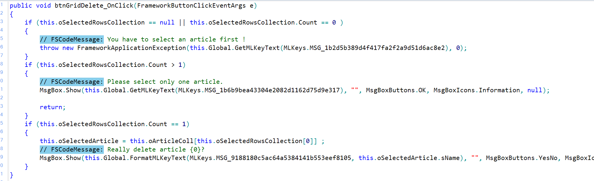

# Neuheiten Framework Studio 4.2

Informationen zu aktuellen Versionen und korrigierten Fehlern finden Sie in den [Release-Informationen](release-4-2.md).

## Neue Systemvorraussetzungen

In dieser Version gibt es einige Anpassungen bei den [Systemvoraussetzungen](requirements.md). Im folgenden sind die wichtigsten **Änderungen** aufgeführt.

#### 64 Bit

Die folgenden Programme können nur noch auf 64-Bit Systemen installiert werden. Eine 32-Bit Installations-Routine wird nicht mehr angeboten:

* Framework Studio IDE / Package Manager
* Publish / Publish2Go
* Anwendungs-Broker
* Framework Studio Services

32-Bit wird weiterhin unterstützt für:

* Client-Rechner
* Print-Server

#### .NET Framework 4.8

Framework Studio setzt auf das .NET Framework 4.8 auf. Dieses wird beim Ausführen der Installations-Routine (nach Rückfrage) automatisch installiert. Es ist nicht mehr im Requirements-Packet enthalten.

Für eine manuelle Installation finden Sie das .NET Framework 4.8 direkt bei Microsoft unter <https://dotnet.microsoft.com/download/dotnet-framework/net48>.

#### Betriebssysteme

Mit dem Umstieg auf das .NET Framework 4.8 können einige ältere Windows Betriebssysteme nicht mehr unterstütz werden. Es werden aktuell folgende Betriebssysteme unterstützt:

* **Server**
  * Windows Server 2012 R2 - oder höher

* **Client / Entwicklungs-Rechner**
  * Windows 10 (Version 18.03 - oder höher)
  * Windows 8.1

Für die Endanwender-Rechner bzw. Terminal-Server gelten weiter die bisherigen Anforderungen.

#### SQL-Server

Es wird der SQL-Server **2012** oder höher unterstützt. Ältere Version (z.B. SQL-Server 2008) werden nicht mehr supported

#### Oracle Server

Es wird der Oracle Server **12.2** oder höher (18c, 19c, ...) unterstützt. Ältere Versionen werden nicht mehr supported.

#### Oracle Client

Es wird nur noch der **Oracle Managed** Provider unterstützt.

Der Oracle ODP Provider ist veraltet (deprecated) und wird nicht mehr supported.

## C# 7

Mit dem Update auf das .net Framework 4.8 unterstützt Framework Studio auch die C# Sprach-Features bis zur Version 7.3. Eine Übersicht der Features bietet die Web-Seite:

* <https://docs.microsoft.com/de-de/dotnet/csharp/whats-new/csharp-7>

In der folgenden Liste werden einige Features genannt, die seit C# 6 hinzugekommen sind.
Der Einsatz dieses Features ist in Framework-Studio empfehlenswert:

* [out variables](<https://docs.microsoft.com/de-de/dotnet/csharp/whats-new/csharp-7#out-variables>) - inline-Deklaration (C# 7.0)

Folgende Features können ggf. sinnvoll sein:

* [Tuples](<https://docs.microsoft.com/de-de/dotnet/csharp/whats-new/csharp-7#tuples>) (C# 7.0)
* [Inferred tuple element names](<https://docs.microsoft.com/de-de/dotnet/csharp/whats-new/csharp-7-1#inferred-tuple-element-names>) (C# 7.1)
* [Tuples support == and !=](<https://docs.microsoft.com/de-de/dotnet/csharp/whats-new/csharp-7-3#tuples-support--and->) (C# 7.3)
* [Pattern matching](<https://docs.microsoft.com/de-de/dotnet/csharp/whats-new/csharp-7#pattern-matching>) (C# 7.0)
* [Local functions](<https://docs.microsoft.com/de-de/dotnet/csharp/whats-new/csharp-7#local-functions>) - aber nur sehr gut überlegt!! (C# 7.0)

## MLKey Wörterbuch

Eine zentrale Neuerung in der Version 4.2 betrifft das Handling der fremdsprachigen Texte. Diese werden jetzt in einem [zentralen Wörterbuch](../doc/mlkey/woerterbuch.md) verwaltet.

Bisher wurden alle Texte am jeweiligen Element (z.B. Metadatentyp, ComponentProperty, FormControl) gepflegt. Jetzt werden an allen diesen Stellen Schlüssel (MLKeys) angegeben, die auf das zentrale Wörterbuch verweisen. Dadurch hat man erst einmal etwas mehr organisatorischen Aufwand, aber auf längerer Sicht betrachtet bringt diese Vorgensweise viele Vorteile:

* Redundanzen werden vermieden, weil existierende Texte wiederverwendet werden können und sollen. Dadurch erhält man zudem in der kompletten Anwendung durchgängige und einheitliche Bezeichnungen.
* Die fremdsprachigen Übersetzungen können sehr einfach und zentral gepflegt werden.
* Besonders im Customizing-Package ist das von großem Vorteil, weil jetzt nicht mehr die einzelnen Elemente ausgecheckt werden müssen.
* Das Wörterbuch kann auch im Service-Release bearbeitet werden.
* Der [Export und Import](../doc/mlkey/import-export.md) von Texten ist sehr einfach. Es wird das standardisierte TMX-Format verwendet. Texte können so zwischen verschiedenen Packages und Versionen ausgetauscht werden. Auch eine Übersetzung durch Werkzeuge oder externe Dienstleister ist dadurch deutlich einfacher als bisher.

Eine detailliert Beschreibung der Funktionalität finden sie im Kapitel [MLKey](../doc/mlkey/woerterbuch.md).

Es ist sinnvoll, die Texte des eigenen Packages in das Wörterbuch zu überführen. Bitte beachten sie dazu die [Hinweise und Anleitungen für die Migration](../doc/mlkey/migration.md).

## Code-Messages überarbeitet

Die vom Exception- und MessageBox-Wizard generierten [Code-Messages](../doc/code-editor/code-messages.md) wurden überarbeitet.

Das bisherige Konstrukt mit `#region` wurde durch eine Variante mit einem einfachen eingefärbten Kommentar `// FSCodeMessage:` ersetzt. Das macht den Quellcode kompakter und leserlicher – ohne extra aufklappen zu müssen.

Der XML-Teil, welcher bisher die Informationen für die Wizard-Dialoge beinhaltet hat, entfällt. In der Vergangenheit konnte es sein, dass die XML-Informationen vom Code abwichen. Der Wizard hat dann den Code ignoriert und einfach ersetzt. Dadurch konnten wichtige Infos – wie z.B. ein MessageBox EventHandler – verloren gehen. Die Informationen werden jetzt aus dem Code geparsed. Kann (z.B. aufgrund von manuellen Anpassungen) der Code nicht geparsed werden, kann er nicht mehr durch den Wizard bearbeitet werden.

Die Code-Messages können einen [MLKey aus dem Wörterbuch](../doc/mlkey/woerterbuch.md) verwenden. Die bisherige Variante mit TextCollection-Einträgen soll nach und nach durch die MLKeys ersetzt werden und so die ctMessage-TextCollections auslaufen.

Bei MsgBox.Show() sind die Enum-Werte für Button und Icon leserlich ausgeschrieben. Bisher wurden dort nur die int-Werte verwendet.

Die Konvertierung des bestehenden Codes in das neue Format erfolgt auf folgende Weise:

1. Durch die [MLKey-Konvertierungs-Routine](../doc/mlkey/migration.md#3-convert-messages) – diese setzt alle Code-Messages automatisch auf einen MLKey und/oder das neue Format um.
2. Durch manuellen Aufruf des Exception- oder MsgBox-Wizards. Beim Speichern wird der Code durch die neue Variante ersetzt.

Bei beiden Konvertierungen wird nur der Code betrachtet - der alte XML-Teil wird ignoriert.
Neue Messages werden immer im neuen Format generiert. Dabei ist es egal, ob ein Textcollection-Eintrag oder ein MLKey verwendet wird.

## Actions SetEnabled und SetVisible nullable

Die Control-Actions `SetEnabled` und `SetVisible` haben neue Überladungen bekommen, welche das Zurücksetzen auf den im Property-Grid des Form-Designers eingestellten Wert ermöglichen.

Dazu wurden folgende Überladungen ergänzt, bei denen der `null`-Wert zum Zurücksetzten verwendet werden kann:

* `SetEnabled(bool? value)`
* `SetEnabled(FSbool value)`
* `SetVisible(FSVisibility? value)`

> [!CAUTION]
> Achtung, falls Reflection verwendet wurde!

Sollte eine der ursprünglichen Methoden aus irgend einem Grund per Reflection angesprochen worden sein, so kann es nun zu dem Problem kommen, dass nicht mehr eine eindeutige, sondern mehrere Überladungen der Methode gefunden werden. Die Überladungen `SetEnabled(bool value)` und `SetVisible(FSVisibility value)` wurden entfernt, da Aufrufe vom Compiler direkt auf die entsprechenden Nullable-Überladungen umgelenkt werden.
