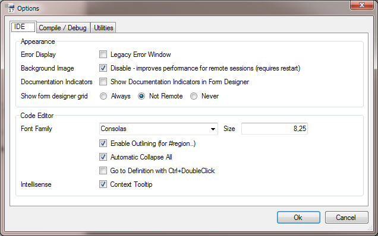
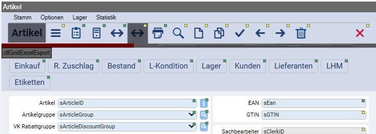
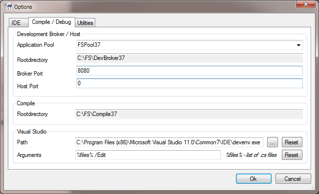
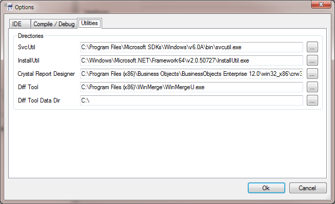

# Options

Die Options können in der IDE über den Menüeintrag **Tools / Options** geöffnet werden.

## IDE (Registerkarte)

### Appearance

**Error Display**:

Wird die Checkbox **Legacy Error Window** gesetzt, kann erzwungen werden, dass die Errors in derselben Art und Weise ausgegeben werden, wie es bis Framework Studio 2.6 der Fall war.

**Background Image**:

Wird die Checkbox **Disable** gesetzt, wird in der Framework Studio Umgebung kein Hintergrundbild mehr angezeigt. Dies kann zu einer Performancesteigerung bei Remote Sessions beitragen (z.B. VNC).

**Documentation Indicators**:

Zeigt an den Controls im Form-Designer an, ob eine Dokumentation gepflegt ist, bzw vererbt wurde.

**Show form designer grid**:

Gibt an, ob im Form-Designer das Raster-Grid angezeigt werden soll. Bei der Arbeit über Remote Desktop kann dieses Grid die Performance sehr stark verschlechtern.

### Code Editor

**Font Family**:

Hier können Schriftart und -größe für den Code-Editor angepasst werden.

**Context Tooltip**:

Gibt an, ob im Code-Editor Informationen zu Elementen angezeigt werden sollen, wenn mit der Maus auf Code-Teile gezeigt wird.

## Compile / Debug (Registerkarte)

**Application Pool**:

Gibt den Application-Pool im IIS an, in dem der Development-Broker laufen soll. Beim Starten von Applications aus Framework Studio heraus werden im IIS automatisch virtuelle Verzeichnisse erzeugt. Diesen wird der hier angegebene Application-Pool zugewiesen.

**Broker Rootdirectory**:

Gibt an, unter welchem Ordner Framework Studio die Verzeichnisse für den Development-Broker erzeugen soll. Diese Einstellung wird automatisch von Framework Studio gesetzt und kann nicht geändert werden.

**Broker Port**:

Standard Broker Port. Wird `0` eingetragen, wird automatisch ein freier Port genutzt.

**Host Port**:

Standard Broker Port. Wird `0` eingetragen, wird automatisch ein freier Port genutzt.

**Compile Rootdirectory**:

Gibt an, unter welchem Ordner Framework Studio die Compile-Verzeichnisse erzeugen soll. Diese Einstellung muss manuell in der Datei FrameworkStudio_3_X.exe.config angepasst werden.

**Visual Studio Path**:

Hier kann angegeben werden, wo Visual Studio installiert ist. Die aktuell von Framework Studio unterstützten Versionen von Visual Studio werden automatisch erkannt. Wenn eine andere Version oder Edition (z.B. Visual Studio Express) verwendet werden soll, kann das entsprechende Programm angegeben werden.

Mit dem Button **Reset** wird der Wert auf die Original-Einstellung zurückgesetzt.
Diese Einstellung wird für das Menu **View /  Compiled Code in Visual Studio** in den Designer-Fenstern verwendet.

Außerdem wird der Ordner aus dieser Einstellung verwendet, um für die Arbeit mit Services das Programm WcfTestClient.exe zu finden.

**Visual Studio Arguments**:

Hier können die Kommandozeilen-Argumente für das Öffnen der Quellcode-Dateien angegeben werden. Beim Einsatz von Visual Studio können die Standard-Einstellungen `%file% /Edit` beibehalten werden.

Der Platzhalter `%file%` steht für die zu öffnenden Dateien. Dieser werden in dem Format `"Datei1.cs" "Datei2.cs"…` übergeben. Wenn dieser Platzhalter nicht angegeben ist, dann werden die Dateien an der Parameter gestellt.

## Utilities (Registerkarte)

**SvcUtil**:

Gibt den Pfad zur SvcUtil.exe des Windows SDK an. Diese wird für die Generierung des Services verwendet.

**InstallUtil**:

Gibt den Pfad zur InstallUtil.exe des .NET-Frameworks an.

**Crystal Report Designer**:

Gibt den Pfad zum Crystal Report Designer an.

**Diff Tool**:

Hier kann die ausführbare Datei für das Diff Tool angegeben werden.

**Diff Tool Data Dir**:

Hier kann das Datenverzeichnis für das Diff Tool angegeben werden.

Mit dem Button [...]  kann jeweils ein Dateiauswahldialog geöffnet werden.
