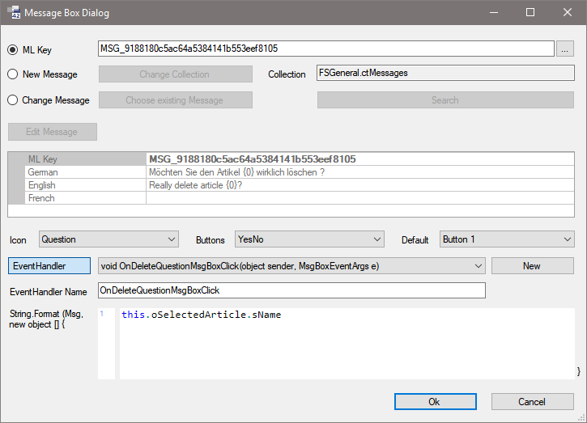
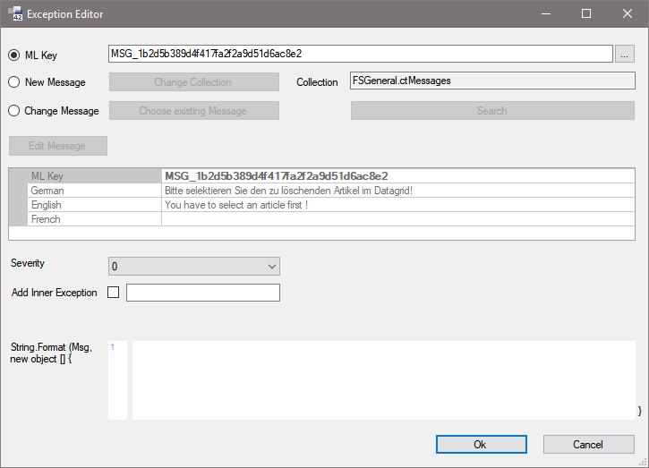
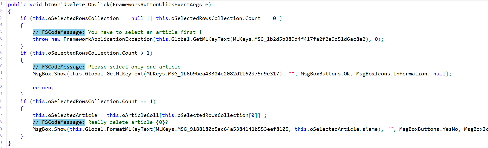

# Code-Messages

Wenn Sie eine Methode eines Forms bearbeiten, stehen Ihnen Editoren zum komfortablen Erstellen und Bearbeiten von mehrsprachigen Ausnahmen (Exceptions) und Meldungen (Message-Boxen) zur Verfügung. Diese können Sie über die Buttons   **Exception Editor Wizard** und   **Message Box Editor Wizard** aufrufen.

Wenn Sie eine Textcollection ändern, indem Sie beispielsweise einen neuen Eintrag erzeugen oder einen bestehenden Eintrag ändern, dann muss die Textcollection dazu in der aktuellen Version für Sie ausgecheckt werden. Benutzen Sie dazu den Button **Edit Message**. Andere Benutzer können nun die Textcollection nicht bearbeiten. Beim Verlassen des **Message Box Editors** bzw. **Exception Editors** wird die Textcollection automatisch wieder eingecheckt, so dass auch andere Benutzer wieder auf die Textcollection zugreifen können.

Beide Editoren weisen nur sehr geringfügige Unterschiede auf.




#### Radiobutton **ML Key**

Hier können sie einen [MLKey](../mlkey/woerterbuch.md) angeben. Mit dem Auswahl-Button neben dem Textfeld öffnet sich der Dialog [Select ML Key](../mlkey/woerterbuch.md).

Dies ist die Standard-Option. Neue Meldungen sollten immer über das Wörterbuch gezogen werden.

#### Radiobutton **New Message**

Wenn Sie diesen Radiobutton auswählen, wird ein neuer Text in die ausgewählte Textcollection eingetragen.

> [!IMPORTANT]
> Wenn Sie einen neuen Text hinzufügen, müssen Sie auch die Textcollection kompilieren, da es sonst beim Ausführen des Programms Fehlermeldungen gibt.

#### Radiobutton **Change Message**

Wenn Sie diesen Radiobutton auswählen, können Sie mit dem Button **Choose existing Message** einen bestehenden Eintrag aus der angegebenen Textcollection auswählen oder mit dem Button **Search** nach einem bestehenden Eintrag suchen.

#### Button **Change Collection**

Mit diesem Button kann die Textcollection geändert werden, aus der ein Text ausgewählt werden soll, bzw. in welcher der neue Text eingetragen werden soll. Als Default-Wert ist die Textcollection ctMessages ausgewählt.

#### Button **Choose existing Message**

Mit diesem Button kann aus der gewählten Textcollection ein existierender Eintrag ausgewählt werden.

#### Feld **Collection**

Zeigt an, welche Textcollection ausgewählt ist.

#### Button **Search**

Mit diesem Button öffnen Sie einen Suchdialog. In diesem Dialog wird die Suche auf die Textcollection, die im Exception Editor / Message Box Editor angegeben ist, eingeschränkt.

Die Suchfunktionalität ist identisch mit den Möglichkeiten, die auf der Registerkarte **Search** im Framework-Designer zur Verfügung gestellt werden.

#### Text-Grid

Ist ein MLKey ausgewählt, wird hier nur der Text angezeigt. Der ML Key kann über das Textfeld bzw. den Auswahl-Button geändert werden. Die Bearbeitung der Texte-Inhalte erfolgt über das [Wörterbuch](../mlkey/woerterbuch.md).

In diesem Grid kann der Text der Message in den verschiedenen Sprachen eingegeben werden. Wurde mit **Choose existing Message** ein Eintrag ausgewählt, wird dieser geändert und in die Textcollection zurückgeschrieben. Alle vorhandenen Message-Boxen, die diesen Eintrag verwenden, sind ebenfalls davon betroffen. Dem Text können Parameter zugewiesen werden. Die Parameter werden in der Form `{0}, {1}` usw. angegeben. Jeder Parameter kann mehrmals verwendet werden.

```text
Der Beleg {0} für Kunde {1} hat sich geändert. Wollen Sie den Beleg {0} speichern?
```

Die Parameter werden in der Textbox **String.Format...** gefüllt.

#### Combobox **Icon**

(nur Message-Box)

Gibt an, welches Icon verwendet werden soll

* Error
* Exclamation
* Information
* Question
* None

#### Combobox **Buttons**

(nur Message-Box)

Gibt an, welche Buttons angezeigt werden sollen. Wird `OK` ausgewählt, ist es nicht notwendig, einen Event-Handler zu hinterlegen. Werden andere Buttons ausgewählt, muss ein Event-Handler hinterlegt werden.

* AbortRetryIgnore
* OK
* OKCancel
* RetryCancel
* YesNo
* YesNoCancel

#### Combobox **Default**

(nur Message-Box)

Gibt den Button an, der beim Anzeigen der Message-Box ausgewählt sein soll. So kann z.B. bei den Buttons `YesNo` durch Angabe von `Button2` das versehentliche Betätigen des `Yes`-Button verhindert werden.

* Button1
* Button2
* Button3

Die Nummer des Buttons entspricht der Angabe bei Buttons. z.B. `YesNoCancel` bedeutet `Button1` = `OK`, `Button2` = `No`, `Button3` = `Cancel`

#### Button **Event Handler**

(nur Message Box Editor)

Mit diesem Button kann angegeben werden, ob mit dem Klick in der Message-Box (z.B. auf `OK` oder `Cancel`) ein Event angestoßen werden soll oder nicht.

Ist der Button gedrückt, erscheint rechts daneben eine Combobox, mit der evtl. bestehende Methoden ausgewählt werden können. Mit dem Button **New** wird ein neuer Event-Handler angelegt.

Es wird eine Methode `OnMsgBoxClick1` angelegt. Der Parameter `MsgBoxEventArgs` hat ein Property DialogResult, damit abgefragt werden kann, welcher Button gedrückt wurde.

```csharp
public void OnMsgBoxClick1(object sender, MsgBoxEventArgs e)
{
    if (e.DialogResult == DialogResult.OK)
    {
        //Code for Ok.
    }
}
```

#### Combobox **Severity**

(nur Exception Editor)

Hier können Sie den Schweregrad der Ausnahme (0-3) festlegen.

#### **Add Inner Exception**

(nur Exception Editor)

Wenn die Checkbox gesetzt ist, können Sie das Property InnerException füllen. Geben Sie dazu die zu übergebende Variable im Textfeld an. Geben Sie dazu im Textfeld den Namen der lokalen Exception-Variable an.

#### Textbox **String.Format...**

In dieser Textbox können die Parameter der Message angegeben werden. Es ist möglich im Message Text Parameter anzugeben. Dies geschieht mit `{0}, {1}` usw. Diese Parameter können im Text auch mehrmals verwendet werden. Für jeden dieser Parameter kann hier, mit Komma getrennt, ein Wert angegeben werden. Der erste Parameter steht für `{0}`, der zweite für `{1}` usw.

```text
this.oOrder.lngOrderID, this.oOrder.lngCustomerID
```

#### Button **OK**

Schließt den Dialog und fügt den generierten Message-Code in den Code-Editor ein.

#### Button **Cancel**

Schließt den Dialog und verwirft die Änderungen.

Wenn der Message-Box-Editor mit **OK** verlassen wird, wird an die Stelle im Code, an der sich der Cursor befindet der Code generiert.

```csharp
// FSCodeMessage: Really delete article {0}?
MsgBox.Show(this.Global.FormatMLKeyText(MLKeys.MSG_9188180c5ac64a5384141b553eef8105, this.oSelectedArticle.sName), "", MsgBoxButtons.YesNo, MsgBoxIcons.Question, new MsgBoxEventHandler(OnDeleteQuestionMsgBoxClick));
```

Durch eine farbige Markierung ist dieser Code im Code-Editor gut zu erkennen.



Um die Code-Message nachträglich zu ändern, setzen Sie den Fokus irgendwo in den generierten Code-Block und drücken erneut den entsprechenden Wizard-Button. Es öffnet sich wieder der Editor wie oben und die Daten der Code-Message werden angezeigt und können geändert werden.

Bei Bedarf können auch einzelne Bestandteile wie z.B. der MLKey oder ein Enum-Wert direkt im Code geändert werden.

> [!CAUTION]
> Die Struktur des Code darf jedoch nicht geändert werden, weil dieser sonst für eine spätere Bearbeitung mit dem Editor nicht geparsed werden kann. Der Code darf nicht mehrzeilig sein.
