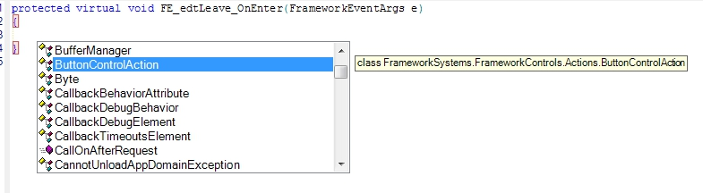

# Code-Editor

Framework Studio bietet einen umfangreichen C#-Code Editor mit IntelliSense Funktion und Code Highlighting.

## Intellisense

Der Code Editor beinhaltet die Funktionalität von IntelliSense, die kontextabhängig Code-Vervollständigung zur Verfügung stellt. Aufgerufen werden kann IntelliSense mit der Tastenkombination **Strg + Leertaste** an einer beliebigen Stelle im Code.

## Go to Definition

Mit der Kombination **Strg + Doppelklick** oder über das Kontextmenü kann aus dem Code Editor heraus zu den angeklickten Zielen gesprungen werden. Dies funktioniert bei Properties und Methoden. Ausgenommen davon sind Methoden fremder Components.

## Go to Base

Über den Eintrag Go to Base im Kontextmenü des Code Editors kann zu der Basis der aktuellen Methode navigiert werden.

## Compare with Base

Über den Kontextmenüeintrag **Compare with Base** im Code Editor ist es möglich, Überschreibungen von Methoden mit deren Implementierung im Basis-Package  zu vergleichen. Zum Vergleich wird ein externes Programm verwendet, welches mit dem Menüpunkt **Tools / Options** im Hauptfenster konfiguriert werden muss. (Vgl. Konfiguration von Method History Browser)
