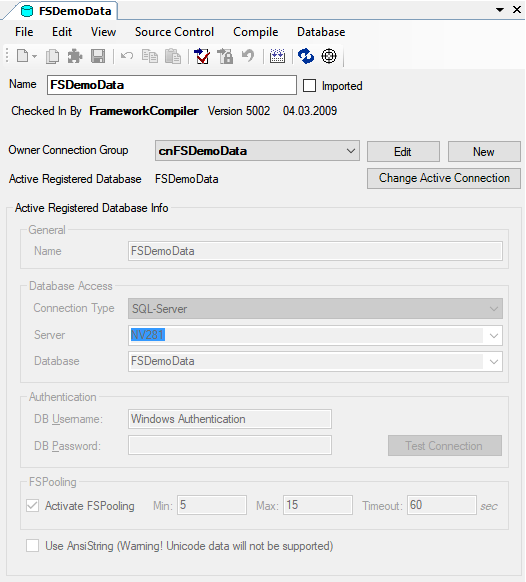

# Datasource

Ein **Datasource** (Datenquelle) definiert eine Datenbankverbindung, die von der Anwendung zum Lesen und Schreiben der Anwendungsdaten verwendet werden kann.

Alle Datenquellen werden im Objekt-Baum ([**Registerkarte Namespaces**](../ide/registerkarten.md#registerkarte-namespaces)) im Namespace **FSGeneral / DBTables** verwaltet.

Das Erstellen und Löschen von Datenquellen funktioniert in diesem Namespace wie bei allen anderen Elementen ([**Elemente erstellen**](../ide/bearbeiten-von-elementen.md#elemente-erstellen), [**Elemente löschen**](../ide/bearbeiten-von-elementen.md#elemente-löschen)).

Durch einen Doppelklick auf eine Datenquelle wird das Designer-Fenster geöffnet.

Erläuterungen zu den Standardfunktionen, die im Designer-Fenster für Datenquellen angeboten werden, finden Sie unter [**Allgemeine Funktionalitäten**](../ide/allgemeine-funktionatitaeten.md). Alle weiteren Funktionen werden im Folgenden beschrieben:

**Name:**

Über das Textfeld können Sie der Datenquelle einen Namen zuweisen.

Die Verbindungs-Einstellungen sin dim Kapitel **Connection Einstellungen**(!TODO LINK) beschrieben.

**Test Connection:**

Über diesen Button können Sie testen, ob mit den angegebenen Verbindungsdaten eine Verbindung aufgebaut werden kann.
