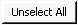

# DBTable

Ein **DBTable** ermöglicht Komponenten den Zugriff auf eine Datenbanktabelle, die über einen Datasource angesprochen werden kann.

Alle DBTables werden im Objekt-Baum ([**Registerkarte Namespaces**](../ide/registerkarten.md#registerkarte-namespaces)) im Namespace **FSGeneral / DBTables** unterhalb des Datasources angezeigt, den der DBTable zur Verbindung mit der Datenbank verwendet.

Das Erstellen und Löschen von **DBTables** funktioniert wie bei allen anderen Elementen ([**Elemente erstellen**](../ide/bearbeiten-von-elementen.md#elemente-erstellen), [**Elemente löschen**](../ide/bearbeiten-von-elementen.md#elemente-löschen)). Zuvor muss allerdings im Objekt-Baum der zu verwendende Datasource markiert werden!

Durch einen Doppelklick auf ein DBTable wird das Designer-Fenster geöffnet.


Erläuterungen zu den Standardfunktionen, die im Designer-Fenster für **DBTables** angeboten werden, finden Sie unter [**Allgemeine Funktionalitäten**](../ide/allgemeine-funktionatitaeten.md).

Über den Menüpunkt **Database / Import** kann die auf der Datenbank existierende Datenstruktur ausgelesen werden und der DBTable automatisch konfiguriert werden ([**Automatisiertes Importieren von Datenbankstrukturen**](#automatisiertes-importieren-von-datenbankstrukturen)).

Über den Menüpunkt **Component / Create Component...** kann aus dem DBTable eine Komponente generiert werden ([**Erzeugen einer Komponente**](#erzeugen-einer-komponente)).

Die Checkbox **View** legt fest, ob es sich bei dieser Tabelle um einen View handelt. Wenn dies der Fall ist, muss auf der [**Registerkarte View**](#registerkarte-view) eine entsprechende View-Definition angegeben werden. Diese Einstellung kann im Customizing nicht verändert werden.

Die Checkbox **Use History** legt fest, ob historische Daten in einer separaten Tabelle ausgelagert sind ([**Auslagerung historischer Daten**](#auslagerung-historischer-daten)).

Die Checkbox **Imported** gibt an, ob es sich bei dieser Tabelle um eine importierte Datenstruktur handelt. Importierte Strukturen werden beim automatischen Datenbank-Update nicht berücksichtigt. Wenn an der, der DBTable zugehörigen, Connection die Eigenschaft **Imported** gesetzt ist, dann ist auch die Checkbox an der DBTable automatisch gesetzt und kann nicht deaktiviert werden. Diese Einstellung kann im Customizing nicht verändert werden.

Die einzelnen Registerkarten werden im Folgenden beschrieben.

## Registerkarte Columns


Auf der Registerkarte **Columns** werden die einzelnen Spalten der Tabelle angezeigt. Die Eigenschaften der Spalten sind editierbar und müssen mit der Definition des Datenmodells auf der Datenbank vereinbar sein. Außerdem kann ein Metadatentyp zugeordnet werden.

#### Link **Preview DBTable**

Öffnet die [**Sql Statement Preview**](#sql-statement-preview)

#### Spalte **Name**

Feldname in der Datenbank.

#### Spalte **Metadatatype**

Art des Feld-Typs. Hier stehen alle Metadatentypen und Datenbank-Datentypen zur Verfügung. Wird ein Metadatentyp ausgewählt, können Size, Precision und Scale nicht mehr geändert werden.

#### Spalte **DBType / FSType**

Gibt an, Welchen Datenbank-Typ die Spalte hat und welchen FS-Datentyp ein dieser Spalte zugeordnetes Component-Property erhält. Diese Informationen ergeben sich aus dem zugeordneten Metadatentyp und sie können nicht direkt geändert werden.

#### Spalte **Size**

Größe des Felds.

#### Spalte **Precision**

Anzahl der Stellen, die das Feld haben soll (inkl. Nachkommastellen).

#### Spalte **Scale**

Anzahl der Nachkommastellen.

#### Spalte **PK**

Primary Key. Ist die Checkbox aktiviert, handelt es sich um ein Schlüsselfeld.

#### Spalten **IsROWID / IsRowVersion**

Auf jeder Tabelle können die beiden Spalten FSROWID und FSROWVERSION definiert werden. Diese beiden Spalten werden dann jeweils mit der entsprechenden Checkbox gekennzeichnet.

Diese Spalten sind fürs Update der Daten notwendig, damit konkurrierende Transaktionen erkannt und verhindert werden können. (Siehe auch **FSROWID / FSROWVERSION**(TODO LINK!))

#### Spalte **IsMLColumn**

Ist die Checkbox aktiviert, kann in der Anwendung der Dateninhalt der Spalte mehrsprachig gepflegt werden (siehe [**MLColumn**](ml-column.md)).

#### Spalte **NotNull**

Wenn gesetzt, dann darf diese Spalte keine Null-Werte beinhalten. Diese Information wird bei automatischen Datenbank-Update abgeglichen.

#### Link **Open Metadatatype**

Öffnet den [**Metadatentyp**](../mdt/metadatentypen.md) der momentan ausgewählten Spalte.

### Registerkarte Texts

Hier können Sie das zu verwendende **Default-Label**, die **Column-Caption**, der **Tooltip** und die **Description** für eine Datenbankspalte festlegen bzw. überschreiben. Wenn der Spalte ein Metadatentyp zugeordnet wurde, wird das Default-Label vom Metadatentyp verwendet, solange es nicht an dieser Stelle überschrieben wird.

### Registerkarte ControlTypes


Auf der Registerkarte **ControlTypes** wird angezeigt, welche Controls der Spalte zugeordnet sind. Ist der Spalte ein Metadatentyp zugewiesen, werden die dem Metadatentyp bereits zugewiesenen Controls hier angezeigt. Die Liste kann ggf. ergänzt werden. Ist kein Metadatentyp zugewiesen, können Sie die ControlTypes hier hinterlegen.

Mit den Buttons **Add** und **Change** öffnet sich das Fenster **Assign Controls**. Siehe auch Metadatentyp [**Registerkarte Control Types**](../mdt/metadatentypen.md#registerkarte-control-types)

### Registerkarte Documentation

Auf der Registerkarte **Documentation** kann die Benutzer-Dokumentation für die Tabelle hinterlegt bzw. die Dokumentation aus dem verwendeten Metadatentypen überschrieben oder ergänzt werden. Siehe auch [**Dokumentations-System**](../documentation/dokumentations-system.md).

## Registerkarte Indices

Die Indizes einer Tabelle lassen sich auf der Registerkarte **Indices** festlegen. Ein neuer Index lässt sich wie gewohnt durch das Kontextmenü, die Toolbar oder durch das Menü **File / New** anlegen. Diesem können nun Spalten zugeordnet werden, die entweder absteigend (DESC) oder aufsteigend (ASC) indiziert sein können. Des Weiteren kann ein Index als Unique (eindeutig) deklariert werden und er kann aktiviert oder deaktiviert werden, wodurch der automatische Abgleich mit der Datenbank beeinflusst wird. Indizes lassen sich nur dann verwalten, wenn es sich bei der Tabelle nicht um einen View handelt.


## Registerkarte View

Wird eine DBTable mit der Checkbox View gekennzeichnet, dann muss auf der Registerkarte View ein SQL-Statement für die View-Definition angegeben werden. Die View-Definition wird beim automatischen Datenbank-Update abgegelichen und der View ggf. angepasst.


Das Statement wird in Framework-Studio-Syntax formuliert ([**SQL-Syntax**](../sql/syntax.md)).

Die Bezeichnungen der Ergebnis-Spalten werden aus dem Select-Statement ermittelt. Aus diesem Grund muss ggf. ein Spalten-Alias angegeben werden - z.B. bei berechneten Spalten und wenn die Bezeichnung von der Tabellen-Spalte abweichen soll.

Es ist zwingend zu beachten, dass alle in der [**Registerkarte Columns**](#registerkarte-columns) definierten Spalten in der View-Definition enthalten sind.

Die View-Definition kann im [**Customzing-Package**](../package/packages.md#customizing) überschrieben werden.

Mit dem Link Preview Select öffnet sich die [**Sql Statement Preview**](#sql-statement-preview). Damit kann das Statement gestestet werden.

## Registerkarte Relations


Auf der Registerkarte **Relations** hinterlegen Sie die Beziehungen, die 2 Tabellen miteinander verbinden sollen.

Mit dem Button **New** können neue Verbindungen definiert werden. Unter **Relation Detail** benennen Sie zunächst die Relation, um anschließend auszuwählen, ob es sich um eine Fremdschlüssel-Relation (Foreign Key) oder um eine Meta-Relation handelt. Die Combobox PK-Table zeigt Ihnen alle Tabellen, auf welche Sie mit Ihrer Verknüpfung verzweigen können.

Dann verbinden Sie noch alle Felder miteinander, die zu der Schlüssel-Kombination gehören. Klicken Sie dazu auf den Button **New Join** und ordnen Sie anschließend in den Comboboxen die beiden korrespondierenden Spalten zu, welche die Schlüsselkombination darstellen.

## Registerkarte Description


In dem Textfeld der Registerkarte können allgemeine Informationen zu dieser Tabelle hinterlegt werden.

## Sql Statement Preview

Mit der Sql Statement Preview können SQL-Befehle getestet werden. Sie steht in verschiedenen Programmteilen zur Verfügung um z.B. eine DBTable, die View-Definition oder eine Component-Query zu testen.


#### Registerkarte **Select Statement**

Hier wird der SQL-Befehl angezeigt, der von der Aufruf-Stelle übergeben wurde. Dieser kann hier temporär bearbeitet werden, die vorgenommenen Änderungen werden jedoch nicht übernommen.

Im Feld **Additional where clause** kann optional eine zusätzliche Suchbedingung angegeben werden. Wenn das Statement selber schon eine Bedingung besetzt, dann wird diese ergänzt.

Bei **Connection** wird die aktuell ausgewählte Datenbank angezeigt. An diese wird das SQL-Statement geschickt.

Mit dem Button **View Result** wird auf die Registerkarte **View top 50 Results** gewechselt.

#### Registerkarte **Converted Statement**

Zeigt den in die Syntax der Zieldatenbank konvertierten SQL-Befehl an. Standardmäßig wird der Typ der aktuell ausgewählten Datenbank vorbelegt. Mit den Buttons kann der Typ gewechselt werden. Falls bei der Konvertierung ein Fehler auftritt, wird dieser statt dem Statement angezeigt.

#### Registerkarte **View top 50 Results**

Beim Wechsel auf diese Registerkarte wird das Statement an die aktuell ausgewählte Datenbank gesendet und die ersten 50 Ergebnisse in einer Tabelle angezeigt.

## Automatisiertes Importieren von Datenbankstrukturen

**Framework Studio** bietet Ihnen einen Automatismus, der es erlaubt, alle nötigen Angaben über die Struktur der Daten auf der Datenbank auszulesen und daraus die Spaltendefinitionen generieren zu lassen.

Benutzen Sie dazu den Menüpunkt **Database / Import**, der Ihnen sowohl im Designer-Fenster eines Datasources als auch im Designer-Fenster eines DBTables zur Verfügung steht.

Zunächst werden Ihnen alle Tabellen, die über die Datenquelle (des DBTables) erreichbar sind, zur Auswahl gestellt.


Wenn Sie eine Tabelle ausgewählt haben, die in **Framework Studio** bisher noch nicht bekannt ist, wird diese automatisch als neuer **Table** in **Framework Studio** eingebunden.


Danach sehen Sie im Fenster **Update Table** eine Tabelle, in der alle **Columns** (Spalten der Datenbanktabelle) aufgelistet werden.

**Update Table (Spalten):**


In der Tabellenspalte mit der Überschrift **Column Name** wird der Name der Datenbankspalte aufgeführt.

In der Tabellenspalte **Action** wird ein Symbol dargestellt, an welchem Sie erkennen können, welche Art von Änderung bei einer Aktualisierung durchgeführt wird. Die Symbole haben folgende Bedeutung:

 New: Die Spalte ist in **Framework Studio** bisher unbekannt und wird neu eingefügt.

 Modified: Einige Eigenschaften der Spalte (z.B. Genauigkeit, Größe oder Metadatentyp) unterscheiden sich von den Vorgaben durch die Datenbank. Diese Eigenschaften werden geändert.

 OK: Die Konfiguration in **Framework Studio** stimmt mit der Datenstruktur in der Datenbank überein. Sie haben trotzdem die Möglichkeit, den Metadatentypen zu ändern.

 Delete: Diese Spalte ist in **Framework Studio** angelegt worden, existiert aber nicht in der Datenbank. Deshalb wird Sie aus der Konfiguration entfernt.

In der Tabellenspalte **Metadatatype** wird der Metadatentyp, welcher der Spalte zugewiesen wird, festgelegt. In der Combobox stehen alle Metadatentypen zur Auswahl, deren Datentyp sich mit dem der Datenbankspalte vertragen. Außerdem haben Sie die Möglichkeit, über den Eintrag **Create ’mdtBeispieldatentyp’** für diese Datenbankspalte einen neuen Metadatentypen generieren zu lassen.

In der Tabellenspalte **Action Description** werden die einzelnen Änderungen aufgeführt, die bei einem Update der Spalte durchgeführt werden. Die alten Werte werden in runden Klammern hinter den neuen Werten aufgeführt.

Mit der Checkbox in der Tabellenspalte **Update** legen Sie für jede einzelne Datenbankspalte fest, ob die vorgeschlagenen Änderungen tatsächlich durchgeführt werden sollen.
Mit den Buttons  und  legen Sie fest, dass alle Datenbankspalten bzw. keine Datenbankspalte aktualisiert werden soll.

Durch einen Klick auf  gelangen Sie zur Zusammenfassung der vorzunehmenden Änderungen. Sie können den Aktualisierungsvorgang nun mit dem Button  starten.

**Update Table (Zusammenfassung):**


Wenn Sie automatisch neue Metadatentypen generieren lassen, haben Sie die Möglichkeit, den Namespace auszuwählen, in dem der Metadatentyp angelegt werden soll.

**Select Namespace:**


Sie können für jeden neu zu erstellenden Metadatentypen einzeln einen Namespace auswählen oder durch Setzen der Checkbox **Create all Metadatatypes in this Namespace** alle Metadatentypen im gleichen Namespace erzeugen lassen. Mit dem Button  **New Namespace** können Sie im ausgewählten Namespace einen neuen Namespace anlegen.


## Auslagerung historischer Daten

Sehr große Datenvolumen in Tabellen mit aktuellen und historischen, viele Jahre alten Daten, können die Geschwindigkeit der Anwendung bremsen. Werden die historischen Daten in eine spezielle Tabelle ausgelagert, so kann Framework Studio abhängig von einem Laufzeitschalter beim Laden von Components entweder die aktuellen Daten oder alle Daten berücksichtigen. Der Geschwindigkeitsvorteil entsteht im Wesentlichen dadurch, dass im täglichen Betrieb nur mit den aktuellen Daten, also einer geringeren Datenmenge gearbeitet werden muss.

Dem Datenbankadministrator wird außerdem die Möglichkeit gegeben, die historischen Daten auf einer langsameren Hardware zu speichern.

Der Mechanismus ist für sehr große Datenmengen interessant. Typische Anwendungsfälle sind Journaltabellen, in denen viele Millionen Datensätze abgelegt sind.

### Details

An **DBTables** kann über die Checkbox **Use History** festgelegt werden, ob historische Daten in eine separate Tabelle ausgelagert sind. Diese Eigenschaft kann auch in Customizing Packages nachträglich gesetzt werden.


Ist der Schalter für eine Tabelle *Xyz* gesetzt, geht Framework Studio davon aus, dass eine Tabelle *Xyz_H* (für die historischen Daten) und ein View *Xyz_A*, welcher mit Union All die Daten aus Xyz und *Xyz_H* vereint, vorhanden ist. Tabelle und View können von der Endanwendung (z.B. beim Update) automatisch generiert werden.

> [!NOTE]
> Für das Übertragen von Daten aus der Tabelle Xyz in die Historientabelle *Xyz_H* ist manuelle Programmierung nötig.

Wird versucht, einen historischen Datensatz zu speichern, so wird eine Exception ausgelöst.

Am **Global Object** (this.Global) gibt es einen Schalter **Use History**, mit dem global entschieden wird, ob beim Laden historische Daten berücksichtigt werden sollen. Ist der globale Schalter Use History gesetzt und an einer Tabelle ist der Schalter Use History ebenfalls gesetzt, so wird beim Laden statt auf die Originaltabelle auf den View zugegriffen.

Um temporär den Historienmodus zu aktivieren, kann folgendes ***Using*** Konstrukt verwendet werden:

```csharp
// Historienmodus temporär erzwingen:
using(this.Global.UseHistoryTemporarily())
{

  ...

}
```

Alle **Components**, die einen Datenbankbezug haben, bieten die Funktion **GetTableName** an. Diese Funktion gibt den Tabellennamen inklusive Alias zurück, zum Beispiel **„Artikel_A as Artikel“**. Diese Funktion eignet sich für die Formulierung von Sub Selects. Für die manuelle Formulierung von Update-, Insert- oder Delete Statements kann an der Component Instanz auf **QueryInfo.GetJoinInfo().FirstOrDefault().Table.TableName** zugegriffen werden.

## Erzeugen einer Komponente

Über den Menüpunkt **Component / Create Component** öffnet sich das gleichnamige Fenster. Hier wird eine Abfrage erzeugt, die genau die Daten aus der Datenbank holt, welche Sie über Ihren **DBTable** definiert haben.

**New Component Wizard / Create Component:**


Aktivieren Sie die Checkbox **Create a Collection for the Component**, um gleichzeitig eine Collection zu der Komponente zu erzeugen. Die Collection wird in dem gleichen Namespace erzeugt und trägt das Suffix Coll (also cdXxxColl).

Der Button **Next** auf der Maske Create Component öffnet das Fenster **Choose Namespace**.

**New Component Wizard / Choose Namespace:**


Im Fenster **Choose Namespace** wählen Sie den Namespace aus, in dem die neue Komponente erzeugt werden soll.

Über den Button **Next** öffnet sich das Fenster **Summary**. Es zeigt Ihnen eine Zusammenfassung Ihrer **Einstellungen**.

**Summary:**


Mit **Finish** wird die Komponente erzeugt.

Alle angezeigten Tabellen werden ebenfalls über **Source Control** gesteuert. Das bedeutet, dass Elemente, die editiert werden sollen, ausgecheckt und zum Übernehmen der Änderungen wieder eingecheckt werden müssen. In dieser Ansicht ist nicht direkt erkennbar, welche Elemente ausgecheckt sind und welche nicht. Sie sollten es sich deshalb zur Gewohnheit machen, Ihre Database-Elemente so schnell wie möglich wieder einzuchecken und so für andere Entwickler verfügbar zu machen. Tabellen können eingecheckt werden, indem Sie sie in der Tabelle auswählen und dann über das Hauptmenü **Source Control** / **Check In** wählen.
