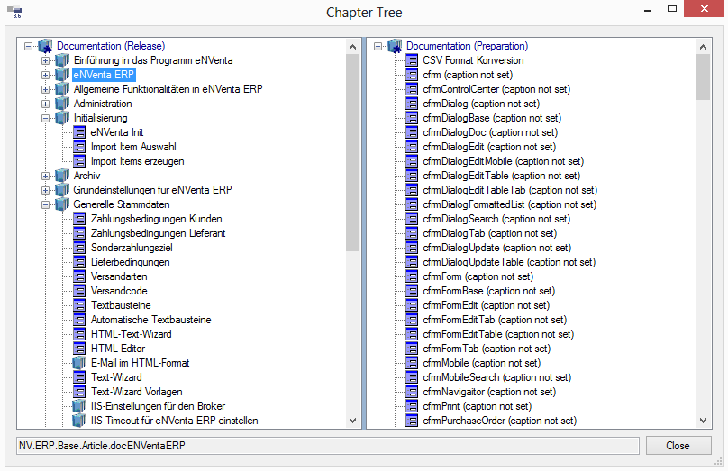
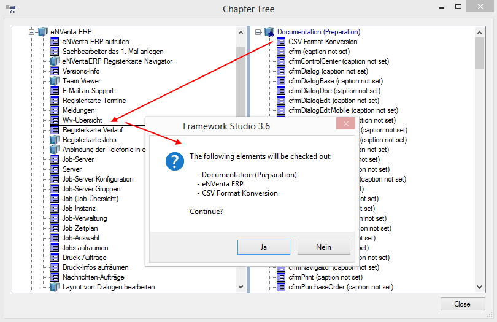

# Chapter Tree

## Allgemein

Der Chapter Tree ist die zentrale Instanz, welche alle Form- und Documentation-Elemente in Kapitel organisiert. Zu erreichen ist der Chapter Tree über das Menü **Tools** -> **Documentation** -> **Chapter Tree**. Ein Form- oder Documentation-Element spiegelt in einer exportierten Dokumentation genau ein Kapitel mit eigener Kapitelnummer wider.

Chapter Tree für die Organisation der Kapitel:

Es gibt zwei Abschnitte im Chapter Tree. Der ***Documentation (Preparation)***-Knoten beinhaltet alle Formulare und Documentation-Elemente, die in einer Anwendung neu hinzugekommen oder noch nicht in die Dokumentation eingebunden wurden. Sie werden alphabetisch aufsteigend aufgelistet. Der ***Documentation (Release)***-Knoten spiegelt den Kapitelbaum der Dokumentation wieder, die mit dem [Export Wizard](./export-wizards.md) gerendert werden kann. Als Text wird die im Dokumentations-Editor angegebene Caption des Formulars oder Documentation-Elements angezeigt. Ist diese nicht definiert wird in Klammern hinter dem Namen des Formulars oder Documentation-Elements der Zusatz **“caption not set”** angezeigt.

Die Form- oder Documentation-Elemente können aus dem Chapter Tree mit einem Doppelklick auf den Knoten oder mit der Entertaste direkt geöffnet werden.

Die Textbox am unteren Rand zeigt den vollen Namespace des aktuell ausgewählten Knoten an.

## Kapitelstruktur

Wird die Dokumentation wie in der Abbildung mit dem [Export Wizard](./export-wizards.md) in eine Word-Datei exportiert, folgt die Kapitelnummerierung der Ebene des ***Documentation (Release)***-Knotens. Wie im Beispiel zu sehen hätten die folgenden Kapitel die angegebenen Kapitelnummern:

|                                      |       |
| ------------------------------------ | ----- |
| *Einführung in das Programm eNVenta* | = 1.  |
| *eNVenta ERP*                        | = 2.  |
| *Initialisierung*                    | = 5.  |
| *eNVenta Init*                       | = 5.1 |

Da Word bis zu 9 Ebenen unterstützt, können auch im Chapter Tree die Formulare und Documentation-Elemente in bis zu 9 Ebenen (x.x.x.x.x.x.x.x.x) verschachtelt werden.

Um ein Kapitel an eine andere Stelle einzufügen bzw. ein Kapitel aus dem Preparation- in den Release-Knoten zu verschieben, muss nur der entsprechende Knoten per Drag&Drop an die richtige Position gezogen werden. Sind nicht alle beteiligten Elemente im Framework Studio ausgecheckt, wird eine entsprechende Meldung angezeigt.

Auschecken von beteiligten Elementen:

Im Beispiel wurde der Knoten **CSV Format Konversion** aus dem Preparation-Knoten in den Release-Bereich unter das Kapitel **eNVenta ERP** -> **Wv-Übersicht** gezogen. Keines der Elemente war zu diesem Zeitpunkt ausgecheckt.
