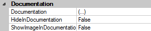

# Control Features

Es gibt einige Einstellungen, die speziell an Controls verfügbar sind. Machne dieser Einstellungen sind an allen Controls verfügbar, andere wiederum nur an Controls eines bestimmten Typs.
Wenn ein Control im Designer ausgewählt ist, sind alle verfügbaren Einstellungen unter der Kategorie **Documentation** zu finden.

## Alle Controls

### Documentation

Öffnet den Dokumentations-Editor (siehe [Editor](./editor.md))

### HideInDocumentation

Gibt an, ob das ausgewählte Control in die Dokumentation gerendert werden soll oder nicht. Dies kann z.B. dann hilfreich sein, wenn in einem abgeleiteten Form Controls aus dem Basis-Form in der Dokumentation ausgeblendet werden sollen.

## TabbedWindow

### ChaptersForTabs

Gibt an, ob die Registerkarten des TabbedWindow als eigenständige Kapitel in die Dokumentation gerendert werden sollen. Dieser Schalter ist nur für TabbedWindows auf oberster Ebene vorgesehen. Er zieht also nicht für TabbedWindows, die z.B. in einem Panel verschachtelt sind.

## ImageButton

### ShowImageInDocumentation

Gibt an, ob das am Control hinterlegte Bild in die Control-Überschrift in der Dokumentation gerendert werden soll oder nicht.
