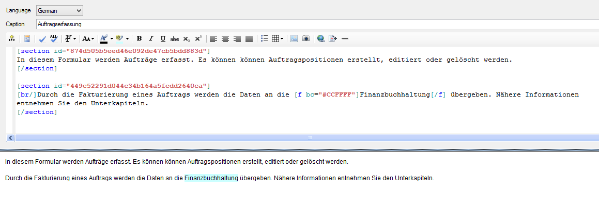
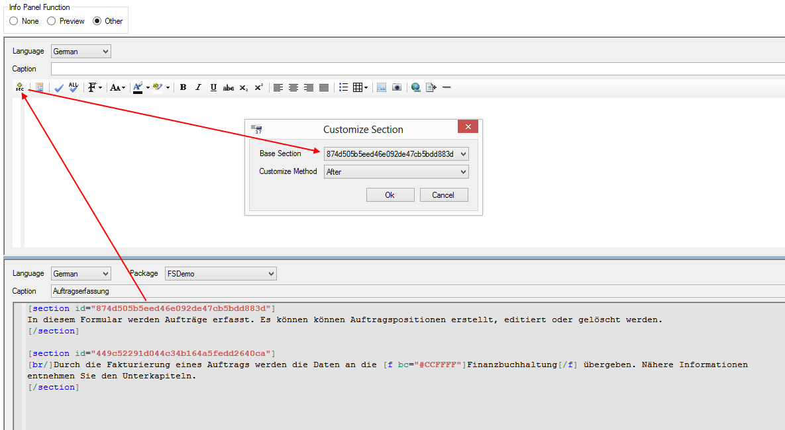
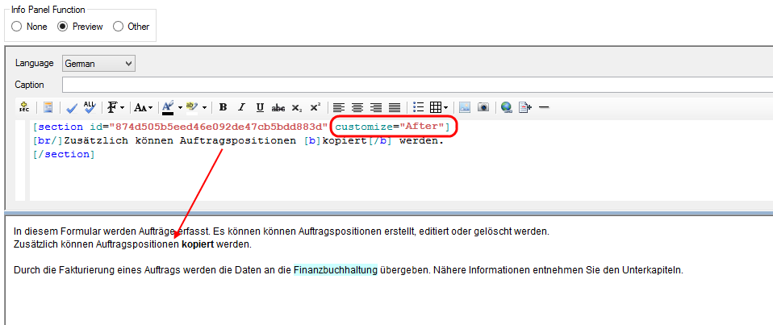

# Customizing

Sections sind nur in Dokumentationen von Forms und Documentation-Elementen verfügbar und dienen dazu, längere Texte in Abschnitte zu unterteilen, die in Customizations dieser Elemente ausgetauscht oder ergänzt werden können.

##### **Beispiel:**

Eine Dokumentation eines Forms in Package **P1** sieht wie folgt aus:

Es ist zu sehen, dass der Text in zwei Sections unterteilt ist, die jeweils mit einer einmaligen ID ausgestattet sind. Wird dieses Form nun in einem Package **P2** gecustomized und an der Funktion des Forms Änderungen vorgenommen, die danach nicht mehr mit der Dokumentation aus der Basis übereinstimmen, muss die Dokumentation der Customization ebenfalls angepasst werden. Meistens ist es jedoch der Fall, dass nur einzelne Teile oder nur wenige Sätze aus der bisherigen Dokumentation geändert werden müssen, um die Dokumentation zu korrigieren.

Im konkreten Beispiel könnte im gecustomizten Form die Möglichkeit geschaffen worden sein, Auftragspositionen auch kopieren zu können. Diese Information sollte nun in die Dokumentation des neuen gecustomizten Forms eingefügt werden. Praktisch wäre natürlich eine Ergänzung nach dem ersten Satz *„…editiert oder gelöscht werden.“*. Während in einem einzelnen Package die Sections funktionslos sind, stellen sie beim Customizing von Forms oder Documentation-Elementen einen Einsprungpunkt für zusätzliche Dokumentationen bereit. Um die zusätzliche Information in die Dokumentation einzufügen, muss im gecustomizten Form eine neue Section über den Button in der Werkzeugleiste erstellt werden:

Customizing einer Section:

Framework Studio erkennt, dass das Form gecustomized wurde und listet in der Combobox **Base Section** alle in der Basis verfügbaren Section-ID’s auf. Über das [Panel Other](./editor.md#panel-other) des Editors kann zur Kontrolle der zu editierenden Section(-ID) die Basis-Dokumentation des Formulars angezeigt werden.

Im Dialog für die Section-Auswahl gibt es drei Möglichkeiten, eine Section zu überschreiben:

##### **Override**

Die Section aus der Basis wird durch den neuen Text ersetzt.

##### **Before**

Der neue Text wird beim Rendern der Dokumentation des gecustomizten Formulars **vor** dem Text aus der Basis eingefügt.

##### **After**

Der neue Text wird beim Rendern der Dokumentation des gecustomizten Formulars **nach** dem Text aus der Basis eingefügt.

Wird der Dialog geschlossen, wird eine neue Section erstellt, die ein **customize**-Attribut beinhaltet, in der die ausgewählte Customizing-Methode steht.

Die zusätzliche Information (Auftragspositionen können kopiert werden) kann nun eingegeben werden. Wird eine Vorschau der Dokumentation gerendert, erscheint der neue Text an der gewünschten Stelle in der Basis-Dokumentation (in diesem Fall hinter dem ersten Satz aus der Basis).
