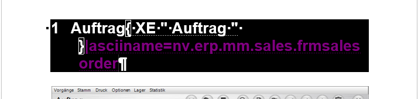

# Doc2Help

> [!IMPORTANT]
> Da Framework Studio mittlerweile auch selbst in der Lage ist, mittels des HTML-Exports ([HTML](export-wizards.md#html)) komplette Online-Hilfen zu generieren, sollte diese Möglichkeit verwendet werden, da Doc2Help Größenbeschränkungen hat, die bei sehr umfangreichen Dokumentationen ggf. zu Fehlern führen können.

Doc2Help ist eine Anwendung der Firma **ComponentOne**, die in der Lage ist, aus Word-Dateien Onlinehilfen in HTML zu generieren. Um normale docx-Dateien jedoch mit Doc2Help verarbeiten zu können, müssen einige Vorkehrungen getroffen werden. Framework Studio bietet die Möglichkeit, mit der Option **Doc2Help** in den [Wizard-Optionen](export-wizards.md#wizard-optionen) eben diese Vorkehrungen automatisch zu treffen. Um z.B. in einer von Doc2Help generierten Onlinehilfe über einen Url-Parameter ein bestimmtes Kapitel aufzurufen, muss an jede Überschrift in Word eine besondere Formatvorlage eingebunden werden und ein Parameter mit dem Namen **asciiname** definiert werden.

Parameter am Kapitel für Doc2Help:

Wird eine Dokumentation über den Export Wizard erstellt und die Option **Doc2Help** aktiviert ist, sind keine weiteren Anpassungen an der Word-Datei nötig. Die Dokumentation kann in Doc2Help importiert und sofort in eine Onlinehilfe konvertiert werden.
