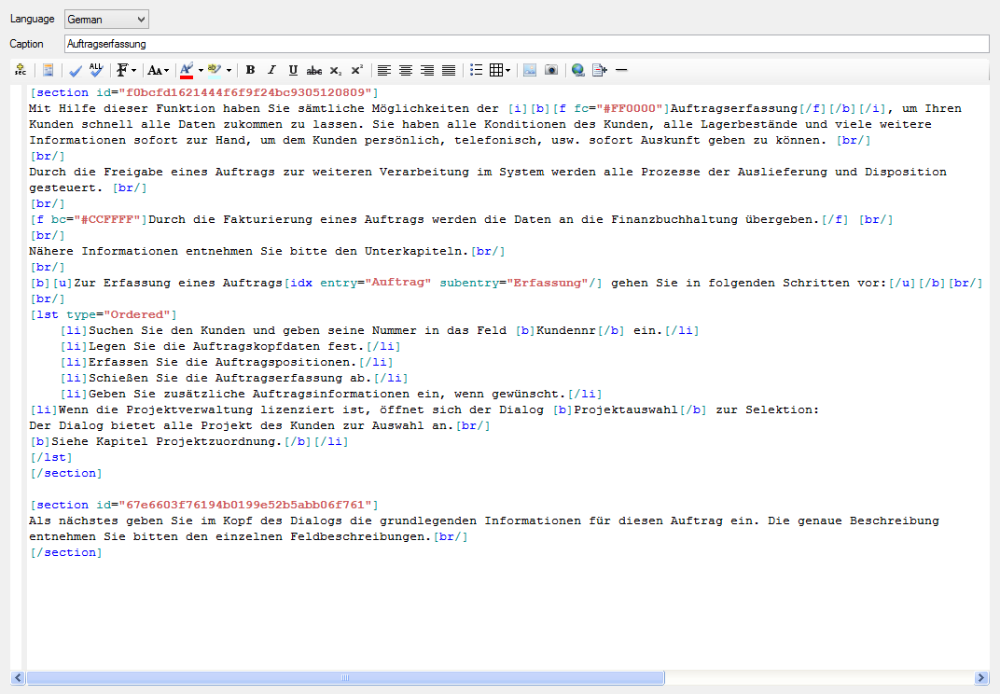
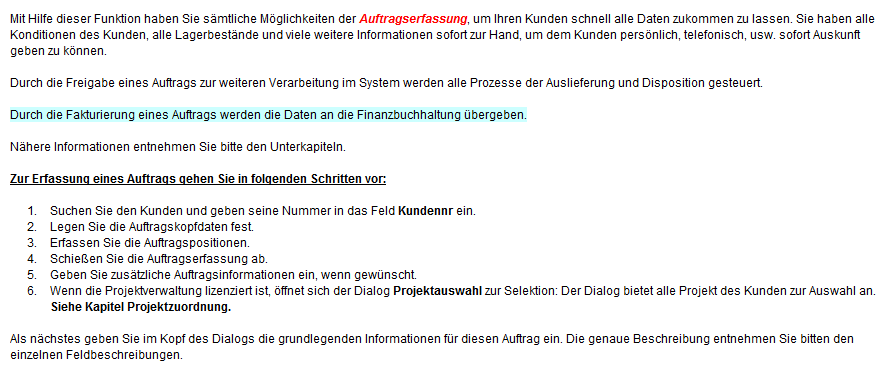
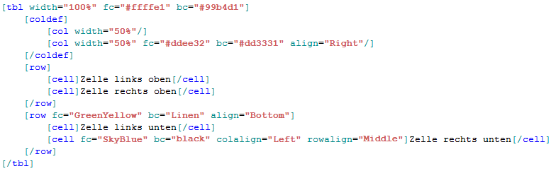
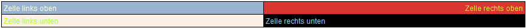

# DocML

Bei einer Dokumentation in Textform bedarf es grundsätzlich der Möglichkeit, den Text zu formatieren und zu strukturieren. Für diesen Zweck bedient sich Framework Studio der eigens entwickelten Dokumentationssprache **DocML**. Ein Vorteil dieser Sprache ist, dass sie in beliebige andere Formate konvertiert werden kann. So ist die Vorschau einer Dokumentation in Framework Studio z.B. in Form von HTML realisiert. Es besteht aber auch die Möglichkeit, die gesamte Dokumentation als Worddatei zu exportieren.

Um einen ersten Eindruck der Sprache zu bekommen folgt ein kurzer Auszug einer Dokumentation eines Formulars:



Und hier die Ausgabe im Preview-Fenster in Framework Studio (HTML):



## Aufbau der Sprache

Die Sprache **DocML** besteht weitestgehend aus dem Text, welcher die Dokumentation widerspiegelt sowie Tags, die mit Attributen versehen sein können, um den beinhaltenden Text zu formatieren oder zu strukturieren.

### Tags

Ein Tag definiert sich durch eine öffnende eckige Klammer **`[`**, einem Bezeichner (um welches Tag es sich handelt), gefolgt von einer schließenden eckigen Klammer **`]`**:

**`[`**  + Bezeichner + **`]`**

<u>Beispiele:</u> **`[b]`**, **`[tbl]`**, **`[f]`**, **`[ac]`**

Dabei wird zwischen öffnenden und schließenden Tags unterschieden. Das schließende Tag beinhaltet nach der öffnenden Klammer einen Schrägstrich **`/`**:

**`[/`** + Bezeichner + **`]`**

<u>Beispiele:</u> **`[/b]`**, **`[/tbl]`**, **`[/f]`**, **`[/ac]`**

Angewendet wird ein Tag immer auf den Text, der zwischen dem öffnenden und schließenden Tag steht:

**`[b]`** Dies ist ein fett gedruckter Text **`[/b]`**

Tags können ineinander geschachtelt werden um mehrere Formatierungen auf einen Textabschnitt vorzunehmen:

**`[b][i]`** Dies ist ein fett gedruckter und kursiver Text **`[/i][/b]`**

Es ist zu beachten, dass öffnende Tags genau in der umgekehrten Reihenfolge geschlossen werden müssen.

<u>Folgende Beispiele sind korrekt:</u>

* `[b][i]`Ein Text`[/i][/b]`
* **`[i][b]`** Ein Text **`[/b][/i]`**
* **`[b][i][u]`** Ein Text **`[/u][/i][/b]`**

<u>Folgende Beispiele sind ***nicht*** korrekt:</u>

* `[b][i]`Ein Text`[/b][/i]`
* **`[i][b]`** Ein Text **`[/i][/b]`**
* **`[b][i][u]`** Ein Text **`[/b][/u][/i]`**

Eine komplette Auflistung aller verfügbaren Tags in DocML und deren Funktion findet sich im Kapitel [Tag Reference](#tag-reference).

### Leere Tags

Eine besondere Untergruppe der Tags bilden die leeren Tags. Dies sind öffnende und schließende Tags in einem. Leere Tags können keinen Text oder andere Tags beinhalten. Leere Tags definieren sich durch eine öffnende eckige Klammer **`[`**, den Bezeichner, einen Schrägstrich **`/`** und die schließende eckige Klammer **`]`**:

**`[`** + Bezeichner + **`/`** + **`]`**

<u>Beispiele:</u> **`[screenshot/]`**, **`[img/]`**, **`[br/]`**

Diese leeren Tags dienen z.B. dem Einfügen eines Bildes oder Zeilenumbruch in die Dokumentation.

### Tag-Attribute

Die meisten Tags können in ihrem Verhalten durch Attribute gesteuert werden. Ein Attribut definiert sich durch einen Bezeichner gefolgt, von einem Gleichheitszeichen **`=`** sowie dem Attributwert in Hochkommas. Attribute können in öffnenden und leeren Tags vorkommen:

In öffnendem Tag:

`[f` **`bg="ff0000"`** `]`Text mit roter Hintergrundfarbe`[/f]`

In leerem Tag:

`[screenshot` **`caption="Auftragserfassung"`** `/]`

Im Kapitel [Tag Reference](#tag-reference) ist ausführlich beschrieben, welcher Tag mit welchen Attributen gesteuert werden kann.

## Tag Reference

Nachfolgend werden alle verfügbaren Tags und die zugehörigen Attribute der **DocML**-Sprache beschrieben. Die Tags unterscheiden sich in zwei Klassen, [Inline-Tags](#inline-tags) und [Block-Tags](#block-tags)
. **Inline-Tags** werden meist für Formatierungszwecke genutzt wie z.B. Fettschrift oder Textfarbe, während **Block-Tags** Strukturen wie Tabellen, Listen oder Abschnitte definieren.

> [!WARNING]
> Grundsätzlich gilt: **Inline-Tags** können keine **Block-Tags** beinhalten

### Inline-Tags

#### Font

**Eigenschaften:**

* **Bezeichner:** **`[f]`**
* **Leeres Tag:** nein
* **Funktion:** Wendet Schriftart, Schriftgröße, Schriftfarbe und Hintergrundfarbe auf den beinhaltenden Text an

**Attributes:**

| Bez.  | Benötigt | Mögliche Werte                                                                      | Funktion                                                          |
| :---- | :------: | :---------------------------------------------------------------------------------- | :---------------------------------------------------------------- |
| style |   nein   | Normal, Code                                                                        | Stellt die Schriftart zwischen Arial und einer Code-Schriftart um |
| size  |   nein   | XXXL, XXL, XL, L, Normal, S, XS, XXS oder XXXS                                      | Schriftgröße                                                      |
| fc    |   nein   | Systemfarben wie `red`, `black`, `blue` oder Farbangaben in HEX wie z.B. `#FF00000` | Textfarbe                                                         |
| bc    |   nein   | Systemfarben wie `red`, `black`, `blue` oder Farbangaben in HEX wie z.B. `#FF00000` | Hintergrundfarbe                                                  |

**Beispiel:**

```fs
[f style="code" size="xl" fc="red" bc="#00ff00"]Möglichkeiten des Font-Tags[/f]
```

#### Bold

**Eigenschaften:**

* **Bezeichner:** **`[b]`**
* **Leeres Tag:** nein
* **Funktion:** Markiert den beinhaltenden Text als fett geschrieben

**Attributes:** Keine

**Beispiel:**

```fs
[b]Dieser Text ist fett geschrieben[/b]
```

#### Italic

**Eigenschaften:**

* **Bezeichner:** **`[i]`**
* **Leeres Tag:** nein
* **Funktion:** Markiert den beinhaltenden Text als kursiv geschrieben

**Attributes:** Keine

**Beispiel:**

```fs
[i]Dieser Text ist kursiv geschrieben[/i]
```

#### Underline

**Eigenschaften:**

* **Bezeichner:** **`[u]`**
* **Leeres Tag:** nein
* **Funktion:** Markiert den beinhaltenden Text als unterstrichen

**Attributes:** Keine

**Beispiel:**

```fs
[u]Dieser Text ist unterstrichen[/u]
```

#### Strikethrough

**Eigenschaften:**

* **Bezeichner:** **`[s]`**
* **Leeres Tag:** nein
* **Funktion:** Markiert den beinhaltenden Text als durchstrichen

**Attributes:** Keine

**Beispiel:**

```fs
[s]Dieser Text ist durchstrichen[/s]
```

#### Subscript

**Eigenschaften:**

* **Bezeichner:** **`[sub]`**
* **Leeres Tag:** nein
* **Funktion:** Markiert den beinhaltenden Text als tiefgestellt

**Attributes:** Keine

**Beispiel:**

```fs
[sub]Dieser Text ist tiefgestellt[/sub]
```

#### Superscript

**Eigenschaften:**

* **Bezeichner:** **`[sup]`**
* **Leeres Tag:** nein
* **Funktion:** Markiert den beinhaltenden Text als hochgestellt

**Attributes:** Keine

**Beispiel:**

```fs
[sup]Dieser Text ist hochgestellt[/sup]
```

#### Align Left

**Eigenschaften:**

* **Bezeichner:** **`[al]`**
* **Leeres Tag:** nein
* **Funktion:** Markiert den beinhaltenden Text als linksbündig

**Attributes:** Keine

**Beispiel:**

```fs
[al]Dieser Text ist linksbündig[/al]
```

#### Center

**Eigenschaften:**

* **Bezeichner:** **`[ac]`**
* **Leeres Tag:** nein
* **Funktion:** Markiert den beinhaltenden Text als zentriert

**Attributes:** Keine

**Beispiel:**

```fs
[ac]Dieser Text ist zentriert[/ac]
```

#### Align Right

**Eigenschaften:**

* **Bezeichner:** **`[ar]`**
* **Leeres Tag:** nein
* **Funktion:** Markiert den beinhaltenden Text als rechtsbündig

**Attributes:** Keine

**Beispiel:**

```fs
[ar]Dieser Text ist rechtsbündig[/ar]
```

#### Justify

**Eigenschaften:**

* **Bezeichner:** **`[aj]`**
* **Leeres Tag:** nein
* **Funktion:** Markiert den beinhaltenden Text als Blocksatz

**Attributes:** Keine

**Beispiel:**

```fs
[aj]Dieser Text ist im Blocksatz geschrieben[/aj]
```

#### Image

**Eigenschaften:**

* **Bezeichner:** **`[img]`**
* **Leeres Tag:** ja
* **Funktion:** Bindet eine Bildressource aus Framework Studio in die Dokumentation ein
  
**Besonderheiten:**

* Wird nur das width- oder height-Attribut angegeben, wird das Seitenverhältnis des Bildes beibehalten.
* Werden keine Größenangaben gemacht, wird die Größe des Quellbildes verwendet.
* Eine Bildbezeichnung (caption-Attribut) kann nur definiert werden, wenn das inline-Attribut nicht definiert ist oder den Wert `false` hat.

**Attributes:**

| Bez.    | Benötigt | Mögliche Werte                          | Funktion                                                                                                    |
| :------ | :------: | :-------------------------------------- | :---------------------------------------------------------------------------------------------------------- |
| src     |    ja    | ID einer Framework Studio Bildressource | Verweist auf das Bild, welches in der Framework Studio Resource eingebunden ist                             |
| width   |   nein   | z.B. „2.3cm“, „3.3in“, „14,34cm“        | Breite des angezeigten Bildes. Kommawerte müssen mit Punkt „.“ angegeben werden (z.B. width=“3.4in“)        |
| height  |   nein   | z.B. „2.3cm“, „3.3in“, „14,34cm“        | Höhe des angezeigten Bildes. Kommawerte müssen mit Punkt „.“ angegeben werden (z.B. height=“4.7in“)         |
| caption |   nein   | Text                                    | Bildbezeichnung                                                                                             |
| inline  |   nein   | `true`, `false`                         | Wenn `true` wird das Bild wird ein Textzeichen im Textfluss behandelt, sonst wird eine neue Zeile eingefügt |

**Beispiel:**

```fs
[img src="6600e9ad6c3d4ce4ab4c51b7d2a36844" height="1.5cm" inline="true"/]
[img src="6600e9ad6c3d4ce4ab4c51b7d2a36844" caption=“Beispielbild“/]
[img src="6600e9ad6c3d4ce4ab4c51b7d2a36844" width=“3cm“ height="1.5cm" caption=“Test“/]
```

#### Screenshot

**Eigenschaften:**

* **Bezeichner:** **`[screenshot]`**
* **Leeres Tag:** ja
* **Funktion:** Bindet einen automatisch generierten Screenshot des Forms als Bild in die Dokumentation ein.
  
**Besonderheiten:**

* Kann nur in Form-Dokumentationen verwendet werden.
* Werden keine Größenangaben gemacht, wird die Größe des Forms verwendet.

**Attributes:**

| Bez.    | Benötigt | Mögliche Werte                   | Funktion                                                                                             |
| :------ | :------: | :------------------------------- | :--------------------------------------------------------------------------------------------------- |
| width   |   nein   | z.B. „2.3cm“, „3.3in“, „14,34cm“ | Breite des angezeigten Bildes. Kommawerte müssen mit Punkt „.“ angegeben werden (z.B. width=“3.4in“) |
| caption |   nein   | Text                             | Bezeichnung des Screenshots                                                                          |

**Beispiel:**

```fs
[screenshot/]
[screenshot width="17cm"/]
[screenshot width="14.3in" caption="Kostenrechnung"/] caption="Test"/]
```

#### Link

**Eigenschaften:**

* **Bezeichner:** **`[lnk]`**
* **Leeres Tag:** ja
* **Funktion:** Erstellt einen Querverweis auf ein anderes Kapitel oder einen Hyperlink auf eine Url.
  
**Attributes:**

| Bez. | Benötigt | Mögliche Werte                                                                   | Funktion                                                                        |
| :--- | :------: | :------------------------------------------------------------------------------- | :------------------------------------------------------------------------------ |
| src  |    ja    | • ID eines Forms oder Documentation-Elements <br />• Url mit führendem `http://` | Querverweis in der fertigen Dokumentation oder Hyperlink auf die angegebene Url |
| text |    ja    | Text                                                                             | Der angezeigte Text des Links                                                   |

**Beispiel:**

```fs
[lnk src="f037492b790d24c5b9f16cb4120465e25" text="Artikeldetails"/]
[lnk src="http://www.google.de/" text="Suchen mit Google"/]
```

#### Index Entry

**Eigenschaften:**

* **Bezeichner:** **`[idx]`**
* **Leeres Tag:** ja
* **Funktion:** Erstellt einen Eintrag im Index der Dokumentation.
  
**Attributes:**

| Bez.     | Benötigt | Mögliche Werte | Funktion                                            |
| :------- | :------: | :------------- | :-------------------------------------------------- |
| entry    |    ja    | text           | Definiert einen Haupteintrag im Index               |
| subentry |   nein   | Text           | Definiert einen Untereintrag unter dem Haupteintrag |

**Beispiel:**

```fs
[idx entry="Haupteintrag"/]
[idx entry="Haupteintrag" subentry="Untereintrag"/]
```

#### Base

**Eigenschaften:**

* **Bezeichner:** **`[base]`**
* **Leeres Tag:** ja
* **Funktion:** Bindet die Basis-Dokumentation eines Controls, Component Properties, einer DBColumn oder eines Metadatentyps ein.

**Besonderheiten:**

* Wird nur an Control, Component Property, DBColumn und Metadatentyp unterstützt.
* Mehr Information in den Kapiteln [Vererbung](./vererbung.md) und [Customizing](./customizing.md).

**Attributes:** Keine

**Beispiel:**

```fs
[idx entry="Haupteintrag"/]
[idx entry="Haupteintrag" subentry="Untereintrag"/]
```

#### Line

**Eigenschaften:**

* **Bezeichner:** **`[line]`**
* **Leeres Tag:** ja
* **Funktion:** Erstellt eine Line als Absatztrenner über die komplette Seitenbreite.

**Attributes:** Keine

**Beispiel:**

```fs
[line/]
```

#### Break

**Eigenschaften:**

* **Bezeichner:** **`[br]`**
* **Leeres Tag:** ja
* **Funktion:** Erstellt einen Zeilenumbruch.

**Attributes:** Keine

**Beispiel:**

```fs
[br/]
```

### Block-Tags

#### Section

**Eigenschaften:**

* **Bezeichner:** **`[section]`**
* **Leeres Tag:** optional
* **Funktion:** Definiert einen Textabschnitt in einer Form-Dokumentation oder einem Documentation-Element, der durch die angegebene ID customizing-fähig ist. Siehe [Customizing](./customizing.md).
  
**Besonderheiten:**

* Kann sich nur auf oberster Ebene und somit nicht in anderen Tags befinden.
* Wird nur in Form- und Documentation-Elementen unterstützt.

**Attributes:**

| Bez.      |     Benötigt      | Mögliche Werte          | Funktion                                     |
| :-------- | :---------------: | :---------------------- | :------------------------------------------- |
| id        |        ja         | 32-stellige GUID        | Eindeutige ID des Textabschnitts             |
| customize | Im Custom-Package | before, after, override | Überschreibungsart der gecustomizten Section |

**Beispiel:**

```fs
[section id=“ f0bcfd1621444f6f9f24bc9305120809“/]
[section id=“ f0bcfd1621444f6f9f24bc9305120809“ customize=“after“/]
```

#### List

**Eigenschaften:**

* **Bezeichner:** **`[lst]`**
* **Leeres Tag:** nein
* **Funktion:** Erstellt eine geordnete oder ungeordnete Liste von ListItems (li-Tags).
  
**Besonderheiten:**

* Kann nur li-Tags beinhalten.
* Das Symbol kann nur definiert werden, wenn das type-Attribut als „unordered“ definiert ist.

**Attributes:**

| Bez.   | Benötigt | Mögliche Werte       | Funktion                                           |
| :----- | :------: | :------------------- | :------------------------------------------------- |
| type   |    ja    | ordered, unordered   | Definiert den Listentyp                            |
| symbol |   nein   | disk, circle, square | Definiert das Listensymbol bei ungeordneten Listen |

**Beispiel:**

```fs
[lst type="unordered" symbol="square"]
    [li]ListItem 1[/li]
    [li]ListItem 2[/li]
    [li]ListItem 3[/li]
[/lst]

[lst type="ordered"]
    [li]ListItem 1[/li]
    [li]ListItem 2[/li]
    [li]ListItem 3[/li]
[/lst]
```

#### ListItem

**Eigenschaften:**

* **Bezeichner:** **`[li]`**
* **Leeres Tag:** nein
* **Funktion:** Erstellt einen Eintrag in einer Liste.
  
**Besonderheiten:**

* Kann nur innerhalb von lst-Tags verwendet werden.

**Attributes:** Keine

**Beispiel:**

```fs
[lst type="unordered" symbol="square"]
    [li]Ein ListItem[/li]
    [li]Noch ein ListItem[/li]
[/lst]
```

#### Table

**Eigenschaften:**

* **Bezeichner:** **`[tbl]`**
* **Leeres Tag:** nein
* **Funktion:** Erstellt eine Tabelle.
  
**Besonderheiten:**

* Die Breite der Tabelle kann absolut als auch prozentual angegeben werden.
* Wird keine Breite angegeben, definiert sich die Tabellenbreite über die Summe der Spaltenbreiten.
* Ist die Tabellenbreite in Prozent angegeben, müssen auch die Spaltenbreiten in Prozent angegeben werden.
* Ist keine Tabellenbreite angegeben, müssen die Spaltenbreiten in absoluten Werten angegeben werden.
* Eine Tabelle muss eine Spaltendefinition (coldef-Tag) inkl. Spalten (col-Tags) sowie mindestens eine Zeile (row-Tag) beinhalten.

**Attributes:**

| Bez.  | Benötigt | Mögliche Werte                                                                                             | Funktion                                                                                                                                                                           |
| :---- | :------: | :--------------------------------------------------------------------------------------------------------- | :--------------------------------------------------------------------------------------------------------------------------------------------------------------------------------- |
| width |   nein   | • Absolute Angaben wie z.B. „2.3cm“, „3.3in“, „14,34cm“ <br /> • Prozentuale Angaben wie z.B. „50%“, „75%“ | Breite der Tabelle. Kommawerte müssen mit Punkt „.“ angegeben werden (z.B. width=“3.4in“). Die prozentuale Angabe bezieht sich auf die Seitenbreite bzw. die Fensterbreite im HTML |
| fc    |   nein   | Systemfarben wie „red“, „black“, „blue“ oder Farbangaben in HEX wie z.B. „#FF0000“                         | Textfarbe für die gesamte Tabelle. Kann durch Spalten, Zeilen oder Zellen überschrieben werden.                                                                                    |
| bc    |   nein   | Systemfarben wie „red“, „black“, „blue“ oder Farbangaben in HEX wie z.B. „#FF0000“                         | Hintergrundfarbe  für die gesamte Tabelle. Kann durch Spalten, Zeilen oder Zellen überschrieben werden.                                                                            |

**Beispiel:**



**Ausgabe:**



#### Column Definition

**Eigenschaften:**

* **Bezeichner:** **`[coldef]`**
* **Leeres Tag:** nein
* **Funktion:** Beinhaltet die Spaltendefinition einer Tabelle.
  
**Besonderheiten:**

* Muss ein oder mehrere Spalten (col-Tags) beinhalten.
* Kann nur innerhalb eines tbl-Tags vorkommen.
* Kann innerhalb eines tbl-Tags nur einmal vorkommen.
* Kann nur col-Tags beinhalten.
* Muss innerhalb des tbl-Tags als erstes auftreten (vor jeglichen Zeilendefinitionen bzw. row-Tags).

**Attributes:** Keine

**Beispiel:**

```fs
[coldef]
    [col width="50%"/]
    [col width="50%" fc="#ddee32" bc="#dd3331" align="right"/]
[/coldef]
```

#### Column

**Eigenschaften:**

* **Bezeichner:** **`[col]`**
* **Leeres Tag:** ja
* **Funktion:** Definiert eine Spalte innerhalb einer Tabelle.
  
**Besonderheiten:**

* Kann nur innerhalb eines coldef-Tags vorkommen.
* Die Breite der Spalte kann absolut oder prozentual angegeben werden.
* Ist die Tabellenbreite (im tbl-Tag) prozentual angegeben, muss die Spaltenbreite ebenfalls prozentual angegeben werden.
* Ist keine Tabellenbreite (im tbl-Tag) angegeben, muss die Spaltenbreite absolut angegeben werden.

**Attributes:**

| Bez.  | Benötigt | Mögliche Werte                                                                                             | Funktion                                                                                                                                                                           |
| :---- | :------: | :--------------------------------------------------------------------------------------------------------- | :--------------------------------------------------------------------------------------------------------------------------------------------------------------------------------- |
| width |   nein   | • Absolute Angaben wie z.B. „2.3cm“, „3.3in“, „14,34cm“ <br /> • Prozentuale Angaben wie z.B. „50%“, „75%“ | Breite der Tabelle. Kommawerte müssen mit Punkt „.“ angegeben werden (z.B. width=“3.4in“). Die prozentuale Angabe bezieht sich auf die Seitenbreite bzw. die Fensterbreite im HTML |
| fc    |   nein   | Systemfarben wie „red“, „black“, „blue“ oder Farbangaben in HEX wie z.B. „#FF0000“                         | Textfarbe für die gesamte Tabelle. Kann durch Spalten, Zeilen oder Zellen überschrieben werden.                                                                                    |
| bc    |   nein   | Systemfarben wie „red“, „black“, „blue“ oder Farbangaben in HEX wie z.B. „#FF0000“                         | Hintergrundfarbe  für die gesamte Tabelle. Kann durch Spalten, Zeilen oder Zellen überschrieben werden.                                                                            |
| align |   nein   | left, center, right                                                                                        | Horizontale Ausrichtung der Spalte. Kann durch das colalign-Attribut an der Zelle überschrieben werden.                                                                            |

**Beispiel:**

```fs
[col width="4.5cm"/]
[col width="50%" fc="#ddee32" bc="#dd3331" align="right"/]
```

#### Row

**Eigenschaften:**

* **Bezeichner:** **`[row]`**
* **Leeres Tag:** nein
* **Funktion:** Definiert eine Zeile innerhalb einer Tabelle.
  
**Besonderheiten:**

* Kann nur innerhalb eines tbl-Tags vorkommen.
* Muss innerhalb des tbl-Tags unterhalb des coldef-Tags stehen.
* Kann nur cell-Tags beinhalten.

**Attributes:**

| Bez.  | Benötigt | Mögliche Werte                                                                     | Funktion                                                                                                |
| :---- | :------: | :--------------------------------------------------------------------------------- | :------------------------------------------------------------------------------------------------------ |
| fc    |   nein   | Systemfarben wie „red“, „black“, „blue“ oder Farbangaben in HEX wie z.B. „#FF0000“ | Textfarbe für die gesamte Tabelle. Kann durch Spalten, Zeilen oder Zellen überschrieben werden.         |
| bc    |   nein   | Systemfarben wie „red“, „black“, „blue“ oder Farbangaben in HEX wie z.B. „#FF0000“ | Hintergrundfarbe  für die gesamte Tabelle. Kann durch Spalten, Zeilen oder Zellen überschrieben werden. |
| align |   nein   | top, middle, bottom                                                                | Vertikale Ausrichtung der Zeile. Kann durch das rowalign-Attribut an der Zelle überschrieben werden.    |

**Beispiel:**

```fs
[row fc=“#ddee43“]
    [cell]Zelle links oben[/cell]
    [cell rowalign=“top“]Zelle rechts oben[/cell]
[/row]
[row fc="GreenYellow" bc="Linen" align="bottom"]
    [cell]Zelle links unten[/cell]
    [cell bc="black" colalign="left" rowalign="middle"]Zelle rechts unten[/cell]
[/row]
```

#### Cell

**Eigenschaften:**

* **Bezeichner:** **`[cell]`**
* **Leeres Tag:** nein
* **Funktion:** Definiert eine Zelle innerhalb einer Zeile.
  
**Besonderheiten:**

* Kann nur innerhalb eines row-Tags vorkommen.
* Muss innerhalb eines row-Tags genauso oft vorkommen wie die Anzahl der Spalten im coldef-Tag der Tabelle.

**Attributes:**

| Bez.     | Benötigt | Mögliche Werte                                                                     | Funktion                                                                                                |
| :------- | :------: | :--------------------------------------------------------------------------------- | :------------------------------------------------------------------------------------------------------ |
| fc       |   nein   | Systemfarben wie „red“, „black“, „blue“ oder Farbangaben in HEX wie z.B. „#FF0000“ | Textfarbe für die gesamte Tabelle. Kann durch Spalten, Zeilen oder Zellen überschrieben werden.         |
| bc       |   nein   | Systemfarben wie „red“, „black“, „blue“ oder Farbangaben in HEX wie z.B. „#FF0000“ | Hintergrundfarbe  für die gesamte Tabelle. Kann durch Spalten, Zeilen oder Zellen überschrieben werden. |
| rowalign |   nein   | top, middle, bottom                                                                | Vertikale Ausrichtung der Zelle.                                                                        |
| colalign |   nein   | left, center, right                                                                | Horizontale Ausrichtung der Zelle.                                                                      |

**Beispiel:**

```fs
[row fc=“#ddee43“]
    [cell fc=“#3434ee“]Zelle links oben[/cell]
    [cell colalign=“center“]Zelle rechts oben[/cell]
[/row]
[row fc="GreenYellow" bc="Linen" align="bottom"]
    [cell]Zelle links unten[/cell]
    [cell bc="black" colalign="left" rowalign="middle"]Zelle rechts unten[/cell]
[/row]
```
