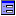
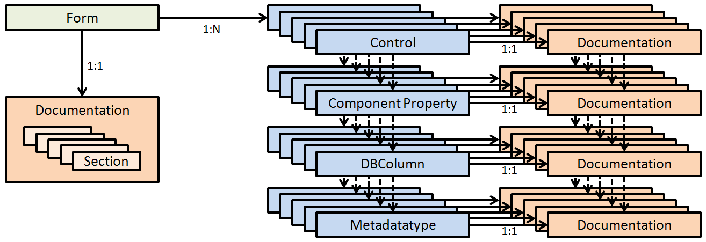
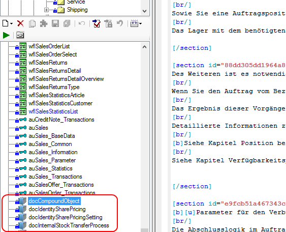

# Dokumentations-System

Framework Studio bietet die Möglichkeit, die entwickelten Applikationen mittels eines in die IDE integrierten Dokumentationssystems zu dokumentieren. Im Gegensatz zu herkömmlichen Dokumentationen mittels Microsoft Word oder Latex bietet das System jedoch gravierende Vorteile, da es komplett an die Datenstruktur und –hierarchie von Framework Studio angepasst ist.

## Features

Um den Einstieg in das Dokumentationssystem zu vereinfachen, werden im Folgenden die wichtigsten Features vorgestellt.

### Automatische Generierung der Dokumentationsstruktur

*„Wo steht was?“* ist ein großes Problem im Bereich Dokumentation. Ein Mitarbeiter beschreibt erst die Steuerelemente des Formulars und danach dessen Funktionalität, ein anderer macht es genau anders herum. Framework Studio trennt sich vom klassischen Weg der Dokumentationserstellung. Egal, ob die Dokumentation später als Word oder HTML exportiert wird, die Struktur bleibt dieselbe. Jedes Formular folgt dem gleichen Schema, alles hat seinen zugewiesenen Platz durch vordefinierte Formatvorlagen seitens Framework Studio.

### Vererbung vom Metadatentyp bis zum Steuerelement

Hinter fast jedem Steuerelement in Framework Studio verbirgt sich als DataSource ein Component Property, eine DBColumn oder ein [Metadatentyp](../mdt/metadatentypen.md). Hier verhält sich die Dokumentation ähnlich wie die Tooltips. Wird ein [Metadatentyp](../mdt/metadatentypen.md) dokumentiert, steht diese Dokumentation auch am Steuerelement zur Verfügung und wird in die endgültige Fassung herausgerendert. Dokumentationen können vererbt, gecustomized und überschrieben werden, sollte sich z.B. der Kontext in einem Formular ändern.

### Customizing und Package-Struktur

Das Herz von Framework Studio bildet das Package-System. Das Dokumentationssystem folgt diesem und bietet voll Customizing-fähige Dokumentationen über Package-Grenzen hinweg. Vererben, überschreiben, anhängen, austauschen… die Dokumentation ist anpassbar bis zum letzten Satz.

### Mehrsprachigkeit

Erfassen Sie die Dokumentation in allen möglichen Sprachen. Der Dokumentationseditor unterstützt das parallele Bearbeiten von mehreren Sprachen. Wenn Sie die englische Dokumentation schreiben, nehmen Sie sich einfach die deutsche Dokumentation als Vorlage für die Übersetzung zur Hand.

### Screenshot-Generierung

Screenshot erstellen, in das Grafikprogramm laden, den Ausschnitt zurechtschneiden, Screenshot in das Dokument einfügen, Größe anpassen… und nach einer Woche ist der Screenshot veraltet, weil drei neue Steuerelemente hinzugekommen sind. Um dieses Problem aus dem Weg zu schaffen, bietet das Dokumentationssystem eine Screenshot-Generierung für Formulare. Bei jedem Herausschreiben der Dokumentation wird von Framework Studio anhand der Steuerelementdaten des Designers ein Screenshot des Formulars erstellt und automatisch in die Dokumentation eingefügt. So sind die Masken in der Dokumentation stets auf dem neuesten Stand und der Benutzer findet jedes Steuerelement wo er es erwartet.

### Theme Support

In Framework Studio 3.5 hielten Themes Einzug in die IDE. Die Dokumentation lässt sich für verschiedene Themes rendern. Sind beispielsweise automatisch generierte Screenshots in die Dokumentation eingebunden, werden diese im jeweiligen Theme gerendert. Auch für eingebundene Bilder können je Theme unterschiedliche Bilder definiert werden.

## Aufbau des Dokumentationssystems

Die beiden Elemente, die das Fundament des Dokumentationssystems bilden, sind das Form- und das Documentation-Element (siehe [Documentation-Element](#documentation-element)). Diese Elemente werden mittels einer Baumstruktur (siehe [Chapter Tree](./chapter-tree.md)) in Kapitel unterteilt. Somit bildet jedes Form- oder Documentation-Element ein Kapitel mit eigener Kapitelnummer in der fertigen Dokumentation ab.

### Form

Sie erkennen Form an einem -Icon.

Elemente des Forms mit Dokumentation:

Ein Form definiert sich grundsätzlich durch dessen Controls. Jedes Control kann eine DataSource zugewiesen haben, die über ein Component Property auf eine DBColumn verweist, die wiederum einen Wert eines [Metadatatypes](../mdt/metadatentypen.md) kapseln kann. Diesem Mechanismus folgt das Dokumentationssystem. Es besteht die Möglichkeit, auf jeder einzelnen Ebene in Framework Studio eine Dokumentation zu hinterlegen, die von der nächst höheren Instanz verwendet werden kann (siehe [Vererbung](./vererbung.md)).

So können am Metadatentyp z.B. Informationen zum Wertebereich oder zur Genauigkeit angegeben werden. In der Dokumentation des Controls, welches auf diesen Metadatentyp verweist, kann z.B. die Dokumentation des Metadatentyps eingebunden werden und steht dem Leser somit als zusätzliche Information zur Verfügung.

Während in der Dokumentation eines Controls ausschließlich auf die Funktion dessen eingegangen werden sollte, dient die Dokumentation des Formulars der generellen Beschreibung, d.h. es können beliebige Texte verfasst werden, die die Funktionalität des Formulars im Gesamten beschreibt. So können Beispiele, Prozesse, Arbeitsanweisungen usw. beschrieben werden. Im Gegensatz zu den Control-Dokumentationen werden Form-Dokumentationen in sogenannte *Sections* unterteilt. Diese dienen als Text-Trenner für das Customizing (siehe [Customizing](./customizing.md)).

### Documentation-Element

Sie erkennen Documentation-Element an einem -Icon.

Die meisten Dokumentationen einer Anwendung beziehen sich auf ein oder mehrere Formulare. Oft muss aber auch ein Hintergrundprozess wie z.B. eine Preisfindung oder ein Importvorgang dokumentiert werden, für den es keine visuelle Repräsentation gibt. Für diesen Zweck bietet Frameworks Studio die Documentation-Elemente. Sie sind eigenständige Elemente wie Forms, Workflows oder Components und können wie diese ein- und ausgecheckt werden.

Documentation-Elemente im Namespace TreeView:

Die Documentation-Elemente bestehen nur aus einem einzigen Dokumentationseditor. Wie Forms bildet jedes Documentation-Element in der fertigen Dokumentation ein eigenes Kapitel mit eigener Kapitelnummer ab.

Anwendungsfall für ein Documentation-Element:

Wenn auf einem Formular ein Button existiert, welcher z.B. den Preis eines Artikels anhand eingegebener Konditionen berechnet, könnte der Kalkulationsprozess dokumentiert werden. Hier bietet sich ein Documentation-Element an. In diesem wird der Kalkulationsablauf im Detail beschrieben, ohne Bezug auf das Formular oder den Button, von dem der Prozess ausgelöst wird. In der Dokumentation des Button-Controls kann nun ein Verweis auf das Documentation-Element eingefügt werden, welcher in der fertigen Dokumentation als Hyperlink verfügbar ist. Der große Vorteil ist: Sollte in einem anderen Programmteil derselbe Kalkulationsprozess aufgerufen werden, müsste dort nur auf das bereits existierende Documentation-Element verwiesen werden, ganz nach dem Motto *„write once, read anywhere“*.
