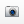
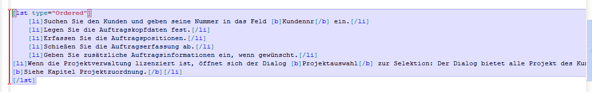

# Editor

 *\*Dokumentations-Editor in Framework Studio*

## Zugang zum Editor der verschiedenen Elemente

Da an verschiedenen Elementen im Framework Studio dokumentiert werden kann, werden nachfolgend alle Einsprungpunkte zum Editor aufgezeigt.

### Documentation-Element

Da das Documentation-Element keine andere Funktion hat außer Freitexte in Form von [DocML](./docml.md) zu verfassen, besteht das Hauptformular eines Documentation-Elements aus dem Editor selbst.

Das Documentation-Element besteht praktisch nur aus einem Editor:

### Form

Um ein Form zu dokumentierten, muss dieses geöffnet werden und auf die Registerkarte **Documentation** gewechselt werden.

Zugang zum Editor über den Reiter **Documentation**:

### Form Control

Controls auf einem Form werden über den Form Designer dokumentiert. Dazu muss das gewünschte Control markiert werden. Mit einem Rechtsklick auf das Control öffnet sich das Kontextmenü in dem der Menüpunkt **Edit Documentation** aufgeführt wird. Alternativ kann über das Property-Fenster von Framework Studio im Bereich **Documentation** auf den Button mit den drei Punkten geklickt werden. Der Editor öffnet sich für die Controls als modaler Dialog über dem Form Designer.

Aufrufen des Editors für ein Control:

### Component Property

Um ein Property zu dokumentieren, muss in der Component das jeweilige Property ausgewählt sein. Danach kann die Registerkarte **Documentation** ausgewählt werden.

Dokumentation eines Properties:

### DBColumn

Um eine Datenbankspalte zu dokumentieren, muss an der DBTable die gewünschte Spalte ausgewählt werden. Danach kann die Registerkarte **Documentation** ausgewählt werden.

Dokumentation einer DBColumn:

### Metadatentyp

Um einen Metadatentyp zu dokumentierten, muss dieser geöffnet werden und auf die Registerkarte **Documentation** gewechselt werden.

Dokumentation eines Metadatatypen:

## Arbeiten mit dem Editor

Der Dokumentationseditor ist ähnlich intuitiv bedienbar wie z.B. ein normaler Texteditor in Microsoft Word oder anderen Textverarbeitungsprogrammen. Es wird der Text markiert, auf den eine Formatierung angewendet werden soll und das jeweilige Icon in der Werkzeugleiste geklickt, um die Formatierung an- oder auszuschalten. Bei Textbausteinen wie Tabellen oder Listen wird der Cursor an die Stelle gesetzt, an der das gewünschte Element eingefügt werden soll.

### Info Panel

Info Panel und Link zum Chapter Tree im Editor:

Über die Radiobuttons im Info Panel kann zwischen verschiedenen Ansichten des Editors umgeschaltet werden.

* None: Zeigt nur den DocML-Editor für die ausgewählte Sprache.
* Preview: Zeigt zusätzlich zum DocML-Editor das Vorschaufenster an (wird automatisch aktiviert, wenn in der Werkzeugleiste geklickt wird).
* Other: Zeigt zusätzlich zum DocML-Editor einen zweiten DocML-Editor im Lesemodus an, um zeitgleich eine andere Sprache oder eine andere Dokumentation aus einem anderen Package bereitzustellen.

Über den Link **Open Documentation Tree** kann aus jedem Editor heraus der Kapitel-Baum aufgerufen werden. Siehe [Chapter Tree](./chapter-tree.md).

### Werkzeugleiste

### Combobox Language

Hier kann die Sprache eingestellt werden, für die im Dokumentations-Editor dokumentiert werden soll. Die DocML-Scripte für die jeweiligen Sprachen sind völlig unabhängig voneinander und beeinflussen sich somit nicht gegenseitig.

### Textbox Caption

Dieses Textfeld ist nur an Form-Dokumentationen und Documentation-Elementen verfügbar. Hier wird die Kapitelüberschrift für das fertige Dokument eingegeben. Die Kapitel werden im [Chapter Tree](./chapter-tree.md) verwaltet.

### Neue Section  

Sie erkennen *Neue Section* an einem  -Icon.

Fügt an der Stelle des Cursers im Dokumentations-Editor eine neues Section-Tag ein. Dabei wird automatisch eine neue 32-stellige GUID generiert und in das id-Attribut des Tags eingefügt. Von da an steht die Section für Customizing-Zwecke bereit. Siehe [Customizing](./customizing.md).

### Preview anzeigen  

Sie erkennen *Preview anzeigen* an einem  -Icon.

Über diesen Button wird das sich im Editor befindliche DocML in HTML konvertiert und im Preview-Panel angezeigt. Kann das DocML aufgrund von Fehlern nicht korrekt umgewandelt werden, werden die entsprechenden Fehler im **Common Errors**-Panel von Framework Studio aufgelistet.

### Syntax-Check  

Sie erkennen *Syntax-Check* an -Icons.

Über diese Buttons kann das DocML auf Validität geprüft werden. Der erste Button überprüft das sich im Editor befindliche DocML für die ausgewählte Sprache. Der Button mit dem Zusatz **All** überprüft das DocML für alle verfügbaren Sprachen, die über die [Combobox Language](#combobox-language) auswählbar sind. Bei einem Klick auf den Preview-Button wird automatisch erst eine Validierung des DocML’s für die aktuelle Sprache durchgeführt.

### Schriftart

Sie erkennen *Schriftart* an einem  -Icon.

Formatiert den im Editor markierten Text in der ausgewählten Schriftart. Um die finale Dokumentation der Anwendung möglichst homogen zu halten, stehen nur zwei Schriftarten zur Auswahl

* Normal: Wird in HTML und Word in **Arial** konvertiert
* Code: Wird in HTML in ein \<code>-Tag geschrieben, im Word wird **Courier New** verwendet.

### Schriftgröße  

Sie erkennen *Schriftgröße* an einem  -Icon.

Formatiert den im Editor markierten Text in der ausgewählten Schriftgröße. Die Einstellung **Normal** spiegelt die gängige Standardgröße 11pt in Word wider. Die Schriftgrößenangaben sind relativ gehalten, da aus DocML unterschiedliche Ausgabeformen generiert werden können (HTML, Word).

### Schriftfarbe  

Sie erkennen *Schriftfarbe* an -Icons.

Formatiert den im Editor markierten Text in der ausgewählten Schriftfarbe. Es können die Schriftfarbe sowie die Hintergrundfarbe für den Text ausgewählt werden.

### Textformatierungen  

Sie erkennen *Textformatierungen* an -Icons.

Umgibt den im Editor ausgewählten Text mit dem entsprechenden Formatierungstag. Zur Auswahl stehen:

*  Fett
*  Kursiv
*  Unterstrichen
*  Durchgestrichen
*  Tiefgestellt
*  Hochgestellt

### Ausrichtung  

Sie erkennen *Ausrichtung* an -Icons.

Richtet den im Editor markierten Text nach Wunsch links, mittig, rechts oder als Blocksatz aus. Die Standardeinstellung ist linksbündig.

### Liste  

Sie erkennen *Liste* an einem -Icon.

Öffnet einen Dialog zum Erstellen einer neuen Auflistung:

##### **List Type**

Mit **List Type** wird die Art der Liste definiert. **Unordered** stellt eine Liste mit Symbolen dar, während **Ordered** die Listeneinträge aufsteigend nummeriert.

##### **List Symbol**

Nur verfügbar, wenn als Listentyp “Unordered” ausgewählt wurde. Es kann zwischen Disk, Circle und Square gewählt werden.

##### **List Item Count**

Legt die Anzahl der in der Liste befindlichen li-Tags fest. Diese können anschließend im DocML beliebig erweitert werden.

### Tabelle  

Sie erkennen *Tabelle* an einem -Icon.

Öffnet einen Dialog zum Erstellen einer neuen Tabelle. Nach dem Klick auf das Symbol wird zunächst ein Panel angezeigt, in dem die Größe der zu konfigurierenden Tabelle ausgewählt werden muss:

Wird mit dem Mauszeiger länger als eine Sekunde auf das Quadrat unten rechts gezeigt, vergrößert sich die Auswahl. Wird mit dem Mauszeiger länger als eine Sekunde auf das Quadrat oben links gezeigt, verkleinert sich die Auswahl.

Nach der Auswahl der Tabellengröße wird der Dialog zum Konfigurieren der Tabelle angezeigt:

Es können alle Parameter der Tabelle eingestellt werden. Dazu gehören Breite, Ausrichtung und Farbe der Tabelle, Spalten, Zeilen und Zellen. Die Werte der Tabelle können durch Spalten, Zeilen und Zellen überschrieben werden. Die Hierarchie der Überschreibungen sieht wie folgt aus:

**Tabelle** -> **Spalte** -> **Zeile** -> **Zelle**

Mit einem Klick auf den Button **Ok** werden für die konfigurierte Tabelle die entsprechenden Tags in den Editor generiert und können anschließend mit Werten befüllt werden.

### Bild einbinden

Sie erkennen *Bild einbinden* an einem -Icon.

Öffnet einen Dialog zum Einbinden eines Bildes in die Dokumentation. Es können nur Bildressourcen aus Framework Studio in die Dokumentation eingebunden werden. Für Bilder von der Festplatte oder aus dem Internet wird eine entsprechende Bildressource angelegt.

Einfügen eines Bildes in die Dokumentation:

Im Bereich **Image Source** muss zuerst ausgewählt werden, woher das einzubindende Bild stammt. Wenn das Bild schon als Ressource im Framework Studio verfügbar ist, kann diese aus der Baumansicht (**Existing Resource**) ausgewählt werden. Eine Vorschau des Bildes erscheint auf der rechten Seite.

Es kann auch direkt ein Bild aus dem Internet eingebunden werden (**From Url**). Damit das Bild in der Dokumentation angezeigt wird, wenn beim Betrachten keine Internetverbindung besteht, muss dieses mit dem Button **Load** geladen werden. Danach erscheint das Bild in der Vorschau. Die Url des Bildes muss mit **Fehler! Linkreferenz ungültig** beginnen.

Soll ein Bild von der Festplatte eingebunden werden, muss zuerst der Radiobutton **From File** aktiviert werden. Danach kann über den Button **[…]** ein Bild von der Festplatte gewählt werden.

Im Bereich **Attributes** können die Anzeigeeigenschaften des einzubindenden Bildes verändert werden:

##### **Original Size**

Verwendet in der Dokumentation die ursprüngliche Größe des Bildes in cm.

##### **Unit**

Gibt an, welche Maßeinheit in der Dokumentation verwendet werden soll. Zur Auswahl stehen Zentimeter (cm) und Inch (in).

##### **Width**

Breite des Bildes.

##### **Height**

Höhe des Bildes (nur aktiv, wenn **Keep aspect ratio** deaktiviert ist).

##### **Keep aspect ratio**

Wenn aktiviert (Standard), wird anhand der eingegebenen Breite des Bildes, die zugehörige Höhe anhand des originalen Seitenverhältnisses berechnet. Das Bild wird somit nicht verzerrt.

##### **Inline Image**

Wenn aktiviert, verhält sich das Bild wie ein Schriftzeichen und folgt dem normalen Textfluss. Andernfalls wird vor und nach dem eingefügten Bild ein Zeilenumbruch generiert.

##### **Caption**

Nur verfügbar, wenn die Option **Inline Image** deaktiviert ist. Es kann eine Bildunterschrift angegeben werden.

> [!WARNING]
> Wenn das Bild aus dem Internet oder von der Festplatte eingebunden werden
> soll, wird nach dem Klick auf den Button **Ok** ein Dialog angezeigt, der 
> darauf hinweist, dass automatisch eine Framework Studio Resource für das 
> Bild angelegt wird.

### Screenshot

Sie erkennen *Screenshot* an einem -Icon.

Öffnet einen Dialog zum Einbinden eines automatisch generierten Screenshots des Formulars in die Dokumentation. Diese Funktion ist nur in der Form-Dokumentation verfügbar.

Anhand der Designer-Daten wird ein Screenshot des Formulars generiert. Sollten Tabellen mehr Spalten haben, als in der Breite angezeigt werden können, werden die Spaltenköpfe umgebrochen und mehrzeilig fortgeführt.

Im Bereich **Attributes** können die Anzeigeeigenschaften des einzubindenden Screenshots verändert werden:

##### **Original Size**

Verwendet in der Dokumentation die ursprüngliche Größe des Formulars in cm.

##### **Unit**

Gibt an, welche Maßeinheit in der Dokumentation verwendet werden soll. Zur Auswahl stehen Zentimeter (cm) und Inch (in).

##### **Width**

Breite des Screenshots.

##### **Height**

Die Höhe des Bildes wird automatisch anhand des Seitenverhältnisses des Formulars berechnet.

### Link

Sie erkennen *Link* an einem -Icon.

Öffnet einen Dialog zum Einfügen eines Querverweises oder eines Hyperlinks.

Es kann im DocML sehr einfach auf ein anderes Kapitel (Formular oder Documentation-Element) verwiesen werden oder ein Hyperlink ins Internet bereitgestellt werden.

Bei einem Querverweis auf ein Kapitel muss das entsprechende Form oder Documentation-Element aus der Baumansicht ausgewählt werden.

Für einen Hyperlink ins Internet kann eine beliebige URL beginnend mit **Fehler! Linkreferenz ungültig** eingegeben werden.

In der Textbox **Text** wird festgelegt, wie der Link in der Dokumentation angezeigt werden soll.

### Indexeintrag

Sie erkennen *Indexeintrag* an einem -Icon.

Öffnet einen Dialog zum Einfügen eines Indexeintrages in die Dokumentation.

Im [Export Wizard](./export-wizards.md) kann definiert werden, ob in der gerenderten Dokumentation ein Index erstellt werden soll. Kapitelüberschriften (von Forms und Documentation-Elementen) werden dem Index automatisch hinzugefügt.

Über den Dialog ist es möglich, manuell einen Indexeintrag zu generieren. Dabei muss der Haupteintrag definiert werden. Optional kann ein Untereintrag angegeben werden.

### Basisaufruf

Sie erkennen *Basisaufruf* an einem -Icon.

Nur verfügbar in den Dokumentationen von Controls, Component Properties, DBColumns und Metadatentypen. Erstellt ein base-Tag, welches die Basisdokumentation des aktuellen Elements (Controls, Component Properties, DBColumn oder Metadatentyps) in die Dokumentation mit einbindet.

Mehr Information hierzu finden Sie im Kapitel [Vererbung](./vererbung.md)

### Linie

Sie erkennen *Linie* an einem -Icon.

Erstellt an der Curser-Position im Editor ein line-Tag. Dieses generiert in der Dokumentation eine schwarze Linie über die gesamte Seitenbreite mit anschließendem Zeilenumbruch.

## Zeilenumbruch

Das br-Tag ist sicherlich das am häufigsten verwendete Tag in einer Dokumentation in DocML. Es wäre sehr umständlich, wenn jedes Mal, wenn ein Zeilenumbruch in der Dokumentation eingefügt werden soll, ein Button in der Werkzeugleiste geklickt werden müsste. Dies würde den Schreibfluss mit der Tastatur erheblich behindern.

Um ein br-Tag (``[br/]``) an der Cursorposition einzufügen, muss im Editor nur \<STRG + Enter> gedrückt werden. Es wird ein br-Tag eingefügt und automatisch in die nächste Zeile gesprungen.

## Text markieren

Alle Formatierungsfunktionen des Editors wie z.B. Fettschrift oder Ausrichtung des Textes funktionieren ähnlich wie in einem WYSIWYG-Editor. Es wird Text markiert und dann die gewünschte Formatierungsoption aufgerufen. Der Unterschied des DocML-Editors ist allerdings, dass sich im markierten Text auch DocML-Tags befinden können, wie folgendes Beispiel zeigt:

Dies ist allerdings absolut kein Problem. Soll z.B. der oben markierte Text kursiv geschrieben werden, kann einfach in der Werkzeugleiste der entsprechende Button geklickt werden. Der Editor erkennt die Markierung und alle Tags darin und wendet die neue Formatierung entsprechend an:

Es muss also nicht auf Tags geachtet werden, wenn zusätzliche Formatierungen auf schon zuvor formatierte Textstellen angewendet werden.

Auch bei Block-Tags wie Listen kann dieses Verhalten auftreten. Nachfolgend soll z.B. eine gesamte Liste fett gedruckt werden. Da Block-Tags (lst-Tags) nicht in Inline-Tags (b-Tags) auftreten dürfen, kümmert sich der Editor selbst darum und ergänzt die Texte in der Liste automatisch mit den entsprechenden Tags.

Folgende Liste soll komplett fett gedruckt dargestellt werden:

Nach einem Klick auf den Button für Fettschrift in der Werkzeugleiste werden die Listeneinträge automatisch um die jeweiligen b-Tags ergänzt und die Validität des DocML wird erhalten:

Beim Markieren von Texten für Formatierungen muss also nicht explizit an schon vorhandene Tags gedacht werden, der Editor erledigt dies alles automatisch.

## Kommentare

DocML bietet die Möglichkeit, in Dokumentationen Kommentare einzufügen, die nicht in die Ausgabe gerendert werden. So können z.B. kleine Notizen oder Erinnerungen in die Dokumentation eingefügt werden. Ein Kommentar-Tag startet mit der Zeichenfolge **`[--`** und endet mit **`--]`**.

Kommentare sind im DocML an ihrer grünen Farbe zu erkennen und beeinflussen die Ausgabe in keinster Weise. Kommentare können an beliebiger Stelle im DocML platziert werden.

## Escape-Zeichen

Die Sprache DocML beinhaltet einige Steuerzeichen wie z.B. eckige Klammern (**`[`** und **`]`**), mit denen die Tags abgebildet werden. Allerdings werden diese Zeichen natürlich auch im Fließtext der Ausgabe benötigt. Dass Framework Studio den Unterschied zwischen einer eckigen Klammer eines Tags und einer **normalen** eckigen Klammer im Fließtext unterscheiden kann, müssen diese Zeichen mit einem **Blackslash** (**`\`**) escaped werden.

Wie zu sehen ist, werden die Backslashes in der Ausgabe eliminiert. Um einen Backslash als Zeichen in die Dokumentation einzufügen, muss dieser ebenso mit einem weiteren Backslash escaped werden.

## Panel Other

Der Editor bietet die Möglichkeit, ein zusätzliches Fenster einzublenden, welches eine Dokumentation aus einem anderen Package oder in einer anderen Sprache anzeigt.

So kann z.B. während die englische Dokumentation für ein Formular erstellt wird, parallel die deutsche Dokumentation angezeigt werden, um besser übersetzen zu können.

##### **Language**

Mit dieser Combobox wird die Sprache der anzuzeigenden Dokumentation gewählt.

##### **Package**

Mit dieser Combobox kann zwischen den Dokumentationen des Elementes in unterschiedlichen Packages gewählt werden.

Mehr Informationen über Package-übergreifende Dokumentation und das Customizing befindet sich in den Kapiteln [Vererbung](./vererbung.md) und [Customizing](./customizing.md).
