# Export Wizards

Die wichtigste Funktion des Dokumentationssystems ist der Export in ein gängiges Format. Framework Studio bietet die Möglichkeit, automatisiert alle Dokumentationen, die an Forms, Controls, Metadatentypen usw. getätigt wurden, anhand der im [Chapter Tree](./chapter-tree.md) definierten Kapitelstruktur zu exportieren.
Die Dokumentation kann als HTML Webapplikation (zum Hosten auf einem Webserver) oder als Word-Datei (.docx) exportiert werden. Zusätzlich dazu gibt es einen besonderen Modus, mit dem ausschließlich Dokumentationen von Component-Properties exportiert werden können, um diese mittels des Browser-Controls in der Endanwendung anzeigen zu können.

## HTML

Dieser Export-Modus exportiert die gesamte Dokumentation oder ein ausgewähltes Kapitel als Webapplikation, welche auf einem beliebigen Webserver (z.B. IIS, Apache, Nginx) gehostet werden kann und somit von nahezu allen Endgeräten mit Webbrowser erreichbar ist.

Der Modus [HTML (Properties)](#html-properties) ist in diesem Export-Modus integriert. Es werden alle Component-Properties von Components, die mit dem Marker **{ExportDoc}** markiert sind, exportiert.

Der Wizard für den Export der Dokumentation als HTML Webapplikation befindet sich im Menü **Tools** > **Documentation** > **Export** > **HTML**.

### Wizard-Optionen

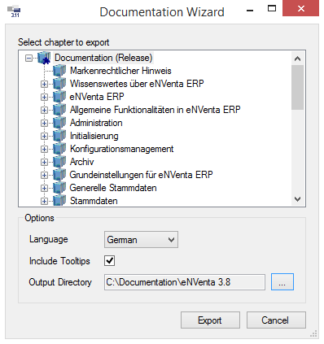

Die Baumansicht bietet die Struktur des Release-Knotens an. Hier muss ausgewählt werden, welches Kapitel exportiert werden soll. Wird der Release-Knoten selbst angewählt, wird die gesamte Dokumentation, die im Framework Studio hinterlegt ist, exportiert.

##### **Language**

Definiert die Sprache, für die die Dokumentation exportiert werden soll. Dies ändert auch die Sprache der automatisch generierten Screenshots (siehe  [Screenshot 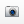](./editor.md#screenshot)).

##### **Include Tooltips**

Ist an einem Steuerelement eines Formulars ein Tooltip hinterlegt, wird dieser mit in die Dokumentation des Steuerelements aufgenommen.

### Export-Vorgang

Für den eigentlichen Export-Vorgang wird ein Dialog mit Statusinformationen bereitgestellt. Über den Button **Abort** kann der Vorgang jederzeit abgebrochen werden.

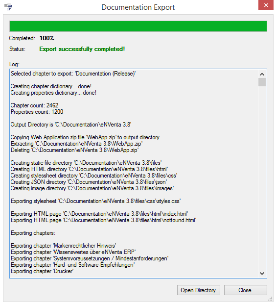

Treten beim Export-Vorgang Infos, Warnungen oder Fehler auf, werden diese detailliert in das Ausgabefenster protokolliert und der Statustext ändert ggf. seine Farbe (<b style="color: orange">orange</b> für Warnungen, <b style="color: red">rot</b> für Fehler).

### Webapplikation

Nach dem Export-Vorgang befindet sich die Webapplikation im zuvor ausgewählten Ausgabeordner.

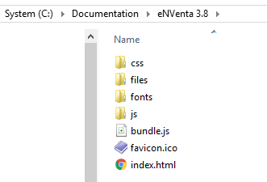

Die Webapplikation ist eine HTML 5 Anwendung, die ausschließlich auf den Technologien HTML, JavaScript und CSS basiert. Damit ist sie kompatibel zu nahezu allen Endgeräten mit einem Browser ([**Webapplikation Vorraussetzungen**](#webapplikation-vorraussetzungen) beachten).

### Inhalt

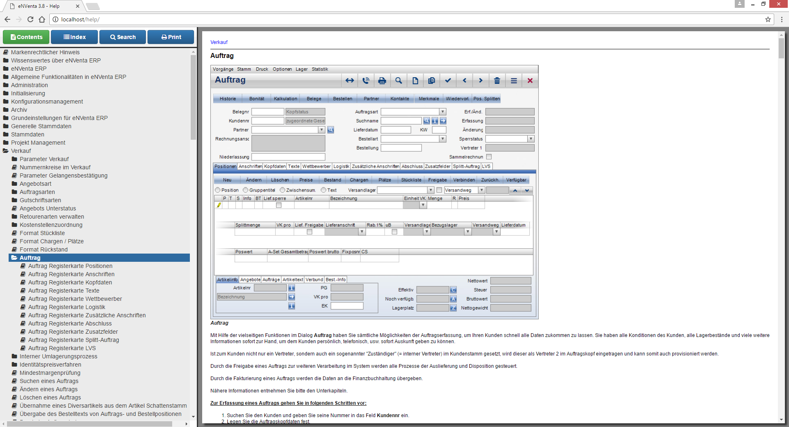

Nach dem Öffnen der Webapplikation im Browser ist standardmäßig der Bereich **Contents** selektiert. Hier kann im Baum auf der linken Seite das gewünschte Kapitel ausgewählt werden, welches dann rechts im Viewer angezeigt wird. Bei einem Klick auf einen Link wird der Baum automatisch aktualisiert und zum neuen Kapitel gesprungen.

### Index

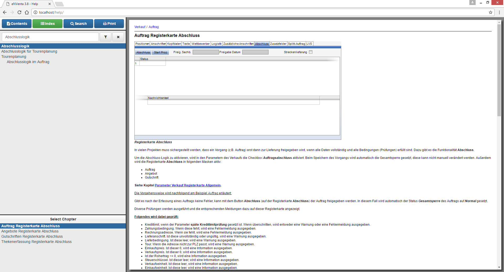

Im Bereich **Index** kann der gesamte Index der Dokumentation durchsucht werden. Ist einem Index-Eintrag nur ein einziges Kapitel zugeordnet, wird dieses sofort nach dem Klick in den Baum ausgewählt.
Sind einem Index-Eintrag mehrere Kapitel zugeordnet, kann das gewünschte Kapitel im Bereich **Select Chapter** links unten im Baum ausgewählt werden.

### Suche

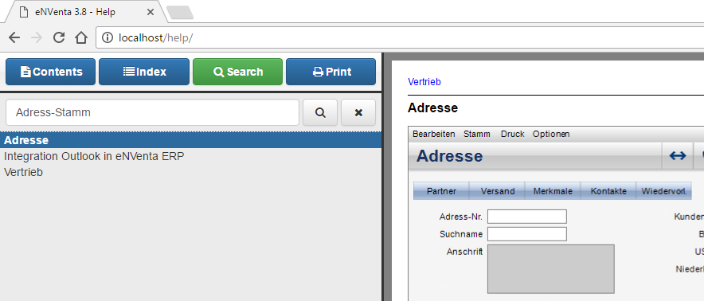

Mit Hilfe der Suchfunktion können alle Kapitel nach Wörtern durchsucht werden. In der Ergebnisliste werden dann alle Kapitel angezeigt, die das eingegebene Wort enthalten.

### Drucken

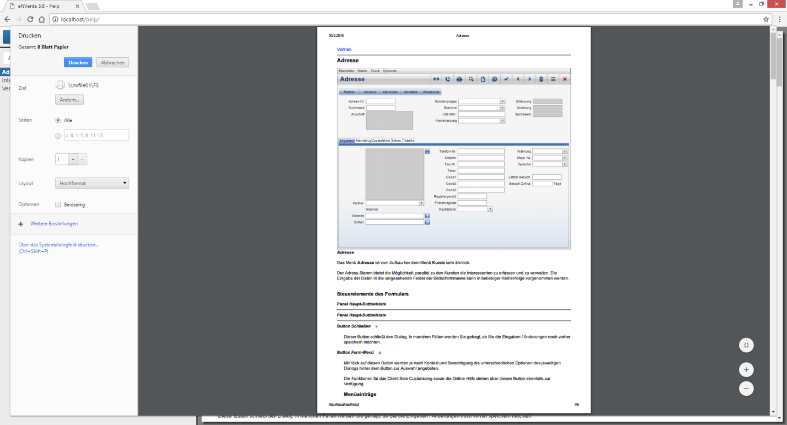

Um den Inhalt des gerade angezeigten Kapitels zu drucken, steht der Button **Print** zur Verfügung. Anders als die Druckfunktion des Browsers, welche die gesamte Webapplikation inkl. Baum drucken würde, wir über den Button **Print** nur der Inhalt des Viewers berücksichtigt.

### Webapplikation Vorraussetzungen

Um die von Framework Studio generierte Webapplikation zu hosten, wird einer der folgenden Webserver vorrausgesetzt:

* IIS 7 oder höher
* Apache 2.2.x oder höher
* Nginx 1.9 oder höher

Es wird empfohlen, einen der folgenden Browser zur Anzeige der Webapplikation zu verwenden:

* Google Chrome
* Mozilla Firefox
* Microsoft Edge
* Microsoft Internet Explorer 11

> [!WARNING]
> Internet Explorer 10 und niedriger werden NICHT unterstützt.

### Export mit FSConsole

Neben dem Export-Wizard kann die Webapplikation auch über die FSConsole.exe ([FSConsole](#fsconsole)) generiert werden. Hierzu gibt es die neuen Parameter \DOCUMENTATION, \ISO und \OUTPUT.

##### **\DOCUMENTATION**

Dieser Parameter ist nur ein Marker für die FSConsole, dass die Dokumentation gerendert werden soll.

##### **\ISO**

Gibt die Sprache an, in der die Dokumentation gerendert werden soll. Der Parameter hat auch Einfluss auf die automatisch generierten Screenshots.

##### **\OUTPUT**

Gibt das Verzeichnis an, in welches die Webapplikation gerendert werden soll.

Zusätzlich zu den neuen Parametern müssen die obligatorischen Connection- und Package-Version Parameter angegeben werden (**\LABELID**, **\SERVER**, **\DBUSER** usw.)

##### **Beispiel:**

```shell
FSConsole.exe \DOCUMENTATION \ISO de \OUTPUT „C:\Temp\Dokumentation“ \PACKAGE MyPackage \VERSION 3.8 \CONNECTIONTYPE SqlServer \SERVER Server01 \DBUSER demo \DBPASSWORD demo123
```

## Word

Der Wizard für den Export der Dokumentation als Word-Datei (.docx) befindet sich im Menü **Tools** > **Documentation** > **Export** > **Word**.

### Wizard-Optionen

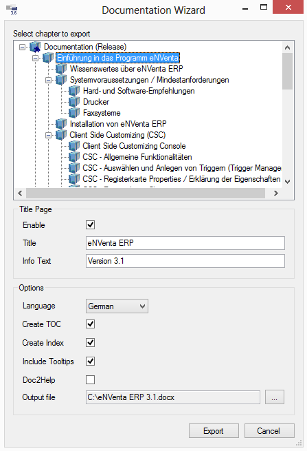

Die Baumansicht bietet die Struktur des Release-Knotens an. Hier muss ausgewählt werden, welches Kapitel exportiert werden soll. Wird der Release-Knoten selbst angewählt, wird die gesamte Dokumentation, die im Framework Studio hinterlegt ist, exportiert.

##### **Title Page**

Wird diese Option aktiviert, wird in der Word-Datei zusätzlich ein Deckblatt mit dem definierten Titel und Info Text generiert.

##### **Language**

Definiert die Sprache, für die die Dokumentation exportiert werden soll. Dies ändert auch die Sprache der automatisch generierten Screenshots (siehe [Screenshot ](./editor.md#screenshot)).

##### **Create TOC**

Erstellt ein Inhaltsverzeichnis für alle in der Dokumentation enthaltenen Kapitel am Anfang der Word-Datei.

##### **Create Index**

Erstellt einen Index für alle Kapitel und manuell in den Dokumentationen definierten Indexeinträgen am Ende der Word-Datei. Die Überschrift jedes Kapitels aus dem [Chapter Tree](./chapter-tree.md) wird automatisch zum Index hinzugefügt.

##### **Include Tooltips**

Ist an einem Steuerelement eines Formulars ein Tooltip hinterlegt, wird dieser mit in die Dokumentation des Steuerelements aufgenommen.

##### **Doc2Help**

Zusätzlich zum Indexeintrag wird jede Kapitelüberschrift mit einer zusätzlichen Formatvorlage versehen, die es [Doc2Help](./doc2help.md) erlaubt, einen Verweis über eine Url in der Onlinehilfe auf das jeweilige Kapitel zu generieren. Für mehr Information hierzu siehe Kapitel [Doc2Help](./doc2help.md).

### Export-Vorgang

Für den eigentlichen Export-Vorgang wird ein Dialog mit Statusinformationen bereitgestellt. Über den Button **Abort** kann der Vorgang jederzeit abgebrochen werden.

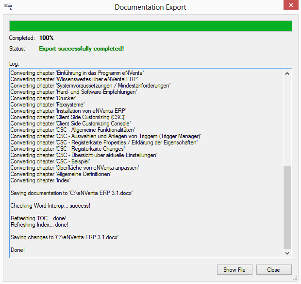

Treten beim Export-Vorgang Infos, Warnungen oder Fehler auf, werden diese detailliert in das Ausgabefenster protokolliert und der Statustext ändert ggf. seine Farbe (<b style="color: orange">orange</b> für Warnungen, <b style="color: red">rot</b> für Fehler).

### Besonderheit bei TOC und Index

Wurde im Export Wizard eine der Optionen **Create TOC** oder **Create Index** ausgewählt, muss Microsoft Word (2007 oder höher) auf dem PC installiert sein, um das Inhaltsverzeichnis oder den Index nach einem erfolgreichem Exportvorgang zu aktualisieren. Zu diesem Zweck wird nach dem Speichern der docx-Datei auf der Festplatte diese automatisch von Framework Studio aus mit Word geöffnet (als Prozess - es wird kein Fenster geöffnet) und eine Aktualisierung der jeweiligen Kataloge angestoßen. Anschließend wird die Datei nochmals gespeichert und Word geschlossen.

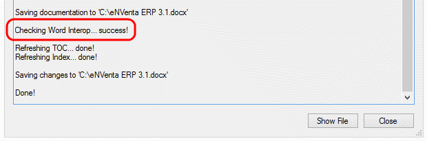

Im Ausgabefenster des Export-Vorgangs ist zu erkennen, dass seitens Framework Studio geprüft wird, ob Word installiert ist. Sollte dies nicht der Fall sein, werden im exportierten Dokument zwar ein Inhaltsverzeichnis und ein Index enthalten sein, die jedoch aufgrund der fehlenden Aktualisierung keine Einträge enthalten. In diesem Fall muss die Aktualisierung der Kataloge manuell mit Word durchgeführt werden.

## HTML (Properties)

Zusätzlich zu den anderen Modi steht ein weiterer Export-Modus zur Verfügung. Dieser ist in der Lage, ausschließlich Dokumentationen von Component-Properties in einzelne HTML-Dateien zu rendern. Er renderd also nicht wie der HTML- oder Word-Exporter die gesamte zur Verfügung stehende Dokumentation, sondern nur ausgewählte Component-Properties.

Soll die Dokumentation eines Component-Properties z.B. an der Oberfläche der Endanwendung angezeigt werden, ist dies nun mit Hilfe des Browser-Controls möglich. Der neue Export-Modus befindet sich wie nun auch der bisherige Word-Export-Modus im Menü

**Tools** > **Documentation** > **Export** > **HTML (Properties)**.

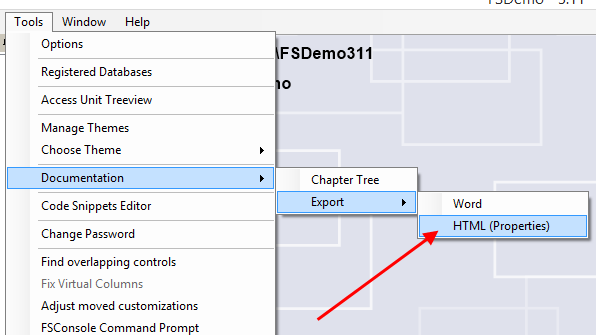

### Markieren der Components

Eine Endanwendung besteht im Normalfall aus extrem vielen Components und Component-Properties. Der neue Export-Modus wird aber meist nur für einen gewissen Bereich der Anwendung benötigt. Deshalb muss auf Component-Ebene definiert werden, welche Components beim neuen Export-Modus beachtet werden sollen.

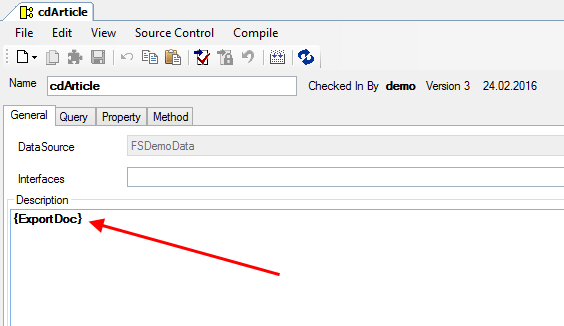

Um eine Component für den neuen Modus zu markieren, muss die Zeichenfolge **"{ExportDoc}"** in das Description-Feld der Component eingetragen werden. Nun werden beim Export alle dokumentierten Properties der markierten Component exportiert.

### Wizard-Optionen

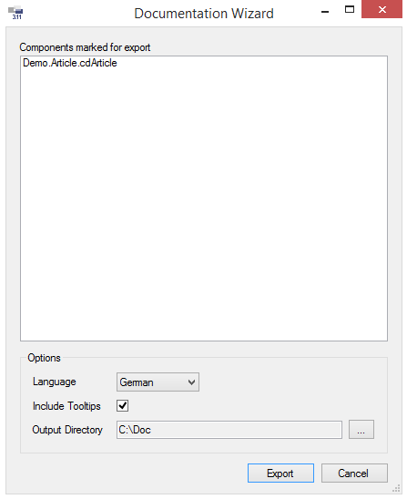

Wird der neue Export-Dialog aufgerufen, wird eine Übersicht mit allen markierten Components angezeigt.

##### **Language**

Definiert die Sprache, in der die Component-Properties gerendert werden sollen

##### **Include Tooltips**

Definiert, ob an den Component-Properties definierte Tooltips zuzüglich zur eigentlichen Dokumentation gerendert werden sollen.

##### **Output Directory**

Über den Button **[…]** muss ein Zielverzeichnis für den HTML-Export definiert werden. Dieses Verzeichnis muss leer sein.

### Export-Vorgang

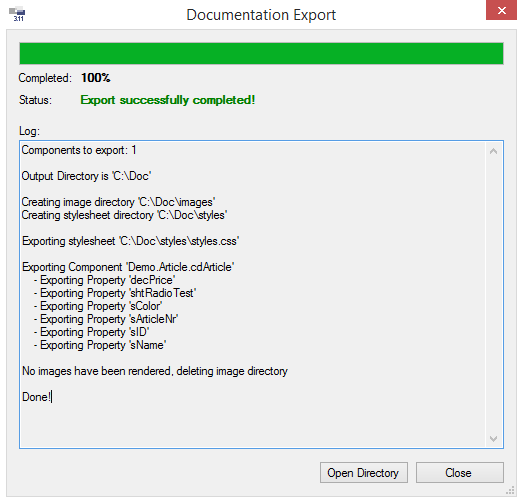

Es kann nachvollzogen werden, welche Properties Dokumentationen beinhalten und gerendert werden. Sollte nach dem Export-Vorgang festgestellt werden, dass keine Bilder gerendert wurden, wird das zuvor erstellte Verzeichnis **images** wieder gelöscht.

### Ausgabe

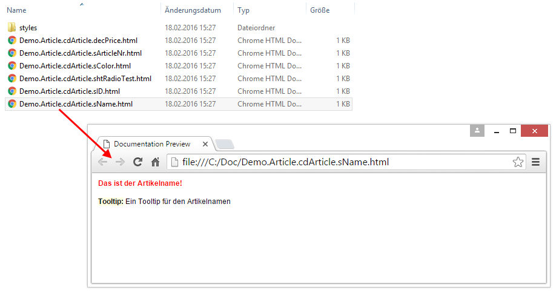

Beim Export wird jedes Property einer markierten Component durchlaufen und in eine separate .html-Datei geschrieben. Der Name dieser Dateien setzt sich allein aus dem Namespace-Pfad des Properties zusammen.
Wird der Export-Ordner nun an einem im Netzwerk zugänglichen Pfad abgelegt (vorzugsweise auf dem Webserver, auf dem auch schon die bisherige Dokumentation liegt), können die Property-Dokumentationen in der Endanwendung mittels eines Browser-Controls eingebunden werden.

## Struktur der Ausgabe

Der größte Vorteil der Generierung der Anwendungsdokumentation mit Framework Studio ist die strukturierte Ausgabe. Ziel ist es, jedes Kapitel bzw. Formular in genau demselben Schema auszugeben. Dokumentations-Elemente sind hier sehr einfach gehalten, da sie nur eine Dokumentation enthalten. Sie werden als einzelnes Kapitel mit dem zugehörigen Text gerendert. Formulare hingegen bestehen aus vielen Steuerelementen und ggf. Menüeinträgen, die wiederum ihre eigene Dokumentation beinhalten. Hier folgt Framework Studio folgendem Schema:

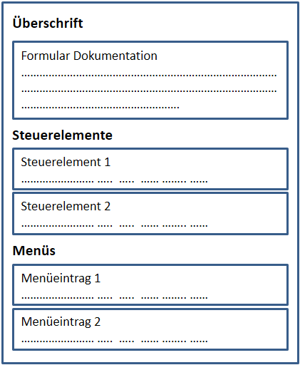

Die Dokumentation eines Formulars beginnt wie ein Documentation-Element mit einem eigenen Kapitel. Danach folgt die Formular-Dokumentation. Die Steuerelemente werden anhand ihrer Position auf dem Form abgearbeitet. Es wird von links nach rechts und von oben nach unten gearbeitet.

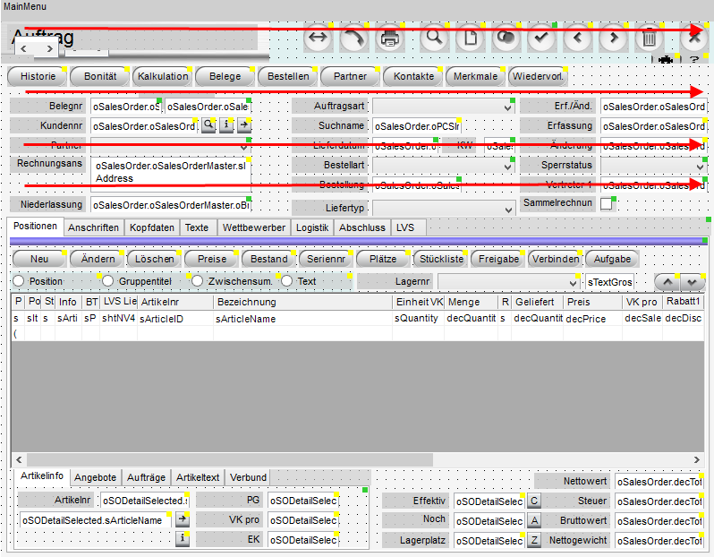

Wenn ein Steuerelement andere Steuerelemente beinhaltet (z.B. Registerkarten oder Tabellen) werden diese inneren Steuerelemente nach demselben Schema abgearbeitet.

Sind alle Steuerelemente gerendert, folgt zum Schluss die Ausgabe der Menüeinträge. Zur Verdeutlichung folgen einige Beispiele in Microsoft Word.

Ausgabe einer Dokumentation eines Documentation-Elements:

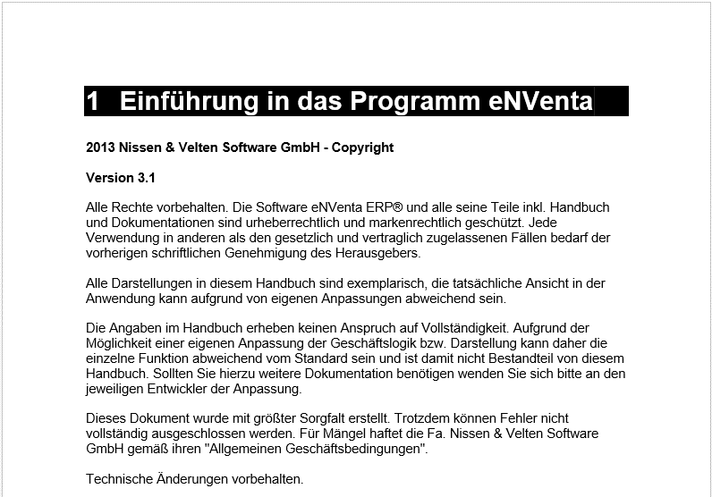

Ausgabe eines Formulars unterhalb eines Documentation-Elements:

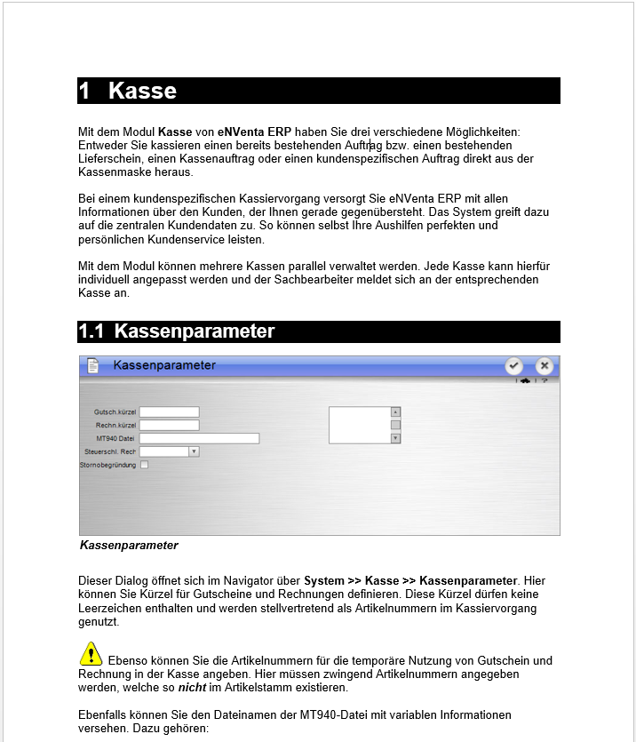

In diesem Beispiel ist zu sehen, dass im Chapter Tree das Formular **Kassenparameter** unterhalb des Documentation-Elements **Kasse** eingefügt wurde. In der Formular-Dokumentation wurde ein automatisch generierter Screenshot eingefügt.

Ausgabe der Steuerelemente eines Formulars:

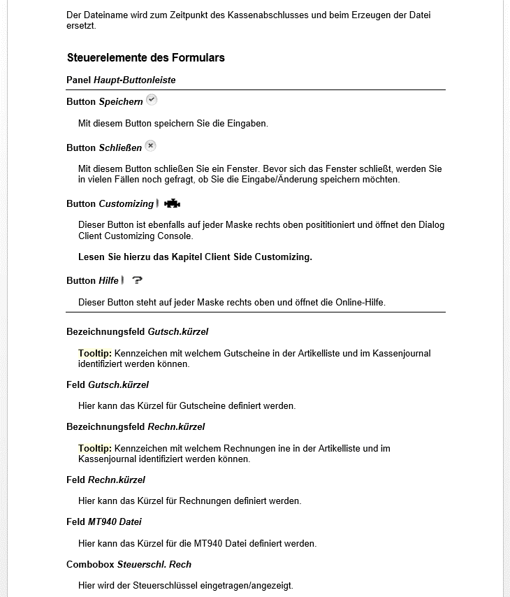

In diesem Beispiel ist die Ausgabe der Steuerelemente eines Formulars zu sehen. Ist ein Steuerelement ein Container (d.h. beinhaltet andere Steuerelemente) wird dies mit horizontalen Linien verdeutlicht. Es ist zu erkennen, dass die Buttons **Speichern**, **Schließen**, **Customizing** und **Hilfe** innerhalb des Panels **Haupt-Buttonleiste** liegen.

Zusätzlich ist erkennbar, dass die Bezeichnungsfelder **Gutsch.kürzel** und **Rechn.kürzel** Tooltip-Informationen enthalten, die automatisch mit in die Dokumentation aufgenommen wurden (Checkbox **Include Tooltips** in den [Wizard-Optionen](#wizard-optionen)).

## Ausgabe der Bilder bei Steuerelementen

Es gibt einige Steuerelemente in Framework Studio, die Bilder anzeigen (z.B. ImageButtons). Um das Auffinden eines solchen Steuerelements in der Dokumentation zu vereinfachen, kann in der Ausgabe des Steuerelements das zugehörige Bild mit angezeigt werden.

ImageButtons mit Bild in der Dokumentation:

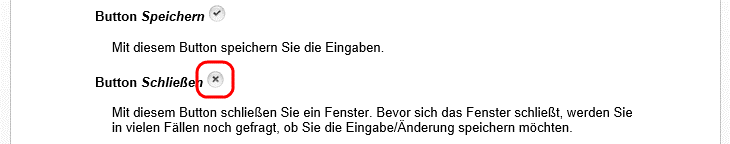

Ob das Bild in der Dokumentation des Steuerelements mit angezeigt wird oder nicht, hängt von einem Schalter direkt am Steuerelement ab.

Einstellung zur Anzeige des Bildes in der Dokumentation des Steuerelements:

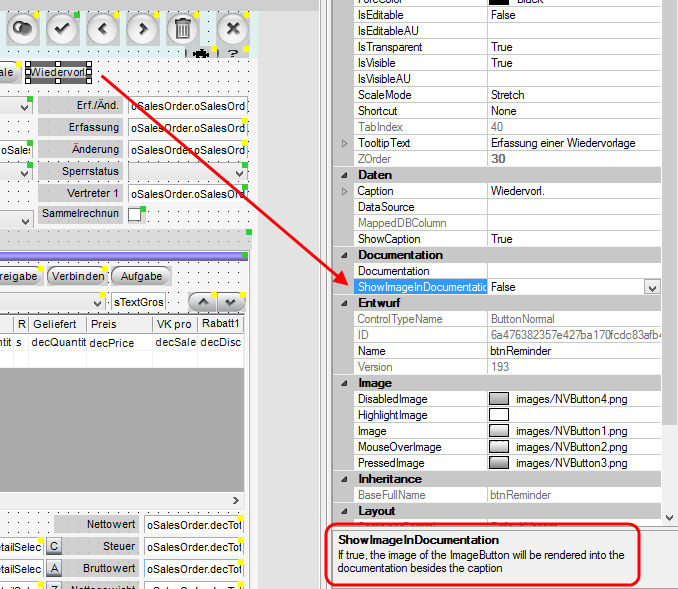

Diese Einstellung kann auch global über die DefaultControlStyles für den jeweiligen Control-Typ definiert werden.

Einstellung der Bildanzeige am DefaultControlStyle:

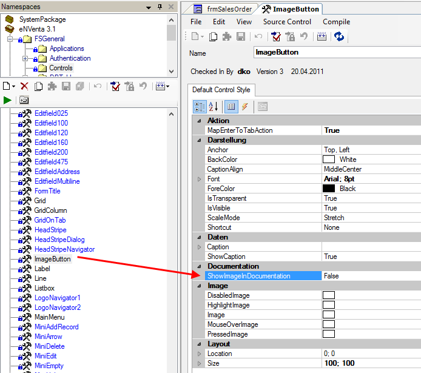

## Registerkarten als separate Kapitel ausgeben

Registerkarten beinhalten in Anwendungen oft Funktionalitäten, die in einer Dokumentation als separates Kapitel betrachtet werden sollte. Standardmäßig werden Registerkarte in der Dokumentation genauso wie andere Container-Steuerelemente in der Liste der Steuerelemente des Formulars mit ausgegeben. Dieses Verhalten ist nicht immer gewünscht, vor allem wenn eine Registerkarte sehr viele Steuerelemente und komplexere Vorgänge beinhaltet. Um für jede Registerkarte eines Registerkartes unterhalb eines Formulars ein eigenes Kapitel in der Dokumentation zu eröffnen, gibt es die Option **ChaptersForTabs** am Registerkarte.

Registerkarten als separate Kapitel Ausgeben:

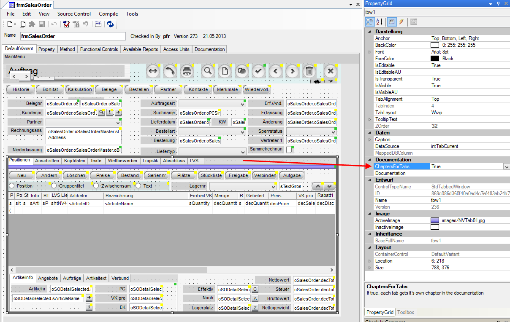

Wird diese Option auf `True` gesetzt, werden beim Exportieren des Formulars für jede Registerkarte des Registerkartes ein eigenes Kapitel mit eigenem Indexeintrag erstellt.

Generierung separater Kapitel für Registerkarten:

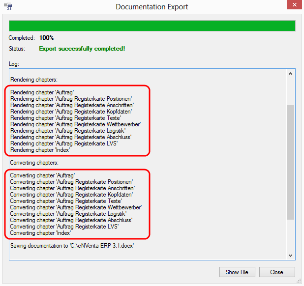

In der Liste der Steuerelemente, in der die Registerkarten normalerweise ausgegeben werden, befindet sich dann nur noch ein Link auf das entsprechende Unterkapitel.

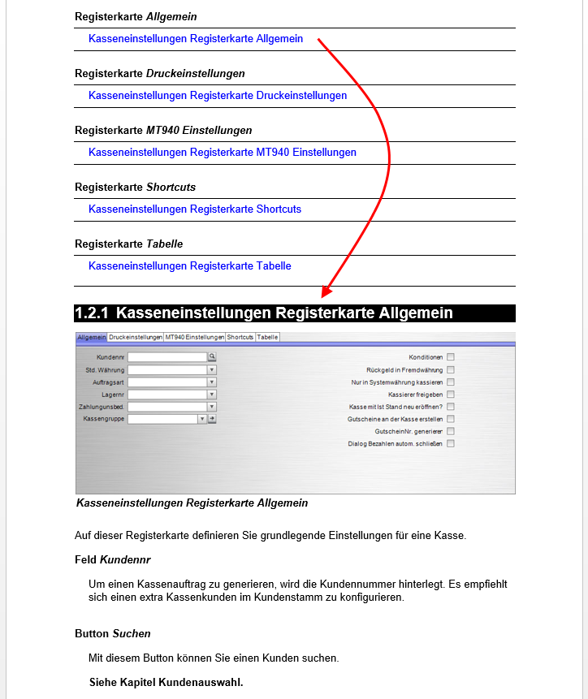

> [!CAUTION]
> Die Option **ChapterForTabs** kann je Formular nur für ein einziges Registerkarte auf `True` gesetzt werden.

## Vorschau eines ganzen Formulars

Die Preview-Ansicht des Dokumentations-Editors zeigt immer nur die Ausgabe des im [Editor](editor.md) befindlichen [DocML](docml.md). Um eine Vorstellung zu bekommen, wie ein ganzes Formular in der Endfassung aussieht, kann dieses komplett mit der Steuerelementauflistung und den Menüeinträgen in ein Vorschaufenster gerendert werden. Hierzu reicht im Documenation-Editor ein Klick auf den Link **View Render Chapter**. Es wird die in der [Combobox Language](editor.md#combobox-language) angegebene Sprache verwendet.

Dieser Link steht auch im Documentation-Editor der **TabPage** zur Verfügung. Diese bilden in der Regel ein eigenes Chapter und werden nicht in der Preview des Forms angezeigt.

Vollständige Voransicht eines Formulars rendern:

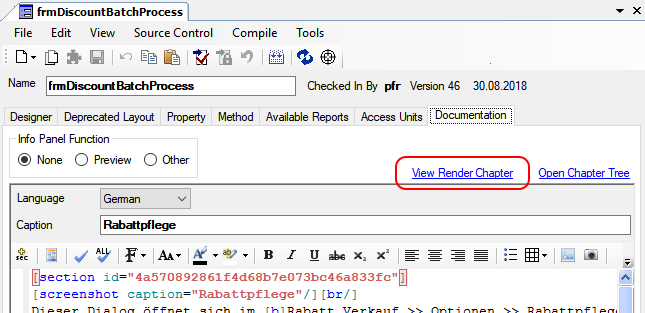

## Unterstützung von Themes

Die Einstellung des Themes in Framework Studio hat unmittelbare Auswirkungen auf die Ausgabe der Dokumentation mittels des Export Wizards. Diese Abhängigkeit betrifft in Framework Studio eingebundene Ressourcen sowie auch die automatisch generierten Screenshots über das Screenshot-Tag (siehe [Screenshot ](./editor.md#screenshot)  ) in der Formular-Dokumentation.

Im folgenden Beispiel wurde eine Dokumentation eines Formulars mit zwei unterschiedlichen Themes exportiert, was zu anderen automatisch generierten Screenshots in der Dokumentation führt.

Dokumentation exportiert mit Theme 1:

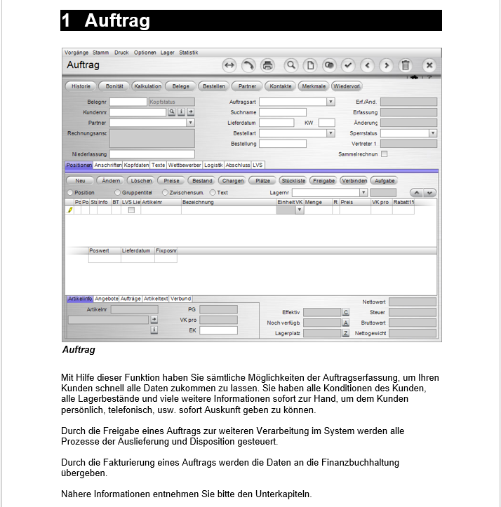

Dokumentation exportiert mit Theme 2:

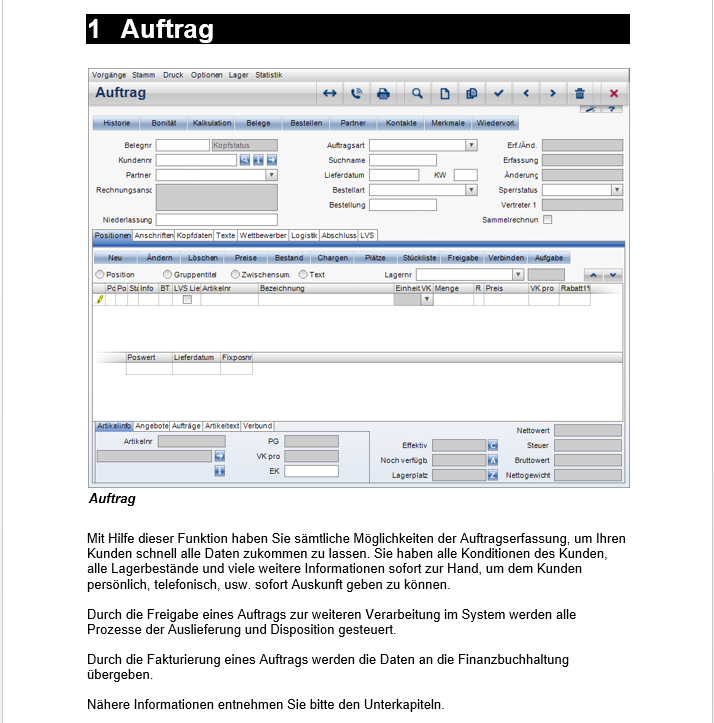

## fsconsole!

> [!WARNING]
> TODO fsconsole link!
