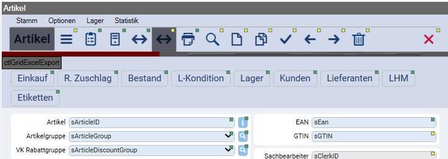

# Dokumentationsstatus von Steuerelementen

Da die Dokumentation der Steuerelemente eines Formulars über den Designer stattfindet, ist nicht immer ersichtlich, welches Steuerelement schon eine Dokumentation beinhaltet oder ob das Steuerelement beim Rendern eine Dokumentation aus der Basis erhält. Um dies zu visualisieren, gibt es in den [Framework Studio Optionen](../allgemein/options.md) die Option **Documentation Indicators**.

Wird diese Checkbox aktiviert, werden für alle Steuerelemente kleine Vierecke in der rechten oberen Ecke angezeigt.

Die Quadrate können dabei zwei Farben annehmen:

<b style="background-color:yellow; padding: 3px">Gelb</b>

Das Steuerelement enthält in diesem Formular **keine** Dokumentation. Es steht aber eine Dokumentation aus der DataSource des Steuerelements (Component Property, DBColumn, Metadatentyp) oder aus einem Basis-Package zur Verfügung und würde bei einem Export ausgegeben.

<b style="background-color:lightgreen; padding: 3px">Grün</b>

Das Steuerelement enthält in diesem Formular eine Dokumentation.

Wenn an einem Steuerelement kein Quadrat existiert, gibt es an diesem Steuerelement keine Dokumentation sowie auch keine Dokumentation aus der DataSource bzw. eines Basis-Packages.
