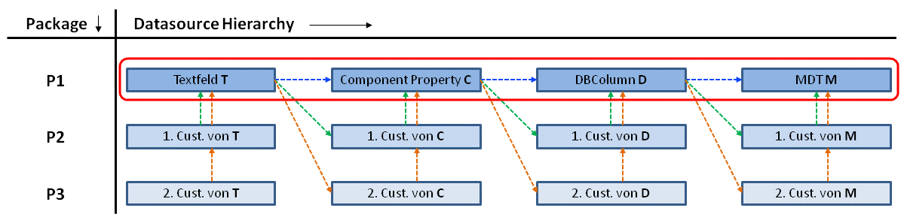
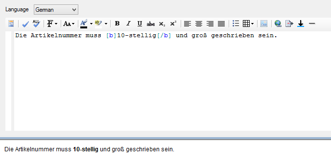
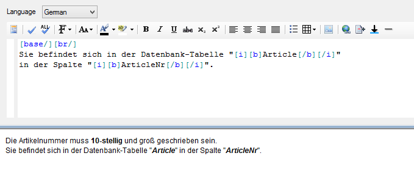
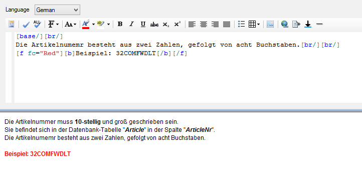
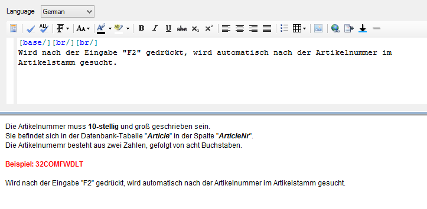
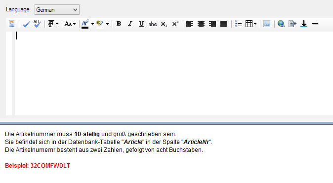
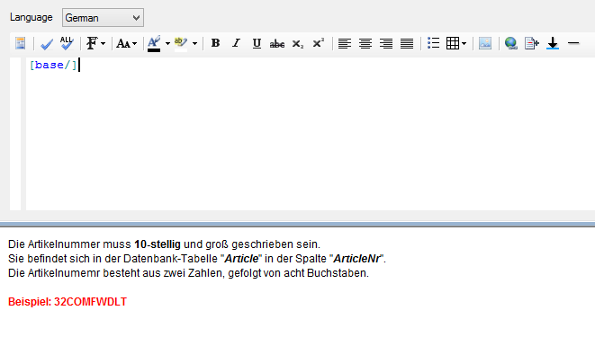
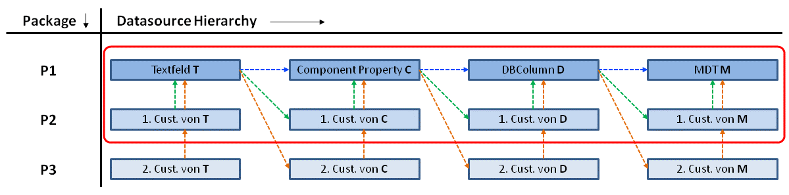

# Vererbung

Ähnlich wie bei den Tooltips für Steuerelemente bietet auch die Dokumentation eine Vererbung bis auf Metadatentyp-Ebene an. Diese Vererbung soll dazu beitragen, Dokumentationen für Steuerelemente mit derselben Funktion nicht mehrmals verfassen oder kopieren zu müssen.

Vererbung einer Dokumentation:

Die Abbildung zeigt die Möglichkeit der Vererbung vom Steuerelement auf dem Form bis zum Metadatentyp ggf. auch über mehrere Packages hinweg, gesetzt den Fall, dass dem jeweiligen Steuerelement eine DataSource zugewiesen wurde.

Eingebunden werden kann eine Dokumentation aus einem darunter liegenden Element mit Hilfe des base-Tags (siehe [Base](./docml.md#base)).

## Vererbung in einem einzigen Package

Im folgenden Beispiel wird gezeigt, wie mit Hilfe der Vererbung in der Dokumentation des Textfelds ***T*** die Dokumentationen aus dessen Component Properties (DataSource), der dazu gehörigen DBColumn und des wiederum damit verbundenen Metadatentyps eingebunden werden kann. Betrachtet wird das Szenario eines einzelnen Packages **P1** (blaue Pfeile).

Die Dokumentation des Metadatentyps ***M*** sieht wie folgt aus:

Die Dokumentation der DBColumn ***D*** bindet mit Hilfe des base-Tags die Dokumentation des Metadatentyps ein. Beim Rendern wird an die Stelle des base-Tags somit die Dokumentation des Metadatentyps eingebunden:

Am Component Property ***C*** ist dasselbe Verhalten zu erkennen:

Letztlich bindet auch das Textfeld ***T*** die Basis-Dokumentation ein, was folgende Ausgabe ergibt:

An der Dokumentation des Controls ist nun zu erkennen, dass die Information über das Drücken der **F2**-Taste am Control auf dem Formular dokumentiert wurde. Dies könnte auf einem anderen Formular z.B. ein anderer Shortcut sein. Die restliche Dokumentation inklusive des rot markierten Beispiels würde aber automatisch übernommen werden.

Diese Art der Vererbung ist also immer dann sinnvoll, wenn auf unterschiedlichen Formularen in der Anwendung Steuerelemente existieren, die genau dieselben DataSources verwenden.

##### **Beispiel**

In einer Anwendung gibt es auf 6 verschiedenen Formularen immer wieder ein Textfeld, welches eine Auftragsnummer anzeigt. Die Funktion des Textfeldes ist auf jedem Form dieselbe und beinhaltet auch immer die Daten desselben Component Properties (die Textfelder haben immer die gleiche DataSource), baut somit immer auf derselben DBColumn auf und ist damit auch vom selben Metadatentyp abhängig. Es wäre nun sehr umständlich, jedes Mal am Steuerelement selbst dieselbe Dokumentation zu hinterlegen. Sollte sich diese ändern, müssten alle 6 Stellen angepasst und erneut auf Fehler überprüft werden. Um dies zu vermeiden, kann die Vererbung genutzt werden. Da die 6 Textfelder immer auf demselben Component Property aufsetzen, kann die gesamte Dokumentation an diesem verfasst werden.

Der große Vorteil dieses Vorgehens ist, wenn sich an der Dokumentation etwas ändert, muss nur die Dokumentation des Component Properties angepasst werden und beim nächsten Rendern haben alle abhängigen Textfelder die aktualisierte Dokumentation des Component Properties übernommen.

Insgesamt gilt also: Die Dokumentation sollte so tief wie möglich im Framework Studio verfasst und auf möglichst viele Elemente vererbt werden.

Entstehen in der Datasource Hierarchy an einer Stelle **Lücken** in der Dokumentation, wird die Dokumentation aus der nächst tieferen Ebene eingebunden. Befindet sich z.B. in der Dokumentation eines Textfelds ***T*** ein base-Tag, wird beim Rendern die Dokumentation aus dem Component Property verwendet. Ist jedoch keine Dokumentation an selbigem verfasst, wird automatisch in der tieferen Ebene nach einer Dokumentation geprüft. In diesem Fall würde die Dokumentation der DBColumn verwendet werden. Ist an selbiger auch keine Dokumentation verfasst, wird die des Metadatentyps eingebunden.

##### **Beispiel**

Eine leere Dokumentation verhält sich wie ein base-Tag:

An einem Textfeld ist nicht explizit eine Dokumentation hinterlegt. Das per DataSource zugewiesene Component Property beinhaltet jedoch eine Dokumentation. Wie zu sehen ist, wird automatisch die Dokumentation des Component Properties für das Textfeld gerendert, wenn die Preview angezeigt wird.

Eine nicht vohandene Dokumentation in einem Control, einem Property, einer DBColumn oder einem Metadatentyp verhält sich also genauso wie ein base-Tag ohne weiteres DocML.

base-Tag ohne weiteres DocML:

Das gezeigte base-Tag kann also entfernt werden, da sich die leere Dokumentation äquivalent verhält.

## Vererbung bei mehreren Packages

Liegen mehrere Packages übereinander (grüne und orangene Pfeile), wird immer erst die höchste Customization des jeweiligen Elements betrachtet.

Vererbung über mehrere Packages hinweg:

##### **Beispiel (grüne Pfeile):**

Wird die Dokumentation für die Customization vom Textfeld ***T*** im Package **P2** gerendert, wird für ein base-Tag in **P1** nach einer Dokumentation gesucht. Wird dort nichts gefunden oder erfolgt dort ein weiterer Base-Aufruf, wird an der Customization des Component Properties ***C*** in **P2** gesucht usw.
