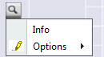

# ContextMenu

* [Properties/Events](xref:FrameworkSystems.FrameworkStudio.General.DevObjects.Form.Designer.ViewModels.ContextMenuDesignViewModel)

* [Actions](xref:FrameworkSystems.FrameworkControls.Actions.MainMenuControlAction)

 

[**Buttons**](button.md) und [**ImageButtons**](image-button.md) können bei Betätigung ein Kontextmenü öffnen. Dazu muss dem Button  über das Property [ContextMenu](xref:FrameworkSystems.FrameworkStudio.General.DevObjects.Form.Designer.ViewModels.ButtonBaseDesignViewModel.ContextMenu) ein **ContextMenu** zugeordnet werden.

Das Control ContextMenu stellt lediglich eine Hülle dar, in der alle Menüeinträge gesammelt werden, die angezeigt werden sollen, wenn das Kontextmenü geöffnet wird.

Ein neues ContextMenu lässt sich im Form-Designer ([**Allgemeiner Überblick**](../designer.md#allgemeiner-überblick)) auf zwei Arten per Drag&Drop anlegen:

1. Aus der Toolbox ([**Registerkarte Toolbox**](../../ide/registerkarten.md#registerkarte-toolbox)) heraus auf die DefaultVariant des Forms (also auf den Hintergrund des Forms) im Designer-Fenster: Das Kontextmenü wird  angelegt und ist keinem Button zugeordnet.

2. Aus der Toolbox heraus **direkt auf einen [Button](button.md) (oder [ImageButton](image-button.md))**: Das Kontextmenü wird angelegt und dem Button zugeordnet. Der Name wird dabei mit men, gefolgt von dem Namen des Buttons, vorbelegt.

Kontextmenüs werden im ClassView ([**Registerkarte Class**](../../ide/registerkarten.md#registerkarte-class)) immer im Teilbaum unterhalb der **DefaultVariant** ggf. parallel zum Hauptmenü (**MainMenu**) angezeigt.

Am Kontextmenü können im ClassView (wie bei anderen Menüs) neue Menüeinträge über den Eintrag **New MenuItem** im Kontextmenü des Treeviews angelegt werden.

> [!WARNING]
> Beim Löschen eines Kontextmenüs wird nicht überprüft, ob das Kontextmenü bereits einem Button zugeordnet ist.
