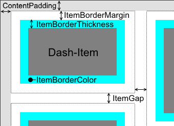

# DashboardContainer

* [Properties/Events](xref:FrameworkSystems.FrameworkStudio.General.DevObjects.Form.Designer.ViewModels.DashBoardContainerViewModel)

* [Actions](xref:FrameworkSystems.FrameworkControls.Actions.DashboardContainerControlAction)

 

Der Dashboard Container kann Dashboards enthalten. Dashboards werden in Form von Registerkarten angezeigt und bestehen aus einer oder mehreren Spalte(n), die die Dashboard Items beinhalten.

Das Dashboard Container Steuerelement ermöglicht es, mehrere Instanzen eines Formulars in einer vom Benutzer bestimmten Weise anzuzeigen. Das bedeutet, dass der Benutzer diese Instanzen erstellen, verschieben, maximieren, nach dem Maximieren wiederherstellen, vergrößern, verkleinern und schließen kann. Jedoch sind alle Aktionen auf das jeweilige Dashboard beschränkt. Folglich kann kein Dashboard Item aus dem Dashboard Container herausgeschoben werden.

Am Dashboard lässt sich eine DataSource festlegen. Darin wird, sobald Änderungen am Layout vorgenommen werden, das neue Layout als XML-string hinterlegt. Wird die DataSource Broker-seitig verändert, so wird das neue Layout vom Client umgesetzt.
Zusätzlich gibt es ein OnLayoutChanged-Ereignis am Dashboard Container, welches am Broker aufgerufen wird, sobald am Client eines dieser Layout ändernde Ereignisse auftritt:

* Positions-/Größenänderung der Dashboard Items

* Hinzufügen/Entfernen von Dashboard Items

* Maximieren/Wiederherstellen von Dashboard Items

* Hinzufügen/Entfernen von Registerkarten

* Umbenennen von Registerkarten

* Registerkartenwechsel

Damit dies nicht zu oft geschieht, gibt es einen Bearbeitungsmodus, der für solche Aktionen (mit Ausnahme des Registerkartenwechsels) aktiviert sein muss. Der Bearbeitungsmodus kann durch die Methode SetEditable am Dashboard Container Steuerelement gesteuert werden.

Ein Dashboard Item kann durch Spezifizierung des Dashboard Containers am Workflow Link geöffnet werden:

