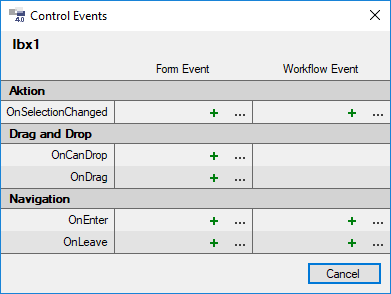

# Events

Events sind Ereignisse, die durch die Interaktion mit einem Formular entstehen. Der Klick auf einen Button ist z.B. ein OnClick-Event. Sie haben in **Framework Studio** die Möglichkeit, auf solche Ereignisse zu reagieren. Erzeugen Sie dazu ein Event und binden es an Ihr Control. Sie sollten dabei beachten, dass beim Eintreten eines Events jedes Mal eine Interaktion zwischen dem Webserver und dem Client stattfindet.

Workflow-Events dienen der Interaktion mit anderen Dialogen, Form-Events der Abarbeitung von Logik aufgrund eines Ereignisses.

Der einfachste Weg ein Event zu erzeugen, ist aus dem Kontext-Menü des Controls den Eintrag **Event** und anschließend das gewünschte Event auszuwählen. Jetzt müssen Sie noch bestimmen, ob Sie ein Form-Event oder ein Workflow-Event wünschen. Es öffnet sich ein kleines Fenster, über das Sie eine vorhandene Event-Handler Methode auswählen oder einfach eine neue erstellen können.

**MethodAssignerForm:**

Manche Events verfügen über spezielle EventArgs, über die Sie Kontext-Informationen des aufgetretenen Events ermitteln können.

Siehe [**ControlDesignViewModel**](xref:FrameworkSystems.FrameworkStudio.General.DevObjects.Form.Designer.ViewModels.ControlDesignViewModel#events)
