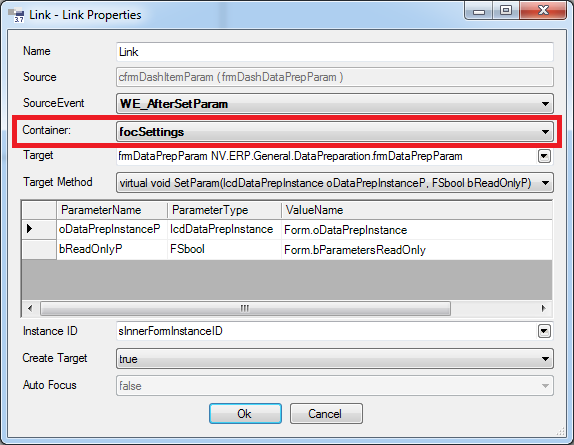

# FormContainer

* [Properties/Events](xref:FrameworkSystems.FrameworkStudio.General.DevObjects.Form.Designer.ViewModels.FormContainerDesignViewModel)

* [Actions](xref:FrameworkSystems.FrameworkControls.Actions.FormContainerControlAction)

 

Der Form Container ist ein Panel, welches genau eine Instanz eines Formulars enthalten kann. Um hierin ein Formular zu öffnen, muss am Workflow Link der **Container**-Wert gesetzt werden:

Wird ein Formular in einem FormContainer geöffnet, der bereits ein Formular beinhält, so wird das alte zuvor entfernt.
