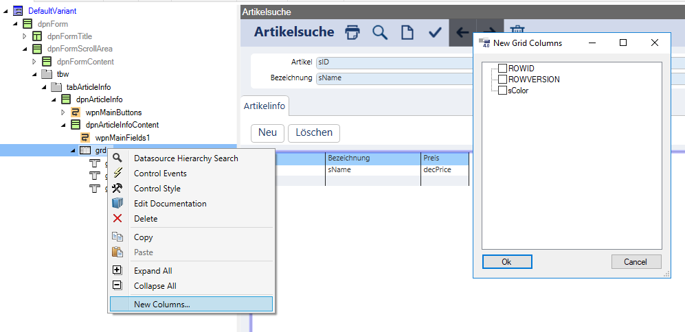

# Grid-Column

* [Properties/Events](xref:FrameworkSystems.FrameworkStudio.General.DevObjects.Form.Designer.ViewModels.GridColDesignViewModel)

* [Actions](xref:FrameworkSystems.FrameworkControls.Actions.GridColumnControlAction)

 

Ist einem Grid eine Collection als Datasource zugewiesen, können die Properties des Collection-Objekts dem Grid als Columns zugewiesen werden.

