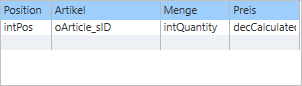
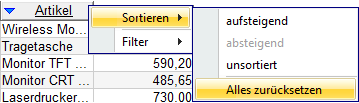
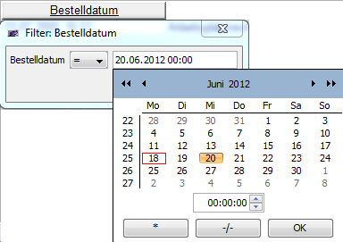

# Grid

* [Properties/Events](xref:FrameworkSystems.FrameworkStudio.General.DevObjects.Form.Designer.ViewModels.GridDesignViewModel)

* [Actions](xref:FrameworkSystems.FrameworkControls.Actions.GridControlAction)

 

Das Grid stellt Daten in tabellarischer Form dar. Dem Client bietet das Grid außerdem die Möglichkeit die Daten per Mausklick auf den entsprechenden Spaltenkopf sortiert darzustellen. Gedrückthalten der Umschalttaste ermöglicht es, auch mehrere Spalten eines Grid Controls per Mausklick zu sortieren. Dabei hat die zuerst (ohne Umschalttaste) ausgewählte Spalte die höchste Priorität. Durch weitere Klicks mit Umschalttaste kann das zweite, dritte, … Sortier-Kriterium angegeben werden.

Wenn der Kopf einer bereits sortierten Spalte erneut mit gedrückter Umschalttaste angeklickt wird, dann wird für diese Spalte die Sortier-Richtung geändert (aufsteigend, absteigend, unsortiert) und sie wird als Sortier-Kriterium niedrigster Priorität hinten angestellt.
Das Kontextmenü eines Spaltenkopfs arbeitet ausschließlich im **Mehrfach-Sortierungs**-Modus und enthält einen weiteren Eintrag, um sämtliche Sortierungen zurückzusetzen:

Außerdem kann auch für jede Spalte ein Filter über das Kontextmenü definiert werden. Hier gilt ebenfalls die Regel, dass das Kontextmenü grundsätzlich Mehrfach-Filterung zulässt und eine Möglichkeit zum Zurücksetzen bietet.

Der Filterdialog erscheint durch den Kontextmenüeintrag **Filter / Filter anpassen**. Bei Spalten mit Datumswerten kann durch Rechtsklick auf das darin enthaltene Eingabefeld ein Kalender aufgerufen werden:

### **Allgemeines zu den Row-Icons**

Hinter jedem Grid steckt eine Collection und hinter jeder Zeile ein Objekt aus der Collection. Das Row-Icon zeigt den Status dieses Objekts an (**neu**, **geändert** oder **gelöscht**).

Das Property [**RowHeader**](xref:FrameworkSystems.FrameworkStudio.General.DevObjects.Form.Designer.ViewModels.GridDesignViewModel.RowHeader) muss auf **DisplayRowStatus** eingestellt sein, damit die Icons angezeigt werden.
