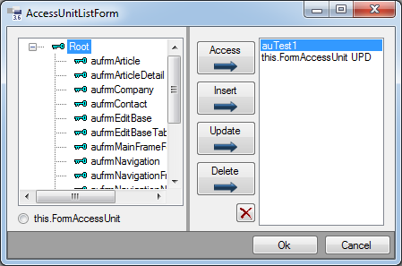

# IsVisibleAU / IsEditableAU

Die Control-Eigenschaften [**IsVisibleAU**](xref:FrameworkSystems.FrameworkStudio.General.DevObjects.Form.Designer.ViewModels.ControlDesignViewModel.IsVisibleAU) und [**IsEditableAU**](xref:FrameworkSystems.FrameworkStudio.General.DevObjects.Form.Designer.ViewModels.ControlDesignViewModel.IsEditableAU) stellen jeweils eine Liste von AccessUnit Objekten verknüpft mit je einem AUPermissionType dar. Für jeden dieser Listeneinträge wird bei der Initialisierung der Form-Controls mit Hilfe der Methode IGlobalObjects.AUHelper.Granted(AccessUnit, AUPermissionType) geprüft, ob der Zugriff gewährt wird. Falls dies bei keinem der Einträge zutrifft und die Liste nicht leer ist, so wird das entsprechende Control unsichtbar (bei [**IsVisibleAU**](xref:FrameworkSystems.FrameworkStudio.General.DevObjects.Form.Designer.ViewModels.ControlDesignViewModel.IsVisibleAU)) bzw. nicht bearbeitbar (bei [**IsEditableAU**](xref:FrameworkSystems.FrameworkStudio.General.DevObjects.Form.Designer.ViewModels.ControlDesignViewModel.IsEditableAU)). Wenn das Property IsVisible bzw. IsEditable bereits auf false gesetzt wurde, haben die Properties keine Auswirkungen.

Eine spezielle Access Unit ist die FormAccessUnit. Sie ist, worauf der Name bereits hinweist, dem Form zugeordnet. Im Fall von [**IsVisibleAU**](xref:FrameworkSystems.FrameworkStudio.General.DevObjects.Form.Designer.ViewModels.ControlDesignViewModel.IsVisibleAU) und [**IsEditableAU**](xref:FrameworkSystems.FrameworkStudio.General.DevObjects.Form.Designer.ViewModels.ControlDesignViewModel.IsEditableAU) ist die äußerste Spezialisierung in der Vererbungskette relevant.

Wird eine Eigenschaft in einem vererbten From oder im Customizing überschrieben, so wirken die Listeneinträge als wären sie mit denen aus der Basis vereinigt.

> [!WARNING]
> Bei kritischen Aktionen sollte weiterhin eine Prüfung der Access Units auf funktionaler Ebene erfolgen. Controls könnten durch Überschreibungen von [**IsVisibleAU**](xref:FrameworkSystems.FrameworkStudio.General.DevObjects.Form.Designer.ViewModels.ControlDesignViewModel.IsVisibleAU)/ [**IsEditableAU**](xref:FrameworkSystems.FrameworkStudio.General.DevObjects.Form.Designer.ViewModels.ControlDesignViewModel.IsEditableAU) oder den Actions `SetVisible(bool)`/`SetEnabled(bool)` sichtbar bzw. zugänglich gemacht werden.

Der Dialog zum Festlegen der Properties [**IsVisibleAU**](xref:FrameworkSystems.FrameworkStudio.General.DevObjects.Form.Designer.ViewModels.ControlDesignViewModel.IsVisibleAU) und [**IsEditableAU**](xref:FrameworkSystems.FrameworkStudio.General.DevObjects.Form.Designer.ViewModels.ControlDesignViewModel.IsEditableAU), der beim Klick auf den  Button im Property Grid erscheint, zeigt links den kompletten Access Unit Baum und die FormAccessUnit zur Auswahl an. Rechts sind die in der Liste enthaltenen Access Units. Die in der Mitte befindlichen Buttons fügen entweder eine im linken Bereich ausgewählte AccessUnit in der rechten Liste ein (Alle Buttons mit diesem Pfeil:  ) oder entfernen sie aus der rechten Liste ().

**Dialog zur Bearbeitung von IsVisibleAU/IsEditableAU:**

