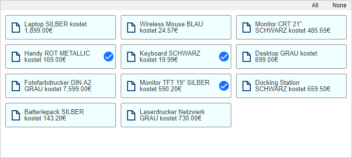
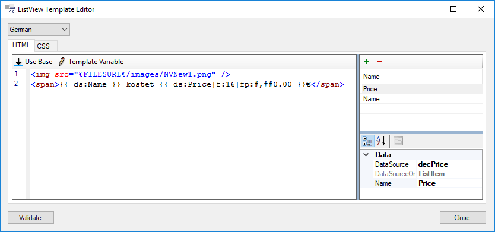
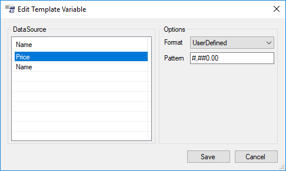
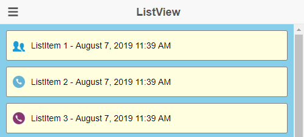

# ListView

* [Properties/Events](xref:FrameworkSystems.FrameworkStudio.General.DevObjects.Form.Designer.ViewModels.ListViewDesignViewModel)

* [Actions](xref:FrameworkSystems.FrameworkControls.Actions.ListViewControlAction)

> [!NOTE]
> Dieses Control funktioniert nur im [Mobile-Client](../../html-client/index.md). Im Java-Client wird das Control nicht angezeigt.



## ListView Template Editor

Der ListView Template Editor bietet die Möglichkeit, das HTML/CSS Template für ListItems sprachabhängig zu definieren. Dabei können Template DataSources definiert werden, auf welche aus dem HTML heraus mittels Template Variablen verwiesen wird. So können sehr einfach Businessdaten ins HTML eingebettet und formatiert werden.

Der Editor kann im Property-Grid über das Property [Template](xref:FrameworkSystems.FrameworkStudio.General.DevObjects.Form.Designer.ViewModels.ListViewDesignViewModel.Template) geöffnet werden.



### Allgemein

#### Dropdown für Sprachauswahl

Das HTML und CSS eines ListItems kann, wenn gewünscht, für jede Sprache einzeln definiert werden. Ist für eine Sprache kein Template definiert, wird auf Deutsch zurückgegriffen.

#### Button **Validate**

Über diesen Button können die im HTML eingebetteten Template Variablen überprüft werden. Es werden folgende Fälle geprüft:

* Ist die Template Variable parsebar?
* Passt das angegebene Format zum Datentyp?
* Zeigt die Template Variable auf eine existierende Template DataSource?
* Ist jeder Template DataSource eine valide DataSource zugeordnet

### Template DataSources

Auf der rechten Seite der Registerkarte **HTML** befindet sich die Liste der definierten Template DataSources. Jede Template DataSource zeigt auf ein Property der der ListView zugeordneten DataSource Collection.

Im Beispiel ist der ListView die `cdArticleColl` aus dem FSDemo als DataSource zugewiesen. Somit stehen einer Template DataSource alle Properties des `cdArticle`-Objekts zur Verfügung. Wie im Bild zu sehen, verweist die Template DataSource Price auf das Property `decPrice` von `cdArticle`.

Der Name einer Template DataSource muss eindeutig sein. Aus dem HTML kann nun mittels einer [Template Variable](#template-variablen) auf die Template DataSource zugegriffen und der Wert wie gewünscht im HTML formatiert werden.

### HTML

Auf der linken Seite der Registerkarte **HTML** befindet sich der HTML-Codeeditor, in dem das HTML für das ListItem definiert werden kann.

> [!NOTE]
> Das benutzerdefinierte HTML wird zur Laufzeit vom HTML Client (Angular) compiliert und optimiert. Grobe Fehler wie z.B. nicht geschlossene Tags oder invalides HTML können zu Anzeigefehlern führen, die unter Umständen auch andere Bereiche des HTML Clients betreffen. ListView Templates sollten vor dem produktiven Einsatz in allen verfügbaren Browsern ausgiebig getestet werden.

#### Button **Use Base**

Mit dem Button Use Base kann das HTML Template z.B. nach einem Customizing wieder auf die Basis zurückgesetzt werden.

#### Button **Template Variable**

Mit dem Button Template Variable kann eine neue [Template Variable](#template-variablen) erstellt, oder eine bestehende geändert werden.

#### HTML Aufbau

Der benutzerdefinierte HTML Code wird im HTML Client in ein `<div>`-Tag mit der CSS-Klasse **`lvItem`** verpackt. Es ist also nicht unbedingt nötig, um den eigenen HTML Code ein `<div>`-Tag als Container zu implementieren.

Der Code aus dem Beispiel sieht im HTML Client z.B. so aus:

```html
<hc-listitem-content _nghost-wvt-c19 class="ng-star-inserted">
    <div _ngcontent-wvt-c19 class="lvItem">
        
        <span _ngcontent-wvt-c19>Laptop SILBER kostet 1,899.00€</span>
    </div>
</hc-listitem-content>
```

Das `<div>`-Tag mit der CSS-Klasse `lvItem` kann im [CSS](#css) wie gewünscht angepasst werden, ohne einen eigenen Container oder eine eigene CSS-Klasse verwenden zu müssen.

#### Placeholder

Die Konstante `%FILESURL%` kann im HTML verwendet werden, um zur Laufzeit die Broker-Url zu erhalten. Dadurch können z.B. in ``-Tags auf Bilder, welche als Ressourcen im Framework Studio hinterlegt wurden, zugegriffen werden.

Dynamische Bilder können über eine binäre Template-Variable realisiert werden. (siehe Abschnitt [Images im ListViewItem](#images-im-listviewitem))

### Template Variablen

Über den Button Template Variable öffnet sich der **Template Variable Editor**. Befindet sich der Cursor im Codeeditor auf einer bestehenden Template Variable, wird diese im Editor vorselektiert.



Auf der linken Seite werden alle zur Verfügung stehenden Template DataSources aufgelistet. Auf der rechten Seite kann für die Template Variable ein passendes Format und/oder FormatPattern definiert werden.

Durch die Aufteilung in Template DataSources und Template Variablen werden die Daten und deren Formatierung im HTML strikt voneinander getrennt. Beispielsweise könnte der Wert einer Template DataSource im englischen HTML anders formatiert werden als im deutschen HTML.

Template Variablen werden im HTML-Code wie folgt angezeigt:

`{{ ds:[Name]|f:[Format]|fp:[FormatPattern] }}`

Dabei verweist `[Name]` auf den Namen der zugehörigen Template DataSource, `[Format]` und `[FormatPattern]` definieren das im Template Variable Editor ausgewählte Format und FormatPattern.

> [!NOTE]
> Es wird empfohlen, Template Variablen immer über den Template Variable Editor zu ändern, um Syntaxfehler zu vermeiden.

### CSS

Das benutzerdefinierte HTML kann mittels CSS im CSS-Codeeditor auf der Registerkarte **CSS** beliebig angepasst werden.

Beispiel:

```css
.lvltem {
    display: flex;
    flex-direction: row;
    align-items: center;
    background-color: azure;
    border-radius: 3px;
    border: 1px solid gray;
    padding: 3px;
    padding-right: 28px;
}
.lvItem[lvDisabled] {
    background-color: #cccccc;
}
img {
    display: inline;
}
```

Wie im Kapitel HTML beschrieben, wird ein ListItem mit einem `<div>`-Tag der CSS-Klasse `lvItem` umgeben. Im CSS-Code kann somit über den CSS-Selector `.lvItem` auf das Element zugegriffen werden.

### IsEditable

Im CSS kann auch ein Style für deaktivierte ListItems in einem nicht editierbaren ListView hinterlegt werden. Wird ein ListView im Designer oder per Action auf isEditable = false gesetzt, so wird am `<div>`-Tag lvItem das HTML-Attribut `lvDisabled` hinzugefügt:

```html
<hc-listitem-content _nghost-wvt-c19 class="ng-star-inserted">
    <div _ngcontent-wvt-c19 class="lvItem" lvDisabled="true">
        [...]
    </div>
</hc-listitem-content>
```

Im CSS-Code kann über den Attribute-Selector `.lvItem[lvDisabled]` genau dieser Fall abgefragt werden. Im Beispiel wird der Hintergrund des ListItems auf grau (`#cccccc`) gesetzt.

## Images im ListViewItem



Eine Besonderheit ist das Anzeigen von Bildern in einem ListViewItem mittels ``, wenn dieses über ein `byte[]` aus der Datenbank gebunden werden soll. Ein Anwendungsfall wäre z.B. das Anzeigen von Artikelbildern.

Beispiel:

```html

```

Um ein Bild an ein HTML img-Tag zu binden sind zwei Template Variablen notwendig. Das `byte[]` mit den Bildinformationen alleine reicht abhängig vom genutzten Browser nicht immer aus (siehe Hinweis). Es muss zusätzlich der HTML Mime-Type spezifiziert werden, sodass der Browser weiß, um welches Bildformat es sich handelt.

**`{{ ds:MimeType }}`** ist eine Template Variable vom typ `FSstring` oder `string` und gibt z.B. den Mime-Type `"image/png"` oder `"image/jpg"` zurück.

**`{{ ds:Image }}`** ist eine Template Variable vom Type `FSByteArray` oder `byte[]`. Binärdaten werden als Base64-String zum Client übertragen. Da das HTML `src`-Attribut Base64 versteht, ist keine weitere Formatierung der Daten nötig.

> [!TIP]
> Die Angabe des Mime-Types ist in den meisten Browsern wie Chrome, Firefox, Safari oder Edge (auch auf mobilen Geräten) nicht zwingend nötig. Manche proprietären Browser auf mobilen Geräten haben jedoch Schwierigkeiten, ohne die Angabe des Mime-Types, das Bild korrekt darzustellen. Sollten diese Browser keine Rolle für die Anwendung spielen, kann auch folgendes HTML genutzt werden:
>
> ```html
> 
> ```
>
> Das Semicolon vor `base64` ist ohne die Angabe des Mime-Types zwingend notwendig.
