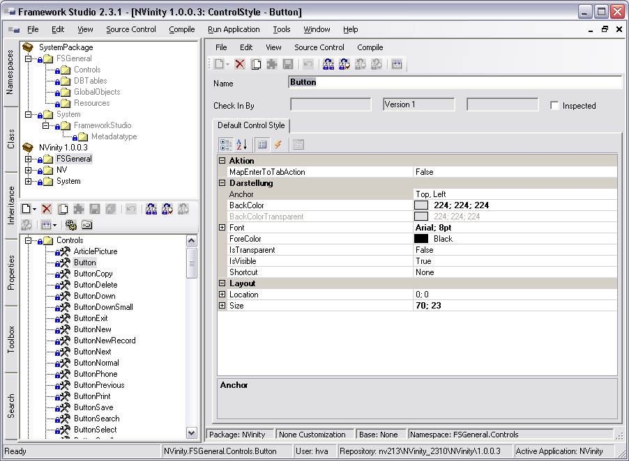

# Default Control Styles

**Default Control Styles** sind Standardvorlagen für alle verfügbaren Controls. Durch diese Vorlagen können für alle Eigenschaften der Controls Standardwerte vorbelegt werden. **Default Control Styles** werden auf der Registerkarte Namespaces im Namespace **FSGeneral / Controls** angezeigt.

Wenn Sie ein **Default Control Style** auf einem Form verwenden wollen, ziehen Sie das Control von der Registerkarte **Toolbox** des Framework-Designers auf die Registerkarte **DefaultVariant** des geöffneten Form-Designers (siehe dazu [**Design des Forms**](!TODO LINK)).

Um Eigenschaften eines Default Control Styles zu ändern, öffnen Sie den Control Style Designer durch Doppelklick auf das Default Control Style im Objektbaum auf der Registerkarte Namespaces. Auf der Registerkarte Default Control Style werden in einem Property Grid alle Eigenschaften des Controls angezeigt. Eine komplette Liste der Eigenschaften der einzelnen Default Control Styles finden Sie unter [**Layout-Konzept**](layout-konzept.md).

Wenn Eigenschaften an einem Default Control Style statt an der Instanz eines Controls auf einem Form festgelegt werden, hat das den Vorteil, dass diese Eigenschaften einheitlich in der gesamten Anwendung verwendet werden. Wenn dann nachträglich eine Eigenschaft (z.B. Hintergrundfarbe) an einem Default Control Style geändert wird, zieht diese Änderung automatisch an allen Stellen, an denen der Default Control Style benutzt wird und die Eigenschaft nicht explizit überschrieben wird.

**Custom Control Default Style Editor:**

Sie haben die Möglichkeit, eigene Default Control Styles zu definieren. Dazu müssen Sie eine Ableitung von einem der Basis Default Control Styles erstellen (Kontextmenü **Derive** im Objektbaum auf der Registerkarte **Namespaces**). Für das so erstellte Default Control Style können Sie die Eigenschaften frei definieren, ohne das Original Default Control Style zu ändern. Dadurch erhalten Sie eine weitere Control-Vorlage, die Sie in Ihren Forms verwenden können.

Basis Default Control Styles sind Button, Checkbox, Combobox, Editfield, Grid, ImageButton, Label, Line, Listbox, MainMenu, Panel, Picture, RadioButton, TabbedWindow, TrafficLight und TreeView.
