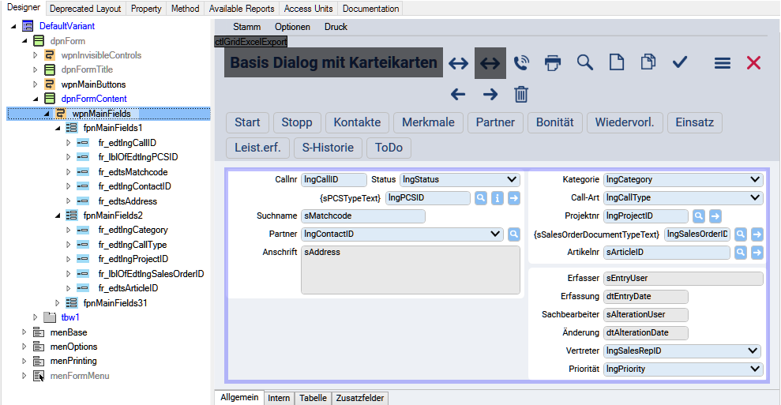
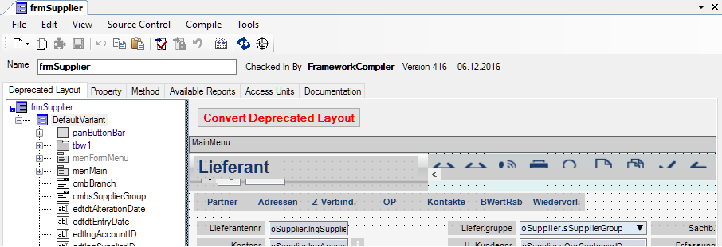
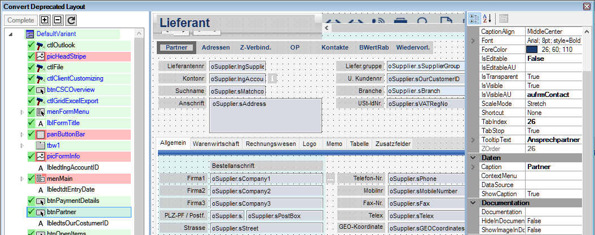
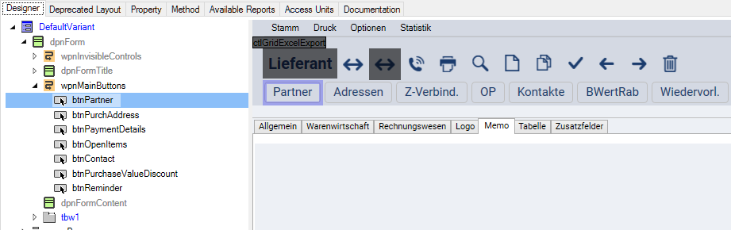

# Layout-Konzept

## Control-Hierarchie

Die Controls eines Forms sind in einem Baum organisiert. Dabei spielen die Hierarchie und vor allem die Reihenfolge in diesem Baum eine wichtige Rolle.

Das Form wird mithilfe von verschiedenen Containern (DockPanel, WrapPanel, FieldPanel), in denen die Controls platziert werden, strukturiert. Ausschließlich die Hierarchie und Reihenfolge der Controls definieren deren Anordnung im Form. Absolute Positionen können nicht angegeben werden.

In Ableitungen bzw. im Customizing können neue Container und Controls in der Hierarchie eingefügt werden. Bestehende Container oder Controls können an eine andere Stelle in der Hierarchie verschoben werden. Die Controls ordnen sich auch dann wieder automatisch an. Besonders vorteilhaft ist dies, wenn Sie mehrere Packages miteinander kombinieren. Überlagerungen von Controls kann es so nicht geben – Überlagerungen sind technisch auch gar nicht möglich.

## Größe von Controls

Die Größe von Text-Feldern und Grid-Columns wird durch den Metadatentyp gesteuert. Dort gibt es die Eigenschaften **DisplayMinLength**, **DisplayMaxLength** und für Multiline-Felder **DisplayMinLines** und DisplayMaxLines. Diese Eigenschaften sind in der kompletten Kette von Metadatentyp über DBColumn und Component-Property bis zum Control verfügbar.

Am ControlStyle **FSGeneral.Controls.BaseControl** wird das Property **MeasureText** angeboten. Die Display-Length-Eigenschaften werden vom Client mithilfe dieses Textes in die realen Größen umgerechnet. Zuzüglich Padding und Border ergibt sich so die Gesamt-Größe des Controls.

Die Display-Length Einstellungen sollten soweit wie möglich am Metadatentyp erfolgen. Eine gute Hilfe dabei ist die DataSource Hierarchy Search im Form-Designer.

Die Control-Eigenschaften **MinSize**, **MaxSize** bzw. GridColumn.**Width** sollten nur in Ausnahmefällen gesetzt werden, weil dadurch das Control nicht mehr, z.B. auf Änderungen der Schriftgröße, reagieren kann.

## Tab-Reihenfolge

Die Tab-Reihenfolge der Controls wird durch deren Position im Baum bestimmt. Wenn Sie den kompletten Baum von oben nach unten durchlaufen, ergibt sich so die komplette Tab-Reihenfolge. Eine davon abweichende Tab-Reihenfolge kann nicht definiert werden. Individuelle oder von der Situation abhängige Tab-Reihenfolgen können mit dem **OnLeave/OnValidate**-Event und der **SetFocus**-Action realisiert werden.

Mit dem Property **TabStop** kann ein Control in der Tab-Reihenfolge übersprungen werden.

## Deprecated Layout / Migration

Öffnen Sie ein „altes“ Form, dann wird mit der Registerkarte **Deprecated Layout** der alte Form-Designer angezeigt. Dieser funktioniert ganz normal bis zur Umstellung.

**Form-Designer mit Deprecated Form:**

Mit dem Button **Convert Deprecated Layout** wird die Konvertierung in das neue Layout gestartet. Dies geht aber erst wenn alle Basis-Forms in allen Base-Packages dieses Forms umgestellt sind.

Es öffnet sich neben dem neuen Form-Designer ein weiteres Fenster **Convert Deprecated Layout**. Dieses kann auf dem 2. Monitor platziert werden.

**Convert Deprecated Layout:**

**Form-Designer mit teilwiese migriertem Form:**

ALLE Controls müssen in den neuen Baum eingehängt werden. Dazu muss das entsprechende Control aus dem alten Control-Baum per Drag & Drap an die richtige Stelle in den Control-Baum des neuen Form-Designers verschoben werden. Im alten Baum wird das Control dann mit einem <b style="padding: 3px; background-color:#90ee90">grünen Hintergrund</b> als verarbeitet markiert.

Controls, die nicht in das neue Layout übernommen werden, werden von der Konvertierung ausgeschlossen und mit einem <b style="padding: 3px; background-color:#ffbfbf">roten Hintergrund</b> markiert. Das sind Controls, die es im neuen Layout nicht mehr gibt (z.B. Panel, StackPanel, Line) – diese sind automatisch ausgeschlossen. Einige Controls können auch vom Entwickler (rechte Maustaste / **Exclude**) oder einem Automatismus ausgeschlossen werden (Picture, Label).

Ist ein Control verarbeitet, erhält es einen grünen Haken <b style="padding: 3px; background-color:#90ee90"></b>. Ein Container erhält diesen Haken erst dann, wenn auch alle seine Unter-Controls verarbeitet sind. Ziel ist es, dass der komplette Baum – also der oberste Knoten **DefaultVariant** – verarbeitet ist und diesen grünen Haken erhält. Dann kann das Form kompiliert, getestet und die Konvertierung mit dem Button <b style="padding: 3px; background-color:#90ee90"> Complete</b> abgeschlossen werden.
