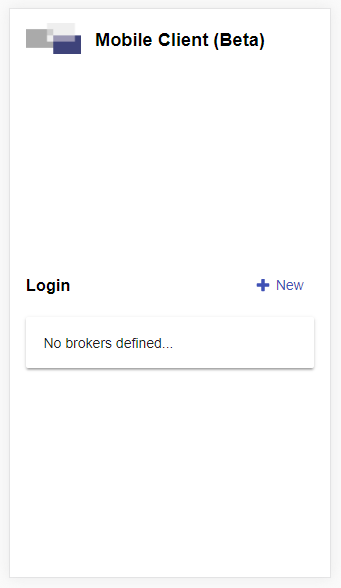
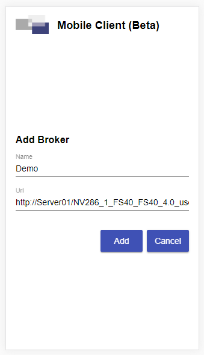
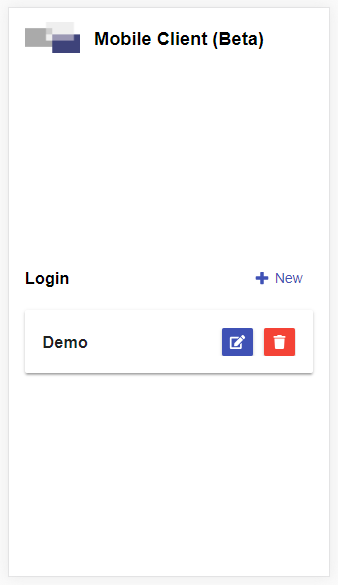
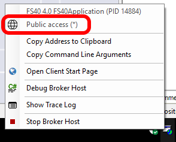

# Android App

Für die volle Integration des HTML-Clients in die mobile Welt, stellen wir im Google Play Store den Client als Android App zur Verfügung. Diese ist vom Funktionsumfang equivalent zur Browser-Version.

**Name der App**:

Framework Studio Mobile Client

**Store Link**:

<https://play.google.com/store/apps/details?id=com.fs.htmlclient>

> [!NOTE]
> Wir können derzeit noch keine Aussagen zu einer Veröffentlichung der App für iOS treffen.

## Einrichten eines Brokers

Es muss natürlich definiert werden, mit welchem Broker sich der Mobile Client verbinden soll. Nach dem Start der App wird der Login angezeigt. Über den Button „+ New“ können beliebig viele Broker zur Liste hinzugefügt werden.

  

Es ist auch möglich, Urls von Development Brokern hinzuzufügen. Dabei ist zu beachten, dass der Mobile Client nur auf den Development Broker zugreifen kann, wenn dieser über das Netzwerk erreichbar ist. Dazu muss Framework Studio mit Administrator-Rechten ausgeführt werden. Ob der Development Broker vom Netzwerk aus zugreifbar ist, kann über das Tray-Icon geprüft werden:

