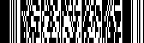
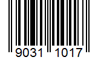

# Barcode Scanner

[!INCLUDE [only-android](only-android.include.md)]

Über die in einem mobilen Gerät integrierte Kamera können im HTML Client Barcodes unterschiedlicher Formate eingescannt werden.

### Unterstützte Formate

| Name        |                 Beispiel                 | Name    |               Beispiel               |
| ----------- | :--------------------------------------: | ------- | :----------------------------------: |
| AZTEC       |        | EAN_13  |   |
| CODABAR     |    | ITF     |      |
| CODE_39     |      | PDF_417 |  |
| CODE_93     |      | QR_CODE |  |
| CODE_128    |     | UPC_A   |    |
| DATA_MATRIX |  | UPC_E   |    |
| EAN_8       |        |

### Action ScanBarcode()

Der Scan-Vorgang wird am Form über die Action [ScanBarcode()](xref:FrameworkSystems.FrameworkControls.GeneratedForm.ScanBarcode(System.Action{FrameworkSystems.FrameworkBase.IFrameworkBarcodeScanInfo},FrameworkSystems.FrameworkBase.BarcodeFormat)) gestartet.

> [!NOTE]
> Es wird dringend empfohlen, nur diejenigen [Barcode-Formate](xref:FrameworkSystems.FrameworkBase.BarcodeFormat) zu übergeben, die auch tatsächlich beim Scan-Vorgang unterstützt werden sollen, um Fehler beim Scannen zu vermeiden. Je geringer die Anzahl der unterstützten Formate ist, desto unwahrscheinlicher ist es, dass der Scan fehlschlägt.

```csharp
// Aufruf der Action beim Click des Scan-Buttons
protected virtual void FE_btnScanArticle_OnClick(FrameworkButtonClickEventArgs e)
{
    this.ScanBarcode(
        this.ScanBarcodeCallback,
        BarcodeFormat.EAN_8 | BarcodeFormat.EAN_13,
        "Article"
    );
}
```

Wenn der Scan-Vorgang am Client abgeschlossen ist, wird die übergebene Callback-Methode aufgerufen. In ihr können die gescannten Daten weiterverarbeitet werden. Der Callback-Methode wird dafür ein Objekt mit dem Typ [IFrameworkBarcodeScanInfo](xref:FrameworkSystems.FrameworkBase.IFrameworkBarcodeScanInfo) übergeben.

```csharp
// Callback-Methode
protected virtual void ScanBarcodeCallback(IFrameworkBarcodeScanInfo e)
{
    if (e.HasError)
    {
        this.sValue = e.ErrorMessage;
    }
    else if (e.Cancelled)
    {
        this.sValue = "Cancelled";
    }
    else
    {
        if (e.Identifier == "Article")
        {
            this.sArticle = e.Value;
        }
        else
        {
            this.sAmount = e.Value;
        }
        this.sFormat = e.Format.ToString();
    }
}
```

### Berechtigung für Kamera

Der Barcode Scanner benötigt auf dem mobilen Gerät Zugriff auf die Kamera. Diese muss z.B. auf einem Android-Gerät einmalig erteilt werden:


