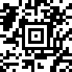
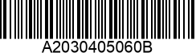
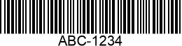
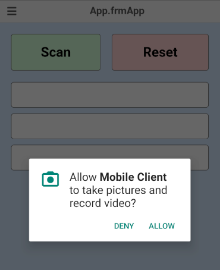

# Gerätespezifische Funktionen

Nachfolgend werden diejenigen Funktionen erläutert, die nur auf spezifischen Geräten verfügbar sind. Es ist nicht oder nur eingeschränkt möglich, vom Browser aus auf native Funktionen wie z.B. das Dateisystem zuzugreifen. Dadurch hat der HTML Client auf mobilen Geräten mehr Möglichkeiten als im Browser.

## Barcode Scanner (nur mobile Geräte)

Über die in einem mobilen Gerät integrierte Kamera können im HTML Client Barcodes unterschiedlicher Formate eingescannt werden.

### Unterstützte Formate

|Name|Beispiel|
|---|---|
|AZTEC||
|CODABAR||
|CODE_39||
|CODE_93||
|CODE_128||
|DATA_MATRIX||
|EAN_8||
|EAN_13||
|ITF||
|PDF_417||
|QR_CODE||
|UPC_A||
|UPC_E||

### Action ScanBarcode()

In Framework Studio wird ein Scan über folgende Action am Form gestartet:

```C#
ScanBarcode(Action<IFrameworkBarcodeScanInfo> callback, BarcodeFormat allowedFormat)

ScanBarcode(Action<IFrameworkBarcodeScanInfo> callback, BarcodeFormat allowedFormat, string identifier)
```

**Beispiel:**


#### Parameter `Action<IFrameworkBarcodeScanInfo> callback`

Wenn der Scanvorgang am Client abgeschlossen ist, wird der übergebene Callback aufgerufen. Der Callback ist vom Typ

```C#
Action<IFrameworkBarcodeScanInfo>
```

**IFrameworkBarcodeScanInfo Properties**

|Property|Typ|Beschreibung|
|---|---|---|
|Cancelled|bool|`true` wenn der Scanvorgang am Client abgebrochen wurde|
|ErrorMessage|string|Fehlermeldung bei einem gescheiterten Scanvorgang|
|Format|BarcodeFormat|Das Format des gescannten Barcodes|
|HasError|bool|`true` wenn beim Scanvorgang ein Fehler aufgetreten ist|
|Identifier|string|Der in `ScanBarcode()` übergebene Wert, sonst `null`|
|Value|string|Der Wert des gescannten Barcodes|

**Beispiel:**


#### Parameter `BarcodeFormat allowedFormat`

Definiert, welches Barcode-Format am Client bei einem Scanvorgang unterstützt wird.

> [!NOTE]
> Es wird dringend empfohlen, nur diejenigen Barcode-Formate zu übergeben, die auch tatsächlich beim Scanvorgang unterstützt werden sollen, um Fehler beim Scannen zu vermeiden. Je geringer die Anzahl der unterstützten Formate ist, desto unwahrscheinlicher ist es, dass der Scan fehlschlägt.

**Beispiel:**

Wenn am Client z.B. CODE_128 und ITF unterstützt werden soll, so können diese per bitweiser Oder-Verknüpfung übergeben werden.


#### Parameter `string identifier`

Es kann vorkommen, dass auf einem Form mehrere Buttons einen Scan initiieren können. Beispielsweise könnte erst ein Auftrag und nachfolgend eine Menge eingescannt werden. Es ist aber oft nicht praktikabel, für jeden Scanvorgang einen separaten Callback zu implementieren.

Anstatt dessen kann der `ScanBarcode()`-Action einfach ein beliebiger `string` mitgegeben werden, über den der Scanvorgang im Callback identifiziert werden kann.

**Beispiel:**


### Berechtigung für Kamera

Der Barcode Scanner benötigt auf dem mobilen Gerät Zugriff auf die Kamera. Diese muss z.B. auf einem Android-Gerät einmalig erteilt werden:

