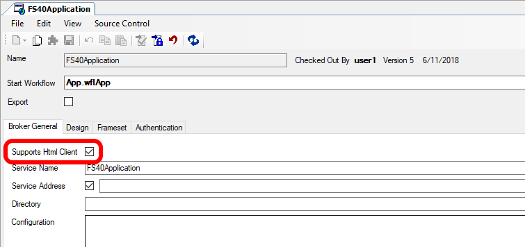

# HTML-Client (Beta)

Neben dem Java Client bietet Framework Studio auch einen HTML-Client für Desktop- sowie mobile Geräte an. Dieser befindet sich aktuell in der Beta-Phase und unterstützt noch deutlich weniger Funktionen und Controls als der Java Client. Was derzeit schon mit dem HTML-Client möglich ist, erfahren Sie in diesem Kapitel.

## Aktivieren des HTML-Clients

Damit der HTML-Client über den Run Wizard und die Broker-Startseite gestartet werden kann, muss in der [Application](../application/application.md) die Checkbox Supports Html Client gesetzt werden.

Dies soll vermeiden, dass bisher existierende Applikationen ohne Weiteres im HTML-Client gestartet werden können, da diese sehr wahrscheinlich auf Controls und Funktionalitäten aufbauen, die derzeit vom HTML-Client noch nicht oder nicht vollständig unterstützt werden.

## Browser-Unterstützung

### Desktop

Der HTML-Client basiert auf modernster Webtechnologie und benötigt deshalb auch einen aktuellen Browser für die Ausführung.

**Für Desktopsysteme empfehlen wir folgende Browser**:

* Chrome
* Firefox
* Edge
* Safari (OSX)

Auch alle weiteren Browser, basierend auf der Chromium-Engine (Opera, Vivaldi), sollten problemlos funktionieren.

> [!NOTE]
> Der immer noch weit verbreitete Internet Explorer 11 kann den HTML-Client zwar ausführen, auf Grund seiner mangelhaften Performance können wir ihn aber absolut nicht mehr empfehlen.

### Mobile Endgeräte

Eine auf den HTML-Client ausgelegte Applikation kann über die Broker-Startseite natürlich auch von einem beliebigen mobilen Gerät aus gestartet werden, welches über einen aktuellen Browser verfügt. Die Unterstützung der Browser im mobilen Umfeld ist sehr schwer zu beurteilen, da es gerade auf Android eine extrem große Auswahl gibt.

**Wir empfehlen deshalb folgende mobilen Browser**:

* Chrome
* Firefox
* Edge
* Dolphin
* Android Browser (ab Android 5.1)
* Safari (ab iOS 10)
