# Allgemeine Funktionalitäten

## Buttons

Einige der nachfolgend beschriebenen Buttons werden in unterschiedlichen Zusammenhängen angeboten. Die angebotene Funktion des Buttons bezieht sich daher immer auf den Kontext, in dem der Button dargestellt wird.

 **New:**

Dieser Button erzeugt ein neues Element.

Beim Klick auf den Button wird ein Kontext-Menü angezeigt, mit dem Sie auswählen, was für ein Element erzeugt werden soll. Im Detailfenster einer **Component** zum Beispiel, können Sie mit diesem Button der **Component** ein neues Property oder eine neue Methode hinzufügen. Auf der **[Registerkarte Namespaces](registerkarten.md#registerkarte-namespaces)** können Sie mit diesem Button dem im Objekt-Baum (unterer Baum) dargestellten Namespace neue Namespace Elemente hinzufügen, wie zum Beispiel **Metadatentypen**, **Components**, **Forms**.

 **Delete:**

Das Element im aktuellen Kontext wird mit dem Button **Delete** gelöscht. Der Löschvorgang wird erst mit betätigen des Buttons  **Save All** wirksam.

Wird das ausgewählte Element noch von einem anderen Element benutzt, wird eine Fehlermeldung mit dem entsprechenden Hinweis angezeigt:

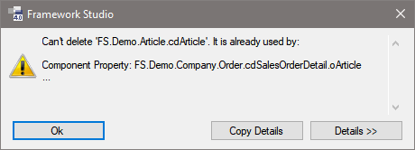

Mit dem Button **Details** wird eine Liste aller Verwendungen angezeigt.

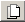 **Derive:**

Wenn Sie diesen Button betätigen, wird das ausgewählte Element vererbt. Dies funktioniert bei Metadatentypen, Reports, Forms und Workflows.

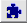 **Customize:**

Im aktiven Package, also in dem Package, an dem Sie sich angemeldet haben, wird von dem ausgewählten Element eine Customization angelegt. Das bedeutet, dass ein Element, das in einem Basis-Package definiert bzw. programmiert wurde, im aktiven Package geändert werden kann.

Diese Funktion steht nur dann zur Verfügung, wenn die verwendete Package-Lizenz (PKL) des Ursprungs-Packages Customizing für diesen Elementtyp freigeschaltet ist.

 **Save:**

Speichert die Änderungen des Elements im aktuellen Kontext ab.

Alle Änderungen werden erst beim Save in das Repository zurückgeschrieben. Geänderte, aber noch nicht gespeicherte Elemente werden mit einem Stern nach dem Namen gekennzeichnet.

 **Save All:**

Alle Änderungen im gesamten Projekt werden über diesen Button gespeichert.

 **Undo Until Last Save:**

Mit diesem Button nehmen Sie alle Änderungen seit der letzten Speicherung zurück.

## Source-Control

In **Framework Studio** kann immer nur ein Entwickler an einem Element arbeiten. Dazu muss dieser das zu bearbeitende Element auschecken. Die anderen Entwickler können das Element weiterhin in dem Stand öffnen, wie es war, bevor es ausgecheckt wurde.

Wenn alle Änderungen an dem Element durchgeführt wurden, kann es wieder eingecheckt werden. Ab diesem Zeitpunkt werden die Änderungen auch für alle anderen Entwickler sichtbar.

> [!WARNING]
> Ein Element kann immer nur von einem Entwickler ausgecheckt werden.

Für die Bedienung der Source-Control-Funktionalität stehen folgende Buttons zur Verfügung:

 **Check Out:**

Checkt das Element aus, d.h. sperrt es für Änderungen durch andere Entwickler, damit Sie es bearbeiten können. Ist das Element bereits von einem Entwickler ausgecheckt, bekommen Sie eine entsprechende Fehlermeldung.

 **Check In:**

Der Button Check In checkt das Element ein. Alle Entwickler sehen ab jetzt das von Ihnen aktualisierte Element.

Ein anderer Entwickler kann das Element jetzt erneut auschecken.

 **Undo Check Out:**

Hiermit machen Sie einen **Check Out** rückgängig. Dabei werden alle Änderungen, die nach dem **Check Out** gemacht wurden, verworfen. Bevor diese Funktion ausgeführt wird, werden alle Änderungen an ungespeicherten Elementen gespeichert (**Save All**). Sollte aufgrund von Abhängigkeiten beim **Undo Check Out** ein Problem auftreten, so startet Framework Studio neu, um weiterhin Datenkonsistenz garantieren zu können.

> [!WARNING]
> Diese vier Befehle können Sie auch über das Kontext-Menü des Elements aufrufen.

**Source Control im Kontext-Menü:**

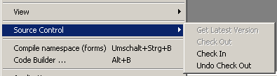

## Compile

 **Compile Options:**

Der Button **Compile Options** öffnet ein Kontextmenü, in dem Sie alle Optionen für den nächsten Kompiliervorgang festlegen können. Außerdem können Sie über dieses Kontextmenü einen Kompiliervorgang starten. Ergänzende Informationen erhalten Sie im Abschnitt [**Code Builder**](code-builder.md).

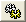 **Applications:**

Öffnet den Applications–Optionen-Dialog, in dem Sie u.a. einstellen können, in welchem Verzeichnis der IL-Code hinterlegt werden soll und wie sich der Session-Storage verhalten soll. Außerdem werden dort einige grundlegende Einstellungen bezüglich Design und Frameset der jeweiligen Anwendung festgelegt. Ergänzende Informationen können Sie dem Abschnitt [**Applications**](application.md) entnehmen.

 **References:**

Der References–Dialog dient dem Einbinden von Assemblies. Wenn Sie weitere Informationen dazu benötigen, lesen Sie bitte den Abschnitt [**References**](references.md).

## Icons

 **Is Not Checked Out:**

Dieses Icon vor einem Element bedeutet, dass dieses Element bei dem angemeldeten Entwickler eingecheckt ist.

Wollen Sie ein Element bearbeiten, müssen Sie es zuvor auschecken.

 **Is Checked Out:**

Steht dieses Icon vor einem Element, ist das Element bereits von Ihnen ausgecheckt und kann bearbeitet werden. Wenn Sie mit der Bearbeitung fertig sind, können Sie das Element wieder über das **Source-Control** einchecken.

Haben Sie ein Element versehentlich ausgecheckt, können Sie den Checkout-Vorgang mit **Undo Checkout** rückgängig machen.

> [!WARNING]
> Sie sollten darauf achten, dass Sie einen kompilierbaren Stand haben,bevor Sie ein Element wieder einchecken. Dazu ist es erforderlich auch in Zusammenhang stehende Elemente einzuchecken.

## Version History

Sowohl über das Kontextmenü eines Objekts im Objektbaum auf der [Registerkarte Namespaces](registerkarten.md#registerkarte-namespaces) als auch über das Hauptmenü können Sie sich unter dem Menüpunkt **View/Version History** einen Überblick über die einzelnen Entwicklungsstufen eines Objektes verschaffen. Dazu werden von allen bisher eingecheckten Versionen Versionsnummer, Benutzer, Datum, Kommentar und die Information, ob die Version bereits inspiziert wurde, angezeigt.

**Version History Report:**

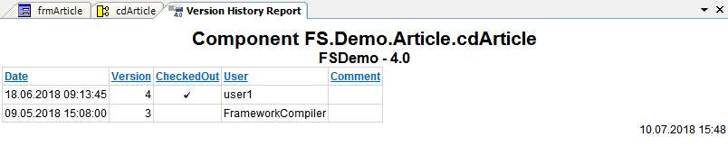

Objekttyp und Name sowie der vollständige Name des Objektes (mit Namespaces) werden im Kopf des Reports angezeigt. Wenn zum Zeitpunkt der Reporterstellung ein Benutzer das Objekt ausgecheckt hat, so wird das mit dem blau gefärbten Kommentar „Checked out.“ unter der neuesten Versionsnummer ebenfalls in der Tabelle dargestellt.

Über die Symbole am oberen Fensterrand wird Ihnen die Möglichkeit zum Drucken, Vergrößern, Blättern und Speichern des Reports bereitgestellt.

Dieser Report steht Ihnen für alle Access Units, Components, Collections, Control Default Styles, Custom Controls, Datasources, DBTables (Tabellen im Database Editor), Forms, Global Events, Global Objects, Metadatatypes, Namespaces, Report Document Types, Resources and Workflows zur Verfügung.

## Source Control History

Über den Menüpunkt **Source Control/History** im Hauptmenü von Framework Studio wird ein Report geöffnet, der einen Überblick über alle Check-In und Check-Out Vorgänge innerhalb des aktuellen Labels ermöglicht.

Mit diesem Report können Sie sich einen guten Überblick darüber verschaffen, was sich seit einem bestimmten Datum geändert hat, welche Elemente im Moment noch ausgecheckt sind und welche Elemente noch nicht vom FrameworkCompiler kompiliert wurden. Ein Vergleich des generierten Codes mit der Vorgängerversion oder der aktuellen Version ist ebenfalls möglich.

**Source Control History:**

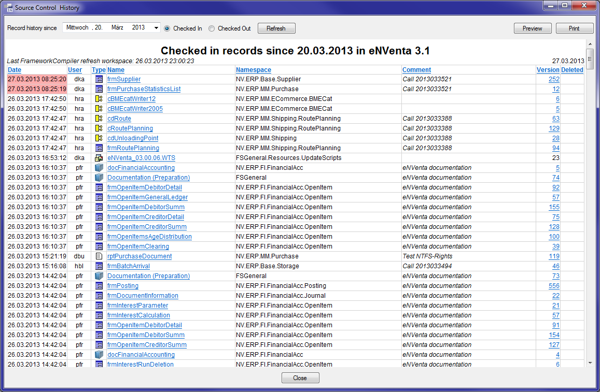

**Es gibt zwei Modi:**

* **Checked In:** Es werden nur eingecheckte Elemente ab dem angegebenen Datum angezeigt.

* **Checked Out:** Es werden alle im Moment ausgecheckten Elemente angezeigt.

Mit dem Button **Refresh** wird die Tabelle aktualisiert.

Durch Anklicken der Spaltenüberschrift kann nach allen Spalten sortiert werden. Die Tabelle kann über die Zwischenablage in andere Programme kopiert werden. Die Druckvorschau und der Druckdialog lassen sich über das Kontextmenü der Tabelle und mit den Buttons **Print** bzw. **Preview** öffnen.

**Besondere Spalten:**

* **Date:** Ist der Text hellrot hinterlegt, wurde dieses Element noch nicht vom FrameworkCompiler kompiliert (Datum größer als das Datum des letzten „Refresh Workspace“ des FrameworkCompilers). Ist der Text gelb hinterlegt, wurde dieses Element zwar noch nicht vom FrameworkCompiler kompiliert, aber vom Benutzer über [Get latest Check Ins](#get-latest-check-ins) im Workspace aktualisiert.

* **Name:** Durch anklicken eines Elements in dieser Spalte wird das Element im Designer geöffnet.

* **Version:** Durch anklicken einer Version kann der generierte Code des Elements mit der aktuellen Version oder der Vorgängerversion verglichen werden. Dazu öffnet sich nach dem Anklicken ein Dialog, in dem Sie die Vergleichsversion auswählen können.

## Get latest Check Ins

Über den Menüpunkt **Source Control/Get latest Check Ins** kann ein Dialog aufgerufen werden, über welchen der Benutzer-Workspace bis zu einem bestimmten Zeitpunkt aktualisiert werden kann, ohne dass ein FrameworkCompiler angestoßen werden muss.

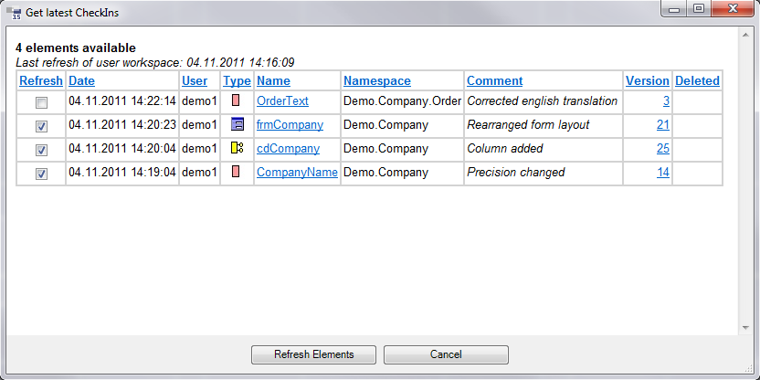

Der Dialog ist ähnlich der [Source Control History](#source-control-history) aufgebaut. Er zeigt allerdings nur Elemente, die die folgenden zwei Kriterien erfüllen:

* Sie sind NACH dem letzten **Refresh Workspace** des Users eingecheckt
* Sie sind von anderen Usern eingecheckt

Anders ausgedrückt zeigt die Liste alle von anderen Usern eingecheckten Elemente, die dem Workspace des aktuellen Users noch nicht bekannt sind.

**Beispiel:**

Benutzer ***demo1*** und Benutzer ***demo2*** holen sich nach einem nächtlichen Compilerlauf den FrameworkCompiler-Workspace. ***demo1*** checkt Elemente aus, ändert sie und checkt sie wieder ein. Versucht ***demo2*** diese Elemente nun auszuchecken, wird FS feststellen, dass neuere Versionen der Elemente verfügbar sind, die dem aktuellen Workspace noch unbekannt sind. Diese Elemente werden dann in der Liste von „Get latest Check Ins“ angezeigt (siehe Bild).

In der **Source Control History** werden diese Elemente rot markiert dargestellt, da sie nach dem Compilerlauf eingecheckt wurden und dem aktuellen Workspace von ***demo2*** nicht bekannt sind.

Im Dialog hat der Benutzer nun die Möglichkeit, über die Checkboxen auszuwählen, bis zu welchem Zeitpunkt/Element er seinen Workspace updaten will. Nach dem Klick auf **Refresh Elements** startet sich Framework Studio automatisch neu. Dabei wird der Benutzer-Workspace genau bis zum ausgewählten Zeitpunkt/Element (im Beispiel frmCompany, 04.11.2011 14:20:23) aktualisiert. Die Elemente **CompanyName**, **cdCompany** und **frmCompany** können nun vom Benutzer ***demo2*** ausgecheckt und bearbeitet werden, obwohl noch kein FrameworkCompiler gelaufen ist. In **Get latest Check Ins** verbleibt nur noch das Element **OrderText**.

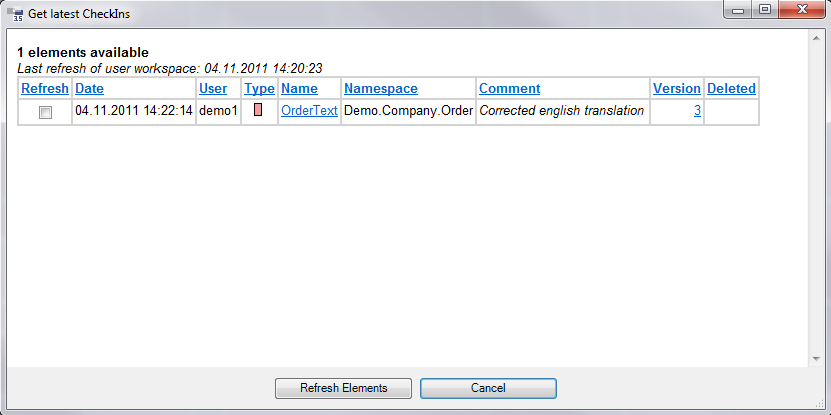

In der Source Control History erscheinen die aktualisierten Elemente nun <b style="background-color: #fff2be; padding: 3px;" >gelb</b>.

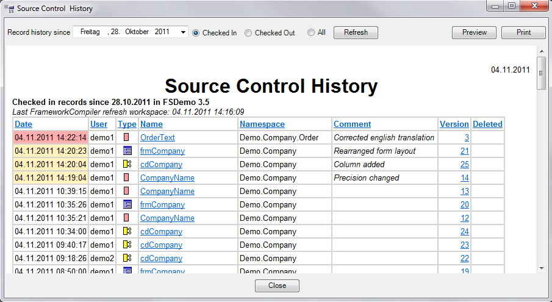

> [!IMPORTANT]
> Bei der Auswahl des Zeitpunkts/Elements bis zu dem aktualisiert werden soll, muss auf zusammenhängende Check Ins geachtet werden. Wenn z.B. **frmCompany** den Metadatentyp **OrderText** benötigt, dieser jedoch nicht mit aktualisiert wird (wie im Beispiel), kann es anschließend zu Compile-Fehlern kommen, da **OrderText** im Workspace nicht gefunden werden kann.
>
> Alle über **Get latest Check** Ins aktualisierten Elemente werden nach dem Neustart von Framework Studio automatisch zur Compile-Liste hinzugefügt. Copy Fullname.
>
> In allen Editoren gibt es im Menü **Edit** den Menüpunkt **Copy Fullname**. Dieser legt den Namen des Elementes inkl. Namespace in die Zwischenablage. So kann dieser z.B. in Dokumentationen eingefügt werden.
>
> 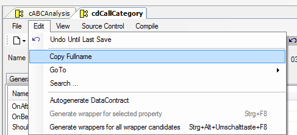

## GoTo

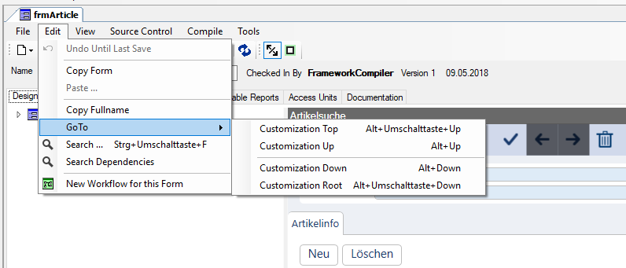

**Customization Top:**

Wechsel zur obersten Customization.

**Customization Up:**

Wechsel zur nächst höheren Customization.

**Customization Down:**

Wechsel zur nächst tieferen Customization.

**Customization Root:**

Wechsel zur Definition des Elements, also dem Basiselement, auf das die unterste Customization aufsetzt.

## Vorwärts- und Rückwärtsnavigation

Framework Studio merkt sich bei jedem Verlassen eines Code Editors, über den grundsätzlich Methodencode bearbeitet werden kann, die aktuelle Cursorposition zusammen mit der Information, welche Methode gerade verlassen wird. Dies gilt für Methoden an Forms, Components, Proxies, Services, Service Hosts und in den Get- und Set-Methoden von Individual Properties an Components. Neben den Code-Editoren kann zusätzlich zwischen den LabeldRecords und den Controls des Form-Designers hin und her navigiert werden.

Es werden maximal 25 Einträge gespeichert. Wenn ein Eintag eingefügt werden soll und alle 25 Speicherplätze bereits belegt sind, wird zuvor der älteste Eintrag verworfen.
Mit dem Menüpunkt **View/Navigate Backward** (Tastenkombination **ALT + Pfeil Links**) kann jeweils zum zuvor gespeicherten Eintrag navigiert werden. Mit dem Menüpunkt **View/Navigate Forward** (Tastenkombination **ALT + Pfeil Rechts**) kann zum jeweils nächsten gespeicherten Eintrag navigiert werden, wenn zuvor rückwarts navigiert wurde.

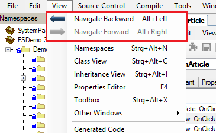

## Method History Browser

Bei allen Elementen, die Methoden enthalten (z.B. Forms, Components, Services, FSTransformations, …) können Sie im Designer-Fenster mit dem Menüpunkt **View / Method History Browser** oder über das Kontextmenü im Editor, Methoden in verschiedenen Versionen innerhalb des aktuellen Packages vergleichen.

Dazu wählen Sie zunächst das Label, anschließend die Version und zuletzt die Methode aus, die betrachtet werden soll. Mit dem Button **Compare** kann diese Version der Methode mit der aktuellen Version verglichen werden.

Zum Vergleich wird ein externes Programm verwendet, welches mit dem Menüpunkt **Tools / Options** im Hauptfenster konfiguriert werden muss. Dort muss auf der Registerkarte **Utilities** der Pfad zum Werkzeug bei **Diff Tool** eingetragen werden. Bei **Diff Tool Data Dir** muss ein Verzeichnis ausgewählt werden, in das temporär die zu vergleichenden Dateien geschrieben werden können. Gut geeignet ist beispielsweise das frei verfügbare Vergleichswerkzeug ***WinMerge***.

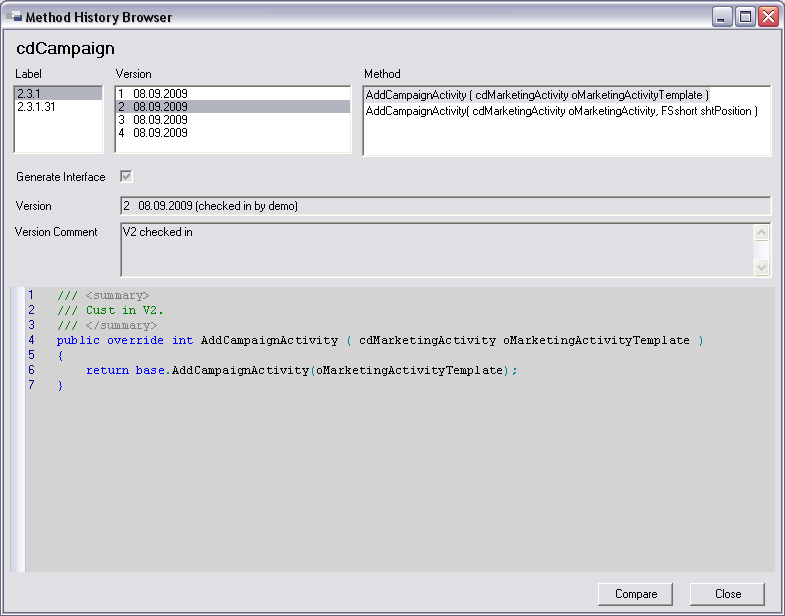

## Element History Browser

Im Designer Fenster aller Elemente für die Code generiert wird (Components, Forms, Workflows, …), lässt sich über den Menüpunkt **View / Element History Browser** analog zum Method History Browser ein Dialog öffnen, mit dem die Historie des Elements im aktuellen Label betrachtet werden kann. Der **Element History Browser**  zeigt den generierten Code zu der ausgewählten Version an und ermöglicht über den Button **Compare** einen Vergleich mit der aktuellen Version.

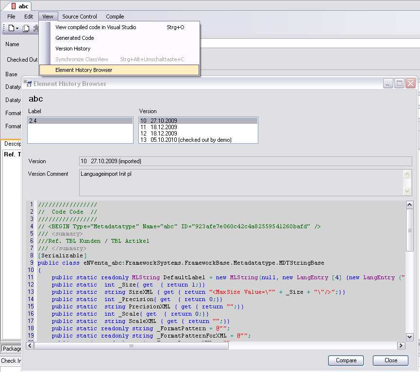

## Methoden-Wächter

Für Form-Methoden, Component-Methoden, ServiceProxy-Methoden, FsTransformation-Methoden, ServiceHost-Methoden, sowie get- und set-Methoden von Individual und DataContract Properties steht ein Methoden-Wächter zur Verfügung. Dieser kann bei überschriebenen Methoden alle Basis-Methoden und deren Änderungsstatus überwachen. Wird bei einem Compile festgestellt, dass sich in einer Basis-Methode etwas geändert hat, wird eine Compiler-Warning (FSWarn[2029](**!TODO LINK**)) ausgegeben:

**Methoden-Wächter Warnung:**

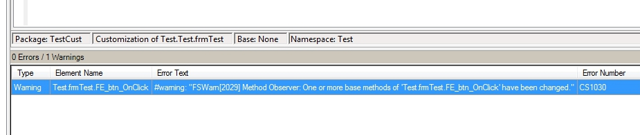

Der Wächter lässt sich über den Button  in der Toolbar aktivieren:

**Aktivierung Methoden-Wächter:**

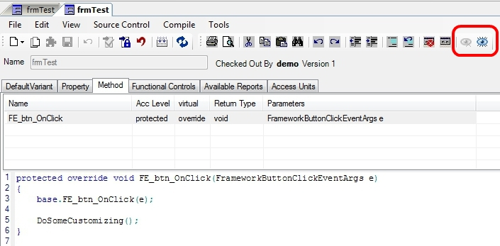

Ist der Wächter aktiviert, ändert sich das Symbol des Buttons in ein Refresh-Icon  und der Button  zum Deaktivieren des Wächters wird aktiv.

**Refresh- und Disable Buttons:**

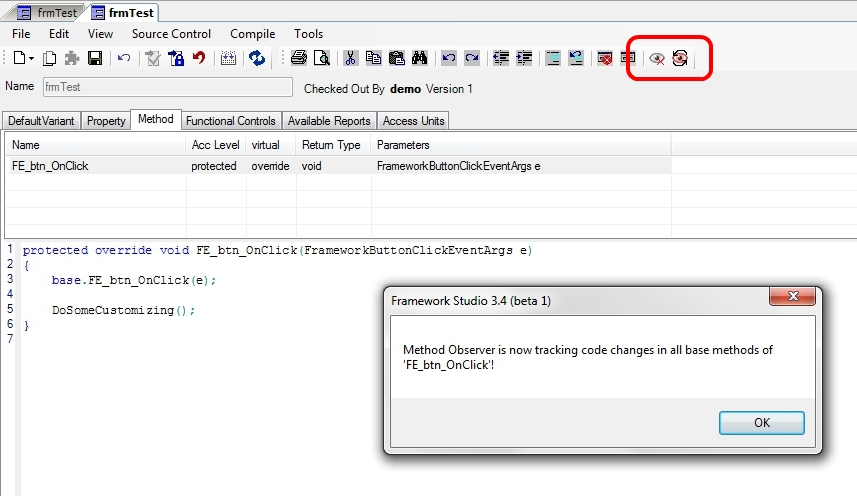

Befinden sich mehrere Packages unter dem aktuellen Package, in dem der Methoden-Wächter aktiviert ist, wird nicht nur die direkte Basis-Methode überwacht, sondern der gesamte Basispfad bis zur **virtual**-Methode.

Werden bei einem Compile Änderungen an einer der Basis-Methoden festgestellt, kann der Methoden-Wächter aktualisiert werden. Damit wird vom Entwickler bestätigt, dass die Änderung in der Basis-Methode keine Auswirkung auf den aktuellen Code hat. Mit dem Aktualisieren des Methoden-Wächters wird auch die Warnung während des Compile-Vorgangs eliminiert.

**Aktualisierung des Methoden-Wächters:**

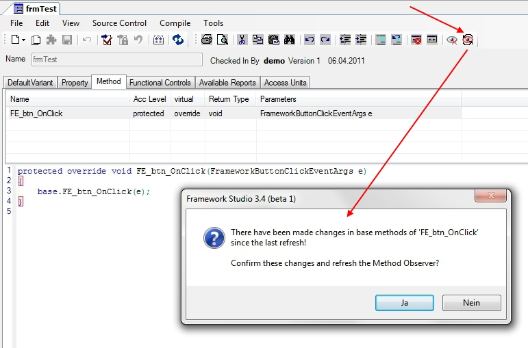

Sollten beim Deaktivieren des Wächters noch nicht bestätigte Änderungen in den Basis-Methoden vorhanden sein, wird zuvor nochmals explizit gewarnt:

**Warnung beim Deaktivieren:**

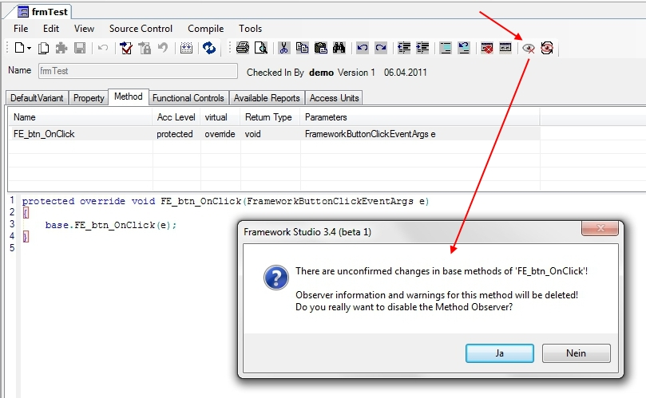
