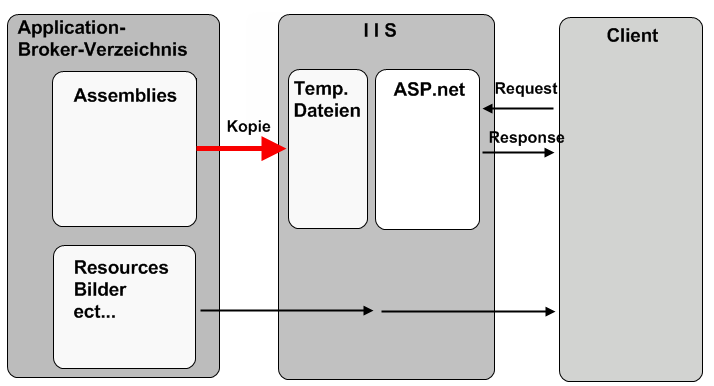
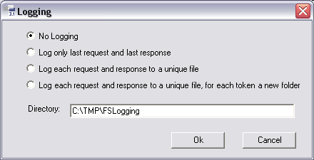

# Anwendung Starten / Fehlersuche

## Hintergrundinformationen

### Application-Broker

Das Brokerverzeichnis für den Application-Broker wird mit dem Button  **Broker Management** im Application Dialog erzeugt.

Dabei werden die folgenden Dateien in das Verzeichnis kopiert:

* Alle Ressourcen der Anwendung (z.B. Bilder)
* Java-Client
* Framework Studio Laufzeit-Assemblies
* Assemblies der Applikation (vom Benutzer **FrameworkCompiler**)

Ein Request des Clients ruft im IIS eine ASP.net Seite auf. Der IIS kopiert dann automatisch alle benötigten Assemblies aus dem Brokerverzeichnis in ein temporäres Verzeichnis und verwendet dann diese temporären Kopien, um den Request zu verarbeiten. Der Vorteil des Kopierens liegt darin, dass die original Assemblies nicht direkt vom IIS verwendet werden und dadurch auch nicht blockiert werden.

Auf diese Weise wird gewöhnlich der Echtbetrieb einer Anwendung realisiert.

### Development-Broker

> [!WARNING]
> TODO! FSBrokerHost beschreiben

### Compile-Verzeichnis

Beim Kompilieren der Anwendung werden alle Dateien in dieses Verzeichnis geschrieben. Das aktuell verwendete Compile-Verzeichnis kann über den Menüpunkt **Compile / Open Compile Directory in Explorer** geöffnet werden.

Auf einem Rechner wird pro Framework Studio Entwickler, pro Package und pro Package-Version je ein eigenes Compile-Verzeichnis verwendet. Falls das aktuell zu verwendende Verzeichnis beim Start von Framework Studio noch nicht existiert, wird es automatisch angelegt.

In den Compile-Verzeichnissen existieren immer die folgenden Unterordner:

**bin:** Enthält alle Assemblies und ggf. Textdateien mit den benutzten Referenzen
**src:** Enthält alle Source Dateien, die von Framework Studio generiert wurden. Durch das Kompilieren dieser Dateien werden die Assemblies der Anwendung (im Verzeichnis bin) erzeugt.

## Anwendung zum Testen starten

Wenn Sie Ihre Anwendung während der Entwicklung zum Testen starten wollen, verwenden Sie dazu den [Development-Broker](#development-broker).

Dieser wird mit den Menüpunkt **Compile / Run** (oder mit der Taste **F5**) mit den zuletzt im [Run-Wizard](!TODO LINK) vorgenommenen Einstellungen gestartet.

Wenn Sie die Einstellungen für den Start der Applikation (z.B. andere Business Datenbank verwenden) ändern möchten, öffnen Sie mit dem Menüpunkt **Compile / Run…** (oder der Tastenkombination **Umschalt + F5**) den [Run-Wizard](!TODO LINK). Dort können alle Einstellungen vorgenommen werden. Wenn Sie den Wizard anschließend mit **Run** beenden, wird die ausgewählte Applikation mit den vorgenommenen Einstellungen gestartet.

## Debugging

Die Anwendung kann mit einem beliebigen .NET Debugger (z.B. Visual Studio) debuggt werden. Dazu müssen Sie die für Sie relevanten Teile der Anwendung **Debuggable** kompiliert haben ([Compile](allgemeine-funktionatitaeten.md#compile)). Dadurch werden entsprechende .cs- und .pdb-Dateien in das Unterverzeichnis \src des Compileverzeichnisses ([Compile-Verzeichnis](#compile-verzeichnis)) geschrieben. Nach dem Start der Anwendung muss der Debugger an den Prozess **FSDevBrokerHost.exe** angehängt werden (Visual Studio: Menüpunkt **Debug / Attach to process**). Gegebenenfalls müssen Sie noch die relevanten .cs-Dateien im Debugger öffnen, um beispielsweise einen Breakpoint setzen zu können.

## Protokollieren der XML-Kommunikation

In manchen Fällen ist es hilfreich, die Kommunikation zwischen Client und Broker zu analysieren. Dazu können sowohl die Anfragen des Clients (Request) als auch die Antworten des Brokers (Response) geloggt werden.

Mit dem Menüpunkt **Compile / Logging ...** öffnen Sie den folgenden Dialog:

Im Eingabefeld **Directory** wird das Verzeichnis angegeben, in das die Protokollierungsdaten geschrieben werden sollen. Das Verzeichnis wird beim Verlassen des Dialogs automatisch angelegt, wenn es noch nicht existiert. Der Benutzer Account, unter dem der IIS (Internet Information Services) läuft, muss Schreibzugriff auf dieses Verzeichnis haben.

Es stehen vier Modi zur Auswahl:

* **No Logging:** Die Protokollierung ist abgeschaltet (Standardeinstellung)

* **Log only last request and last response:** Es werden genau zwei Dateien in das angegebene Verzeichnis geschrieben. In der einen Datei wird jeweils die letzte Anfrage des Clients gespeichert, in der anderen Datei jeweils die letzte Antwort des Brokers.

* **Log each request and response to a unique file:** Jede Anfrage des Clients und jede Antwort des Brokers wird in eine eigene Datei (mit Zeitstempel und aufsteigender Nummerierung) in das angegebene Verzeichnis geschrieben.

* **Log each request and response to a unique file, for each token a new folder:** Für jede Sitzung wird ein eigener Ordner im angegebenen Verzeichnis angelegt, in dem für jede Anfrage des Clients und für jede Antwort des Brokers eine eigene Datei geschrieben wird.

> [!WARNING]
> Es werden unter Umständen sehr viele Dateien auf der Festplatte angelegt! Diese müssen manuell wieder gelöscht werden.

Die Log-Dateien können mit einem beliebigen XML-Viewer betrachtet werden.
