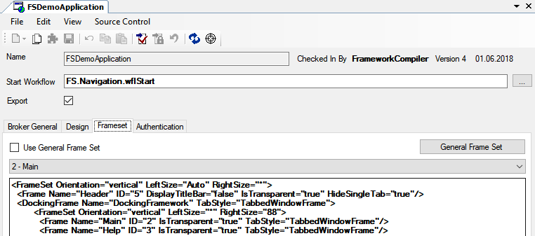

# Application

Um Ihre Anwendung erzeugen zu können, müssen Sie zunächst Ihre Anwendung geeignet konfigurieren.

Mit einem neuen Repository wird unter dem Namespace **FSGeneral** > **Applications** automatisch ein Application-Element angelegt.

Dieses kann aus dem Namespace-Tree oder über den Menüeintrag **Compile** > **Application** aufgerufen werden.

**Start Workflow:**

Hier wird angegeben, welchen Workflow die Applikation starten soll, nachdem sie gestartet wurde.

**Export:**

Über dieses Häkchen wird definiert, ob die Application bei einem Package-Export mit exportiert werden soll oder nicht.

## Registerkarte Broker General

#### **Supports Html Client**

Mit dieser Checkbox kann definiert werden, ob die Application mit dem HTML-Client gestartet werden kann. Ist die Checkbox gesetzt, dann wird in der Broker-Startseite der HTML-Client angeboten.

Wird der HTML-Client aktiviert, muss sichergestellt werden, dass alle Fenster, die in der Application vom Benutzer erreicht werden auch vollständig vom HTML-Client unterstützt werden.

(Siehe auch [HTML-Client](../html-client/index.md))

#### **Service Name**

Name des Services unter dem der Broker erreichbar ist.

#### **Service Address**

Wenn Sie in der Checkbox **Service Address** einen Haken setzen, können Sie im dazu gehörigen Textfeld manuell die Adresse angeben, über welche die Applikation zu erreichen ist.

#### **Directory**

Hier wird das Web-Verzeichnis angegeben, in welches die vom Broker benötigten Dateien kopiert werden sollen. Über den Button  haben Sie auch die Möglichkeit, das Verzeichnis über einen Auswahldialog zu suchen.

#### **Configuration**

Hier kann die Applikation manuell erweitert werden.

## Registerkarte Design

Auf dieser Registerkarte werden allgemeine Design-Einstellungen für die Anwendung vorgenommen. Beispiele dafür sind:

* Start- und Hintergrundbild
* Größe auf dem Bildschirm
* Icon der Anwendung
* Unterstützung von Transparenz
* Standardfarben (z.B. Hintergrundfarbe der Menüs)
* Anwendungstitel

#### DockLayoutXml

Dieses XML ist das initiale Layout für das Docking-Framework des Java-Clients. Beendet ein Benutzer den Java-Client, speichert sich dieser das aktuelle Layout auf dem Client-Rechner. Beim nächsten Programm-Start liest er es wieder ein. Ist kein Layout gespeichert – z.B. beim ersten Start der Anwendung oder nach dem Zurücksetzen des Layouts durch den Benutzer – dann zieht diese Einstellung aus der Application.

Das XML muss durch den Java-Client erzeugt und darf nicht von Hand bearbeitet werden. Mit den folgenden Schritten können Sie das XML aktualisieren:

* Am Client-Rechner das Layout der Anwendung zurücksetzen. Wenn die Anwendung keinen Befehl dafür kennt, dann im Ordner ***%USERPROFILE%\FSJavaClient\*** den entsprechenden Ordner löschen.
* Die Anwendung neu starten.
* Alle Fenster wie gewünscht anordnen. Dabei können auch Fenster aus dem Arbeitsbereich in einen Docking-Bereich platziert werden. Es sollten ausschließlich die notwendigen Fenster angeordnet werden, um unnötige Informationen zu verhindern.
* Achten Sie darauf, dass sich die gewünschten Fenster im Vordergrund befinden.
* Beenden Sie die Anwendung.
* Das Layout wird jetzt vom Client gespeichert. Es befindet sich im entsprechenden  Ordner unter ***%USERPROFILE%\FSJavaClient\***
* Öffnen Sie die Datei **docking.xml** mit einem Editor und fügen Sie deren Inhalt in das Property **DockLayoutXml** ein.

## Registerkarte Frameset

Wenn in der Checkbox **Use General Frame Set** ein Haken gesetzt ist, wird ein Standard-Frameset verwendet. Dieses Standard-Frameset können Sie mit dem Button General Frame Set modifizieren.

Wenn in der Checkbox **Use General Frame Set** kein Haken gesetzt ist, können Sie ein eigenes Frame Set im Textfeld **Frame Set** definieren. In der Combobox legen Sie den Frame fest, in dem Formulare standardmäßig geöffnet werden, wenn für ein solches nicht explizit angegeben wird, in welchem Frame es geöffnet werden soll.

## Registerkarte Authentication

Wenn die Benutzer der Anwendung authentifiziert werden sollen, können Sie auf dieser Registerkarte das Authentifizierungssystem von Framework Studio aktivieren und die nötigen Einstellungen vornehmen.

Zum Aktivieren der Authentifizierung muss in der Checkbox **Enable Authentication** ein Haken gesetzt werden.

Im Bereich **Default Login** wird der Standardbenutzer angegeben, der automatisch von der Anwendung am Authentifizierungsdienst angemeldet wird, bis sich der Benutzer mit eigenem Namen und Passwort angemeldet hat. Programmbereiche, die diesem Default-Benutzer zur Verfügung gestellt werden, können also von allen noch nicht an der Anwendung angemeldeten Benutzern eingesehen werden. Dazu muss insbesondere das Login-Fenster gehören.

#### Default User Name

Name des Standardbenutzers

#### Default User Password

Passwort des Standardbenutzers

Im Bereich **Application Identity** werden Eigenschaften festgelegt, mit denen sich die Anwendung am Authentifizierungsdienst (als Service) anmeldet.

#### Service Name

Unter diesem Namen wird die Anwendung im Authentifizierungsdienst angezeigt.

#### Service ID

Über diese Nummer (vom Typ [Guid](xref:FrameworkSystems.FrameworkBase.Metadatatype.FSSystemGuid)) wird die Anwendung eindeutig identifiziert. Wenn diese Nummer geändert wird, betrachtet der Authentifizierungsdienst diese Anwendung als eine andere Anwendung, auch wenn der Name identisch ist.

Mit dem Button **New Guid** kann automatisch eine neue, eindeutige ID generiert werden.

> [!WARNING]
> Wenn Benutzern Rollen für eine Anwendung zugeordnet wurden und anschließend die Anwendung eine neue ID bekommt und somit als eine andere Anwendung am Authentifizierungsdienst erkannt wird, dann gelten die Rollen der Benutzer nicht für die Anwendung mit der neuen ID!

#### Service Description

In diesem Feld können Sie eine Beschreibung der Anwendung angeben. Diese Beschreibung wird im Verwaltungswerkzeug für den Authentifizierungsdienst angezeigt.
