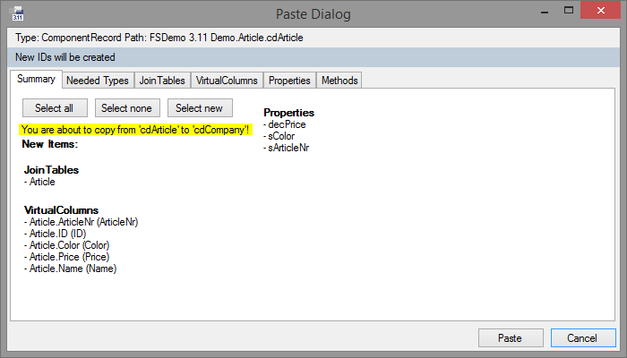

# Bearbeiten von Elementen

Die Elemente, die in Framework Studio bearbeitet werden können, werden alle auf der Registerkarte Namespaces verwaltet.

Es folgt eine Übersicht der Elemente im Framework Studio:

 **Namespace**

Namespaces bilden eine Ordnerstruktur, in der alle anderen Elemente geordnet abgelegt werden. Ein Namespace kann auch wiederum andere Namespaces beinhalten.

 **Resource**

Eine Ressource stellt eine beliebige Datei dar, die beim Kompilieren in das Brokerverzeichnis kopiert wird. Dadurch kann die Anwendung diese Datei (z.B. ein Bild oder eine externe DLL) verwenden.
([Resources](../resources/resources.md))

 **Access Unit**

Über Access Units wird die Anwendung in einzelne Bereiche eingeteilt. Diese Bereiche können dann durch Laufzeitlizenzen und abhängig von den Rollen eines Benutzers gesperrt werden.
(Access Units(**!TODO LINK**), Laufzeitlizenzen(**!TODO LINK**))

 **Metadatentype**

Ein Metadatentyp ist ein erweiterter Datentyp, der mehr Informationen enthält als ein normaler Datentyp unter .NET. Weitere Informationen sind z.B. Labels, Format und Controls.
([Metadatentypen](../mdt/metadatentypen.md))

  **Datasource**

Ein Datasource definiert eine Datenbankverbindung, die von der Anwendung zum Lesen und Schreiben der Anwendungsdaten benutzt werden kann.
([Datasource](../database/datasource.md))

 **DBTable**

Ein DBTable ermöglicht Komponenten den Zugriff auf eine Datenbanktabelle, die über einen Datasource angesprochen werden kann.
([DBTable](../database/dbtable.md))

 **Component / Collection / Textcollection**

Eine Component ist eine funktionale Klasse, die bereits Grundfunktionalitäten wie das Lesen und Schreiben von Daten in eine Datenbank beherrscht.

Eine Textcollection ist eine Sammlung von mehrsprachigen Texten.
(Component / Collections(**!TODO LINK**), Textcollections(**!TODO LINK**))

 **Report Document Type**

Hier werden ausdruckbare Reports und deren Schnittstelle definiert.
(Report Document Type(**!TODO LINK**))

 **Custom Control**

Durch Custom Controls ermöglicht Framework Studio das Hinzufügen von eigenen, spezialisierten Controls, die nicht zu den Standard-Controls gehören.
(Custom Controls(**!TODO LINK**))

 **Form**

Forms dienen der Visualisierung der Daten am Bildschirm. Sie enthalten Controls, welche die Daten anzeigen und bearbeiten können.
(Form(**!TODO LINK**))

 **Global Event**

Global Events dienen dazu, anwendungsweit Nachrichten zu senden.
(Global Events(**!TODO LINK**))

 **Workflow**

In Workflows wird die Kommunikation zwischen den Forms und dem Arbeitsablauf des Anwenders definiert. Workflows können Forms, Global Events, Links, Branches, Switches und andere Workflows enthalten.
(Workflow Designer(**!TODO LINK**))

 **Data Contract**

Data Contracts definieren komplexe Datenstrukturen für Service-Schnittstellen.
(Fehler! Verweisquelle konnte nicht gefunden werden.((**!TODO LINK**)))

 **Service Contract**

Service Contracts legen fest, welche Operationen ein Service beinhaltet.
(Fehler! Verweisquelle konnte nicht gefunden werden.(**!TODO LINK**))

 **Service**

Implementiert die im Service Contract definierten Operationen.
(Service(**!TODO LINK**))

 **Service Host**

Legt Endpunkte und Übertragungsparameter für den Service fest.
(Fehler! Verweisquelle konnte nicht gefunden werden.(**!TODO LINK**))

 **Service Proxy**

Kapselt einen Service Host nach außen.
(Fehler! Verweisquelle konnte nicht gefunden werden.(**!TODO LINK**))

 **Transformation**

Transformationen werden genutzt, um einen Eingangsdatentyp in einen Ausgangsdatentyp umzuwandeln. Häufig wird dies in Bezug auf Data Contracts verwendet.
(Transformationen(**!TODO LINK**))

## Elemente erstellen

Ein neues Element lässt sich erstellen, indem Sie auf der Registerkarte Namespaces den Namespace auswählen, in dem das Element abgelegt werden soll.

Mit dem Button  **(New)** der [**Registerkarte Namespaces**](registerkarten.md#registerkarte-namespaces) oder dem entsprechenden Eintrag aus dem Menü wird im markierten Namespace ein neues Element angelegt. Es wird auch gleich im Hauptfenster geöffnet. Direkt nach dem Anlegen des Elements steht der Cursor in dem sich öffnenden Designer-Fenster auf dem Feld **Name**. Geben Sie hier den Namen des neuen Elements ein.

Der Name lässt sich auch nachträglich noch ändern. Dazu öffnen Sie das Element und ändern die Bezeichnung im Feld **Name** oder wählen Sie aus dem Kontext-Menü des Elements auf der [**Registerkarte Namespaces**](registerkarten.md#registerkarte-namespaces) den Eintrag aus.

> [!WARNING]
> Wird das Element bereits verwendet, kann es zu Problemen kommen, da nicht an allen Stellen der Name automatisch nachgezogen werden kann.

Es empfiehlt sich, die Namen folgendermaßen zu vergeben:

Namespace: <i style="color: gray">XxxXxx</i>

Metadatentyp: ***mdt***<i style="color: gray">XxxXxx</i> oder <i style="color: gray">XxxXxx</i>

Component, die eine Datenbank-Tabelle anbietet: ***cd***<i style="color: gray">XxxXxx</i>

Andere Components: ***c***<i style="color: gray">XxxXxx</i>

Collections: ***cd***<i style="color: gray">XxxXxx</i>***Coll*** bzw. ***c***<i style="color: gray">XxxXxx</i>***Coll***

Textcollections: ***ct***<i style="color: gray">XxxXxx</i>

ReportDocumentTypes: ***rpt***<i style="color: gray">XxxXxx</i>

Form: ***frm***<i style="color: gray">XxxXxx</i>

Global Event: ***gev***<i style="color: gray">XxxXxx</i>

Workflow: ***wfl***<i style="color: gray">XxxXxx</i>

## Elemente bearbeiten

Um ein Element zu bearbeiten, öffnen Sie es mit einem Doppelklick auf der [**Registerkarte Namespaces**](registerkarten.md#registerkarte-namespaces).

Im Hauptteil von **Framework Studio** öffnet sich dann ein Desginer-Fenster für das ausgewählte Element. Dort können die gewünschten Änderungen vorgenommen werden.

Mit dem Button  Save werden die Änderungen gespeichert.

> [!WARNING]
> Namespaces können nicht geöffnet werden. Mit einem Doppelklick wird der Namespace auf- oder zugeklappt.

## Elemente löschen

Löschen können Sie ein Element mit dem Menüeintrag **File / Delete …**. Dazu wird das gewünschte Element im Objekt-Baum markiert. Diese Funktion können Sie auch über das Kontext-Menü eines Elements im Objekt-Baum nutzen.

Der Löschvorgang wird erst wirksam, wenn Sie den Button  **(Save All)**  drücken.

> [!WARNING]
>
> * Durch das Speichern eines gelöschten Elements wird im Hintergrund automatisch ein CheckIn durchgeführt.
>
> * Es werden auch alle Änderungen an anderen, geöffneten Elementen gespeichert.

## Elemente kopieren / einfügen

Es ist möglich, verschiedene Elemente zu kopieren oder auch zusammenzuführen (mergen). Das funktioniert auch, wenn es sich bei Quelle und Ziel um unterschiedliche Repositories handelt.

Folgende Elemente können kopiert und gegebenfalls zusammengeführt werden:

|                |                                |                          |                            |
| -------------- | ------------------------------ | ------------------------ | -------------------------- |
| MDT            | ServiceHost **1**   | Workflow                 | Resource                   |
| DBTable        | Service Proxy **2** | DataContract             | Namespace **1** |
| Collection     | Report                         | ServiceContract          | Component                  |
| TextCollection | GlobalEvent **1**   | Service **2** | Form                       |

> [!WARNING]
>
> **1** Element kann nicht gemerged werden.
>
> **2** Ableitung des Elements kann weder kopiert noch gemerged werden.
>

### Allgemein

##### Copy

Über das Kontextmenü eines Elements, über den Menüpunkt **Copy** im **Edit**-Menü oder über die Copy & Paste Buttons kann ein Element kopiert werden.

**Copy & Paste Buttons:**

##### Paste

Wird ein Element ohne Basis und ohne ID kopiert, kann es überall eingefügt werden. Wird ein Element mit ID kopiert, kann dies nur eingefügt werden, wenn ein Element mit derselben ID noch nicht existiert. Eine Customization kann nur erstellt werden, wenn im Package noch keine Customization vorhanden ist und die passende Basis existiert.

Grundsätzlich wird zwischen zwei verschiedenen Arten unterschieden, um ein Element einzufügen:

1. **Element am Namespace eingefügt**
    Über das KontextMenü am Namespace kann das kopierte Element in den Namespace eingefügt werden. Dabei wird ein neues Element erstellt.
    Falls ein Element mit derselben ID bereits existiert wird über ein Dialog vorgeschlagen das kopierte Element in das bestehende Element einzufügen.

2. **Element in ein bestehendes Element des gleichen Typs einfügen**
    Über das Kontextmenü eines Elements oder über den Menüpunkt Paste im Edit-Menü kann das kopierte Element in ein bestehendes Element desselben Typs eingefügt werden. Dieser Vorgang stand in älteren Versionen schon unter Merge bei Components zur Verfügung.

**Dialog zum zusammenfügen von Elementen mit gleicher ID:**

##### Kompatibilität

Elemente bei denen Copy & Paste bereits vorhanden war (Components, Forms) können zwischen der alten und neuen Version kopiert werden. Das Kopieren mit ID wird jedoch erst ab FS3.11 unterstützt.

### Paste Dialog

##### Allgemein

Über den **Paste** Dialog kann beim Kopieren in ein bestehendes Element ausgewählt werden, welche Unterelemente wie kopiert werden.
Zu beachten ist, dass der **Paste** Dialog sehr viele Freiheiten bietet. Dies ermöglicht natürlich auch fehlerhafte Stände zu erstellen. Dieser Mechanismus ist für versierte Benutzer konzipiert. Grundsätzlich sollte der Benutzer wissen, was er tut und VOR der Aktion sicherstellen, dass alle benötigten Elemente am Ziel vorhanden sind.
Die zu kopierenden Unterelemente sind in Gruppen auf verschiedene Registerkarten aufgeteilt. Jeder **Paste** Dialog enthält eine ***Summary*** und die ***NeededTypes***.
Im obersten Bereich des Paste-Dialogs werden der Type und der Pfad des kopierten Elements angezeigt. Der Pfad des kopierten Elements ist nur für Elemente sichtbar, die aus einer Version ≥ FS 3.11 kopiert wurden.

**Paste Dialog: Angaben zum kopierten Element:**

##### Summary

Die erste Registerkarte beinhaltet immer die Summary. Diese zeigt, ob beim Paste oder Merge Konflikte auftreten.

Framework Studio versucht grundsätzlich bei der Aktion die benötigten Elemente im Ziel-Package auf folgenden Wegen zu finden:

1. Über die interne ID: Das funktioniert meist dann, wenn Quell- und Ziel-Package identisch sind oder wenn Elemente aus einem gemeinsamen Basis-Package verwendet werden.

2. Über den Namen: Wenn über die ID nichts gefunden wird, wird nach einem gleichnamigen Element (z.B. Metadatentyp, Component, Property) gesucht. Das ist vor allem dann sehr nützlich, wenn nach und nach mehrere Elemente in ein anderes Package kopiert werden.

3. Wenn diese Wege nicht zum Ziel führen, wird dies als Konflikt betrachtet und der Benutzer muss nach einer Lösung suchen. Teilweise kann das auf den restlichen Registerkarten erfolgen. Manchmal ist es aber auch nötig, die Aktion abzubrechen, erst die Voraussetzungen zu schaffen (z.B. eine DBTable anlegen) und die Aktion anschließend noch einmal auszuführen.

Für einige Elemente gelten Sonderregeln für das Kopieren und Zusammenfinden von Elementen. Diese sind dem Kapitel ([Kopieren vo¬n ID´s](#kopieren-von-ids)) zu entnehmen.

Über verschiedene Buttons kann ausgewählt werden, welche Unterelemente der Registerkarte selektiert und beim Einfügen berücksichtigt werden.

**Select all:** Alle Unterelemente werden selektiert.

**Select none:** Alle Unterelemente werden deselektiert.

**Select new:** Es werden nur neu hinzugefügte Unterelemente selektiert

**Paste Dialog: Summary:**

Beim Einfügen eines Elements am Namespace kann außerdem ausgewählt werden, ob die ID des Elements kopiert werden soll.

##### NeededTypes

Bei den _Needed Types_ werden alle Typen aufgelistet, die nicht zum Standard gehören. Diese können beliebig ausgetauscht werden. Das kann z.B. dann sinnvoll sein, wenn ein benötigtes Element vorher auch schon kopiert wurde und jetzt ggf. unter einem anderen Namen in einem anderen Namespace zu finden ist.

##### Zusammenführen von Elementen

Mit einem Merge kann erreicht werden, dass Änderungen in einer Kopie nachgezogen werden. Was nicht möglich ist, sind gelöschte Elemente durch den Merge zu entfernen. Es werden nur neu hinzugekommene oder geänderte beachtet.
Beim Kopieren in ein bestehendes Element werden zusätzlich alle zu kopierenden Unterelemente gruppiert und in verschiedenen Registerkarten dargestellt.

Die Unterelemente sind wiederum nach MergeAction und Name sortiert.
Für jedes Unterelement kann separat entschieden werden, ob und wie es im Ziel eingefügt wird.

**Unterelemente:**

* Unterelemente können einzelne Werte oder komplexere Elemente wie Methoden oder Properties darstellen.
* Alle Elemente werden gruppiert und in verschiedenen Registerkarten dargestellt.
* Die einzelnen Elemente können aus einer Liste ausgewählt werden.
* Für jedes Element kann separat entschieden werden, ob und wie es gemerged wird.
* Elemente, die im Ziel noch nicht vorhanden sind (Insert) werden in der Liste Grün dargestellt.

**Merge Action:**
Es stehen verschiedene Merge-Operationen zur Verfügung:

* **Insert**
  * Das Element wird im Ziel neu eingefügt
  * Der Eintrag wird in der Liste Grün dargestellt

* **Replace**
  * Unter **Target** kann das Element, das im Ziel ersetzt werden soll, ausgewählt werden

* **Replace with**
  * Das ausgewählte **Source**-Element ersetzt das „Target“-Element

**Target:**

* Dieses Element wird beim Mergen ersetzt

**Source:**

* Das **Source**-Element ersetzt das „Target“-Element beim Merge

**Merge Info:**

* Bietet Informationen über das Merge Element z.B. die Art der Übereinstimmung im Ziel

### Kopieren von ID´s

Um Parallelentwicklungen zu realisieren, ohne dass die internen IDs von Elementen in verschiedenen Versionen auseinanderlaufen, besteht nun die Möglichkeit die ID von Elementen zu kopieren.

In der obersten Leiste des **Paste** Dialogs ist farblich gekennzeichnet, ob die IDs kopiert oder neu angelegt werden.

**Kopieren von IDs Aktiv:**

**Kopieren von IDs Inaktiv:**

**Für das Kopieren von IDs gelten folgende Regeln:**

* Wenn das zu kopierende Element am Namespace eingefügt wird und aus demselben Package aber unterschiedlicher Version stammt, ist das Kopieren der ID´s optional.
  
* Beim Zusammenführen von Elementen im selben Package aber unterschiedlicher Version wird die ID automatisch kopiert, wenn die IDs der beiden Elemente übereinstimmen, ansonsten nicht.
  
* Wenn das zu kopierende Element aus einem anderen Package stammt, ist das Kopieren der ID´s nicht möglich.

**Kopieren von IDs:**

### Kopieren von Unterelementen

* Es ist möglich Methoden, Controls, Form- und Component-Properties zu kopieren.

* Methoden können unabhängig von dem Parent-Element eingefügt werden.

* Die ID wird bei Unterelementen nur dann übernommen, wenn in demselben Package aber unterschiedlichen Versionen kopiert wird und die ID der Parent-Elemente übereinstimmt. Elemente aus einer älteren Version werden nicht mit ID kopiert.

* Beim Einfügen von Unterelementen in ein anderes Parent-Element wird der PasteDialog angezeigt. Beim Einfügen von Unterelementen aus einer älteren Version wird der Dialog nicht angezeigt.

### Sonderfälle

Es gibt Ausnahmen oder Sonderfälle beim Kopieren oder Mergen, die nachfolgend aufgelistet sind:

##### Metadatentype

* Merge von Indices
  * Falls die ID oder der Name identisch sind, wird ein Replace angeboten.
  * Fall ID und Name nicht übereinstimmen, aber dieselbe Konstellation von Spalten im Ziel enthalten ist und ASC/DSC identisch sind, wird ebenfalls ein Replace angeboten.
  * In allen anderen Fällen wird ein Insert angeboten.

##### TextCollection

* Merge von TextEntries
  * Wenn der PK identisch ist, wird ein Replace vorgeschlagen.
  * Wenn die ID´s oder die Namen identisch sind, aber der PK abweicht, wird ein Replace mit entsprechender Warning angezeigt.
  * Beim Mergen werden ID und Namen als Felder zum Bearbeiten angeboten.
  * Texte, die nicht bekannt sind (ISO nicht bekannt), werden nicht gemerged.

##### Service Elemente

* Allgemein
  * Ableitungen von Service Elementen können weder kopiert noch gemerged werden.

##### Report

* Data Source
  * Die angehakten Checkboxen von DataSources werden beim Kopieren von Ableitungen oder Customizations nicht mit kopiert.
  * Die angehakten Checkboxen vom DataSources werden beim Merge nicht berücksichtigt.

##### GlobalEvent

* Allgemein
  * Das GlobalEvent kann nicht gemerged werden.

##### Workflow

* Merge Allgemein
  * Die Position oder Größe eines Elements wird beim Mergen nicht berücksichtigt.
  * Wenn der Name oder die ID eines Elements identisch ist, wird, falls sich eine Eigenschaft geändert hat, ein Replace angeboten.

**Ein Merge-Konflikt wird angezeigt, wenn:**

* Switch
  * das Event (Name oder ID) nicht identisch sind
* Branch
  * die Condition abweicht
* Link
  * eine Eigenschaft des Links geändert wurde
* Form
  * ***ISModal***, ***ISEntranceInstance*** oder ***IsStartInstance*** geändert wurde
* Workflow
  * ***IsEntranceInstance*** geändert wurde

##### Resource

* Allgemein
  * Ressources können nicht gemerged werden

##### Namespaces

* Allgemein
  * Namespaces können nicht gemerged werden
  * Namespace Referencen werden nicht kopiert
