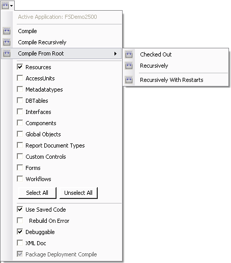

# Code Builder

**Compile Options:**

Das Menü, mit dem Sie zum einen die Optionen zur Codegenerierung und zum Kompilieren festlegen, und zum anderen einen Kompiliervorgang starten können, wird über den Button  **Compile Options** geöffnet.

In diesem Fenster sehen Sie in der Zeile, beginnend mit **Active Application**, welche Applikation ausgewählt ist. Für diese Applikation werden dann durch das Starten des Kompiliervorgangs die Dynamic Link Librarys (DLLs) erzeugt.

Mit den unten aufgeführten Checkboxen () legen Sie fest, für welche Elementtypen der generierte Code neu kompiliert werden soll. Es ist nicht immer notwendig und wird aus Zeitgründen auch nicht empfohlen, alle Elemente in einem Namespace zu kompilieren. Stattdessen sollten Sie nur die Elemente kompilieren, an denen Sie auch tatsächlich Änderungen vorgenommen haben.

#### Checkbox **Resources**

Wählen Sie **Resources**, um alle Ressourcen neu ins Brokerverzeichnis zu kopieren.

#### Checkbox **Access Units**

Wählen Sie **Access Units**, wenn Sie neue Access Units (z.B. durch Hinzufügen eines neuen Forms) hinzugefügt haben und diese im Code ansprechen wollen.

> [!WARNING]
> Wenn Sie für die Anwendung keine Developer-Lizenz verwenden und neue Access Units hinzugekommen sind oder die Hierarchie geändert wurde, müssen Access Units mit dem Benutzer FrameworkCompiler **recursive from root** kompiliert werden.

#### Checkbox **Metadatatypes**

Wählen Sie **Metadatatypes**, um die Metadatentypen in einem Namespace zu kompilieren.

#### Checkbox **DBTables**

Wählen Sie **DBTables**, wenn Sie Änderungen an den DB-Tables vorgenommen haben.

#### Checkbox **Interfaces**

Wählen Sie **Interfaces**, wenn Sie Änderungen an Komponenten vorgenommen haben, welche die Methodendefinitionen, Methodenparameter oder Properties betreffen.

> [!WARNING]
> Der Sinn von Interfaces liegt darin, zirkulare Referenzen zu vermeiden. Die Interfaces werden daher grundsätzlich über alle Namespaces hinweg kompiliert.

#### Checkbox **Components**

Wählen Sie **Components**, wenn Sie Änderungen an den Komponenten vorgenommen haben, welche Methodendefinitionen, Methodenparameter, Properties oder Codes innerhalb von Methoden betreffen.

#### Checkbox **Global Objects**

Wählen Sie **Global Objects**, wenn Sie Änderungen an diesen vorgenommen haben und wenn Sie neue Komponenten angelegt haben.

#### Checkbox **Report Document Types**

Wählen Sie **Report Document Types**, wenn Sie Änderungen an diesen vorgenommen haben.

#### Checkbox **Custom Controls**

Wählen Sie **Custom Controls**, wenn Sie Änderungen an diesen vorgenommen haben.

#### Checkbox **Forms**

Wählen Sie **Forms**, wenn Sie Änderungen an den Forms vorgenommen haben.

#### Checkbox **Workflows**

Wählen Sie **Workflows**, wenn Sie diese geändert haben.

Mit dem Button  wählen Sie alle genannten Elemente aus, mit  keines.

Mit den darunter angeordneten Checkboxen legen Sie weitere Optionen zur Codeerzeugung und zum Kompilieren fest.

#### Checkbox **Use Saved Code**

Um die Codegenerierung zu beschleunigen, besteht die Möglichkeit, **Framework Studio** anzuweisen, auf bereits generierten und im Repository hinterlegten Code (sogenannten Saved Code) zurückzugreifen. Das hat den Vorteil, dass nicht der gesamte Code vor dem Kompilieren neu generiert werden muss, sondern lediglich die Teile, welche sich geändert haben.

Falls es dabei allerdings zu Problemen kommt, können Sie **Framework Studio** anweisen, den Code komplett neu zu generieren.

#### Checkbox **Rebuild On Error**

Diese Option ist irrelevant, wenn **Use Saved Code** nicht aktiviert wurde. Andernfalls bewirkt das Aktivieren von **Rebuild On Error**, dass bei einem Kompilierfehler in einem eingecheckten Element ein zweiter Kompilierversuch ohne **Saved Code** gestartet wird.

Der Kompilierversuch ohne **Saved Code** ist dann nötig, wenn Sie beispielsweise eine Komponente umbenannt haben, die von einer anderen, eingecheckten Komponente benutzt wird. Sie sollten die Option nur bei Problemen dieser Art aktivieren, da sich die Kompilierzeit mit **Rebuild On Error** beim Auftreten eines Fehlers deutlich erhöht.

#### Checkbox **Debugable**

Um den erzeugten Code zur Laufzeit mit Microsoft Visual Studio bereinigen zu können, aktivieren Sie die Option **Debugable**. Das führt dazu, dass im Applikations-Verzeichnis, zusätzlich zu den Dynamic Link Librarys (DLL) auch noch Programmdatenbankendateien und Quellcodedateien (.cs) von den einzelnen Namespaces erzeugt werden. Diese können mit **Visual Studio** geöffnet werden.

#### Checkbox **XMLDoc**

Aktivieren Sie diese Option, damit eine XML-Beschreibungsdatei erzeugt wird. Für weitergehende Informationen lesen Sie das Kapitel **Verwendung von NDoc**.

Um einen Kompiliervorgang zu starten, stehen Ihnen mehrere Möglichkeiten zur Auswahl:

#### Option **Compile Namespace**

Der Code für den im Objekt-Baum dargestellten Namespace wird generiert. Danach werden die Dlls erzeugt und in das Compile-Verzeichnis ([Compile-Verzeichnis](anwendung-starten.md#compile-verzeichnis)) geschrieben. Die darunter liegenden Namespaces werden nicht berücksichtigt.

#### Option **Compile Namespace Recursively**

Auch die untergeordneten Namespaces werden in den Kompiliervorgang mit eingebunden.

#### Option **Compile From Root**

Unter diesem Menüpunkt werden die folgenden Kompilierarten angeboten, die sich grundsätzlich auf alle Namespaces beziehen:

#### Option **Recursively**

Alle Elemente werden kompiliert.

#### Option **Recursively With Restarts**

Alle Elemente werden kompiliert. Dabei wird **Framework Studio** nach der erfolgreichen Abarbeitung eines jeden Elementtyps neu gestartet. Dadurch wird der gesamte verwendete Speicher freigegeben. Diese Funktion ist dann sinnvoll, wenn ohne den Neustart nicht ausreichend Arbeitsspeicher für den Kompiliervorgang zur Verfügung stehen würde.

Über die Tastenkombination **[Strg]+[Shift]+[B]** können Sie aus **Framework Studio** direkt einen Kompiliervorgang für den Elementtyp des aktuell geöffneten Elements anstoßen, ohne vorher das Menü **Compile Options** öffnen zu müssen.
