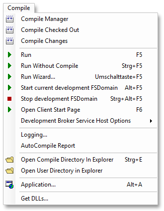
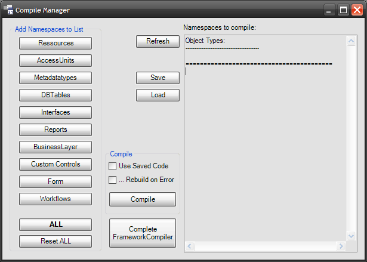

# Compile Menü

In den folgenden Abschnitten werden die Menüpunkte im Menü **Tools** beschrieben.

## Compile Manager

Wenn viele Namespaces kompiliert werden sollen und der Kompiliervorgang durch einen Fehler unterbrochen wird, kann mit dem Compile Manager der Kompiliervorgang fortgesetzt werden. In Verbindung mit dem FC-User ist das vor allem bei Update-Szenarien sehr vorteilhaft.

Mit den Buttons in der Gruppe **Add Namespaces to List** werden die zu kompilierenden Elemente typweise in die Liste übernommen. In der Liste auf der rechten Seite werden alle Namespaces gesammelt. Beim Erstellen der Liste wird nicht geprüft, ob ein Namespace auch tatsächlich Elemente eines bestimmten Typs (z.B. Forms) beinhaltet. Es landen immer alle existierenden Namespaces in der Liste.

Diese Liste versteht sich als eine Aufgabenliste, die durch kompilieren abzuarbeiten ist. Das Abarbeiten kann auf 2 Arten erfolgen:

1. Der Button **Compile** in diesem Fenster. Es öffnet sich ein ganz normales Compile-Fenster, das wie z.B. beim Compile-CheckedOut die entsprechenden Namespaces kompiliert.

2. Durch einen herkömmlichen Kompiliervorgang (über das Namespace-Registerkarte, aus einem Element heraus und auch Compile Checked Out).

Ganz gleich, von wo aus der Compile gestartet wird, immer wenn ein Namespace erfolgreich kompiliert wurde, wird dieser aus der Liste entfernt.

Mit dem Button **Save** kann die aktuelle Liste in eine Datei gespeichert werden. Die Datei wird in das Compile-Directory geschrieben. Mit dem Button **Load** kann diese Liste wieder aus einer Datei eingelesen werden. Das ist nützlich, wenn Framework Studio zwischendurch verlassen werden muss. So kann nach dem Neustart dort weitergemacht werden, wo zuletzt aufgehört wurde.

Mit dem Button **Complete FrameworkCompiler** wird der FrameworkCompiler-Vorgang abgeschlossen. Dieser Button wird nur angezeigt, wenn ein FC-User oder der FrameworkCompiler angemeldet ist. Folgende Aktionen werden ausgeführt:

1. Prüfen, ob etwas ausgecheckt ist. Für diese Aktion muss alles eingecheckt sein.

2. Refresh des FrameworkCompiler-Workspaces (nur wenn man als FC-User angemeldet ist). Beim Arbeiten mit dem FC-User können Elemente aus- und eingecheckt werden. Die SavedCodes und Assemblies wurden generiert und jetzt muss noch der Workspace vom FrameworkCompiler aktualisiert werden, damit dieser wieder zu den generierten Informationen passt. Das ist notwendig, wenn das Package exportiert werden soll oder anschließend andere User beim Refresh des eigenen Workspaces den vom FrameworkCompiler verwenden (**FrameworkCompiler Version and checked out** im Login-Dialog).

3. Aktualisieren des Compile-Stamps. Das beinhaltet die Information, dass der FrameworkCompiler erfolgreich gelaufen ist und sorgt dafür, dass die rote Kennzeichnung im Package-Manager verschwindet.

Beim normalen Kompilieren in FrameworkStudio wird das nicht durchgeführt, weil dieser Stempel sicherstellen soll, dass **ALLES** kompiliert wurde.

> [!WARNING]
> Diese Aktion sollte nur dann ausgeführt werden, wenn sichergestellt ist, dass auch wirklich alles kompiliert wurde.

## Compile Checked Out

Mit dem Menüeintrag **Compile Checked Out** werden alle vom Benutzer ausgecheckten Elemente kompiliert. Falls nötig, werden weitere Elemente kompiliert. Das betrifft insbesondere die folgenden Fälle:

* Wenn mindestens eine **Component** ausgecheckt ist, werden auch **Interfaces** und **GlobalObjects** kompiliert.

* Wenn mindestens ein **Form** ausgecheckt ist, werden auch **Access Units** mit kompiliert.

Diese Funktion verwendet im Hintergrund den [**Compile Manager**](#compile-manager). Wenn beim Kompilieren ein Fehler auftritt, dann kann der Kompiliervorgang im Compile-Manager fortgesetzt werden.

## Compile Changes

!TODO: muss noch genauer beschrieben.

## Run / Run…

Mit dem Menüeintrag **Run** werden die Testumgebung ([**Start / Stop current development FSDomain**](#start--stop-current-development-fsdomain)) und ein Client für die Applikation gestartet. Es werden dazu die zuletzt im [**Run-Wizard**](../publish/wizards.md#run-wizard) vorgenommenen Einstellungen verwendet.

Mit dem Menüeintrag **Run…** wird zunächst der [**Run-Wizard**](../publish/wizards.md#run-wizard) gestartet und anschließend die Testumgebung mit Client für die Applikation gestartet.

## Run Without Compile

!TODO: muss noch genauer beschrieben.

## Run Wizards…

!TODO: muss noch genauer beschrieben.

## Start / Stop current development FSDomain

Mit dem Menüeintrag **Start current development FSDomain** starten Sie alle im [**Run-Wizard**](../publish/wizards.md#run-wizard) konfigurierten Dienste (Service Hosts) und den Development Broker ([**Development-Broker**](anwendung-starten.md#development-broker)).

Mit dem Menüeintrag **Stop development FSDomain** wird der Development Broker beendet.

## Open Client Start Page

!TODO: muss noch genauer beschrieben.

## Development Service Host Options

Mit dem Menüpunkt Development Service Host Options können die folgenden beiden Schalter gesetzt werden:

* **Compile forces stop of Development Broker Service Host:** Ist diese Option mit einem Häkchen versehen, wird der [**Development-Broker**](anwendung-starten.md#development-broker) automatisch beendet, wenn in Framework Studio ein Kompiliervorgang gestartet wird. Andernfalls werden Sie beim Start eines Kompiliervorgangs gefragt, ob der laufende Development-Broker beendet werden soll. Die Beendung des Development-Brokers ist nötig, um kompilieren zu können. Der Schalter ist im Standard gesetzt.

* **Autostop of Development Broker Service Host after run of application:** Ist diese Option mit einem Häkchen versehen, wird der Development-Broker automatisch beendet, wenn die Testapplikation geschlossen wird.

## Logging

Mit dem Menüpunkt **Logging** wird ein Dialog geöffnet, in dem alle Einstellungen zur Protokollierung der Xml Kommunikation zwischen Client und Broker vorgenommen werden.

Siehe [**Protokollieren der XML-Kommunikation**](anwendung-starten.md#protokollieren-der-xml-kommunikation)

## AutoCompile Report

!TODO: muss noch genauer beschrieben.

## Open Compile Directory In Explorer

Mit dem Menüpunkt **Open Compile Directory In Explorer** wird das Kompilierverzeichnis ([**Compile-Verzeichnis**](anwendung-starten.md#compile-verzeichnis)) im Windows Explorer geöffnet.

## Open Development Broker Directory In Explorer

Mit dem Menüpunkt **Open Development Broker Directory In Explorer** wird das im IIS freigegebene Verzeichnis des Development-Brokers ([**Development-Broker**](anwendung-starten.md#development-broker)) im Windows Explorer geöffnet.

## Open User Directory In Explorer

Mit dem Menüpunkt **Open User Directory In Explorer** wird das Verzeichnis im Windows Explorer geöffnet, in dem **Framework Studio** benutzerbezogene Daten ablegt. Dazu gehören verschiedene Konfigurationsdateien sowie ggf. Trace- und Log-Dateien.

## Application…

!TODO: muss noch genauer beschrieben.

## Get Dll‘s

Mit diesem Menüpunkt können die Dll‘s vom FrameworkCompiler, die Debug-Dll’s vom aktiven Package oder die Debug-Dll’s von allen Basis-Packages in das eigene Compile-Verzeichnis geschrieben werden.
