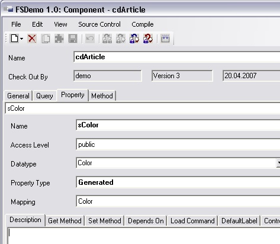

# Dokumentation

Einer der größten Kostentreiber eines jeden Softwareprojektes sind schlechte Dokumentationen, welche die Wiederverwendbarkeit von Code einschränken und die Wartung erschweren. Je besser Ihr Code dokumentiert ist, desto effektiver werden Sie ihn nutzen können.

## Allgemeines

Um die Übersichtlichkeit, Wiederverwendbarkeit und Wartbarkeit Ihres Codes zu gewährleisten, sollten Sie ihre Metadatentypen, Properties und Methoden entsprechend beschreiben.

Um Metadatentypen und Components mit Kommentaren zu versehen, öffnen Sie diese im **Framework-Designer** und tragen die Beschreibung in das Feld **Description** ein. Dabei muss die Eingebesyntax, wie im Folgenden ausgeführt, beachtet werden.

Zu Properties können Sie Kommentare hinterlegen, indem Sie die Component, die das Property enthält, über die Combobox auf der **Registerkarte Property** auswählen und auf der Property-Registerkarte **Description** einen Kommentar hinterlegen.

**Component:**



Bei Methoden sollten Sie Kommentare, Beschreibungen der Parameter, Beispiele u.ä. im Methodenkopf, also noch vor Deklaration der Methode hinterlegen.

Ist der Code ordentlich dokumentiert, haben Sie mit NDoc eine einfache Möglichkeit, eine Entwicklerdokumentation im Stil der MSDN zu erstellen.

> [!WARNING]
> Dazu ist es allerdings notwendig, dass die Kommentare auch in MSDN-konforme Tags eingeschlossen sind.

## Syntax

Damit die Kommentare von NDoc richtig verarbeitet werden, ist es wichtig, diese in Tags einzufassen. Ein Tag ist einfach eine Beschreibung, die den Inhalt definiert. XML benötigt für eine Beschreibung immer 2 Tags, einen öffnenden und einen schließenden.

Der schließende Tag unterscheidet sich dabei von dem öffnenden, dass er ’\’ vor der Tag-Bezeichnung trägt. Wenn Sie verschachtelte Tags benutzen, müssen diese von innen nach außen wieder aufgelöst werden.

```xml
<summary>
Zusammenfassung
</summary>
```

Tags, die Sie zum Beschreiben benötigen, sind:

**`<summary>`** Beschreibung **`</summary>`**<br />
**`<param name ="Parametername">`** Beschreibung **`</param>`**<br />
**`<returns>`** Returnparameter **`</returns>`**<br />
**`<remarks>`** Anmerkungen **`</remarks>`**<br />
**`<example>`** Beispiel **`</example>`**<br />

Sie können auch ein Code-Template anlegen, welches schon eine komplette Beschreibungsstruktur aufweist, so dass Sie die Tags nicht jedes Mal neu anlegen müssen.

Wie Sie es vielleicht auch schon von Visual Studio her kennen, werden Kommentare im Code, die für externe Dokumentationszwecke gedacht sind, durch 3 führende Slashs (**`///`**), interne dagegen durch 2 führende Slashs definiert.

**Beispiel eines Description-Templates:**

```csharp
///<summary>
///???
///</summary>
///
///<param name="???">???</param>
///
///<returns>???</returns>
///
///<remarks>
///???
///</remarks>
///
///<example>
///???
///</example>
public void WriteView()
```

Wenn Sie Kommentare in die Description-Felder eingeben, brauchen Sie keinen Slash voranstellen. Diese sind nur direkt im Code, wie bei Methoden notwendig.

Weitere gültige Tags können Sie der NDoc-Hilfe entnehmen.
