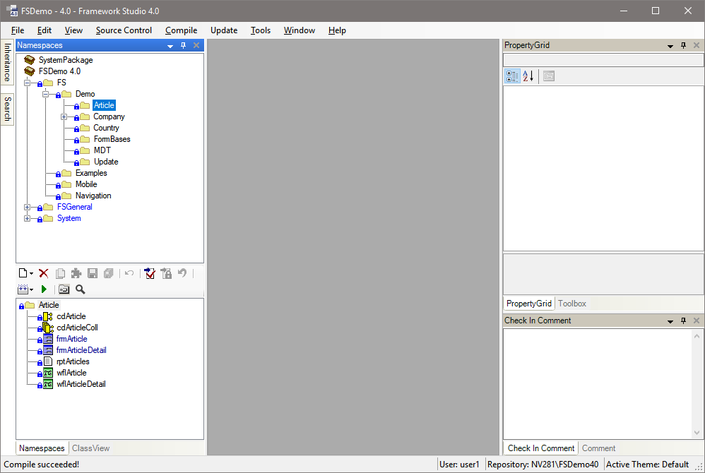

# Framework Studio IDE

Mit dem Framework Designer gestalten Sie auf komfortable Weise **Resources**, **Access Units**, **Metadatatypes**, **Datasources**, **DBTables**, **Components**, **Global Objects**, **Reports**, **Custom Controls**, **Forms** und **Workflows**. Diese grundlegenden Elemente sind über die Registerkarte Namespaces ([**Registerkarte Namespaces**](registerkarten.md#registerkarte-namespaces)) erreichbar.

Andere Elemente wie **Code-Templates**, **Laufzeitlizenzen** und die **Access Unit Hierarchie** sind über das Menü **Tools** erreichbar.

Nachfolgend werden die Registerkarten auf der linken Seite erklärt. Anschließend folgen allgemeine Funktionalitäten.
