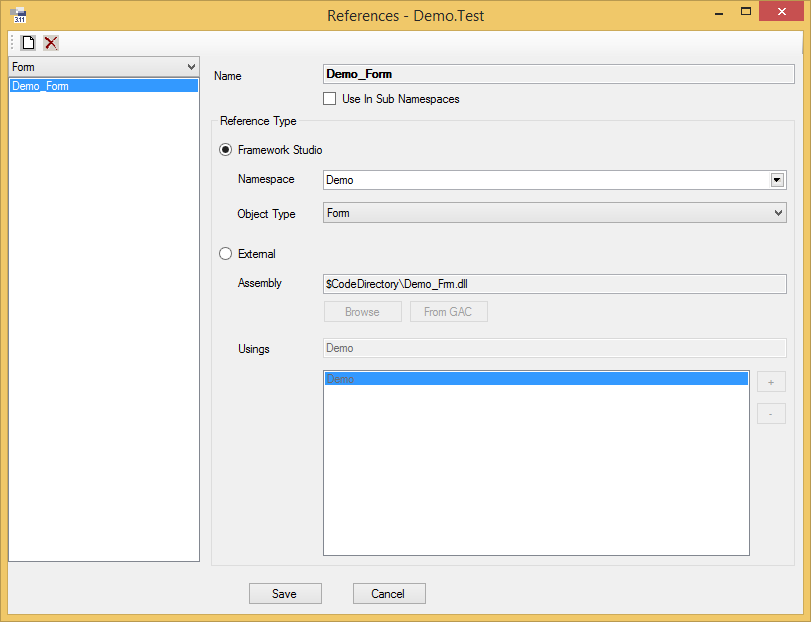
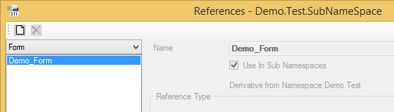
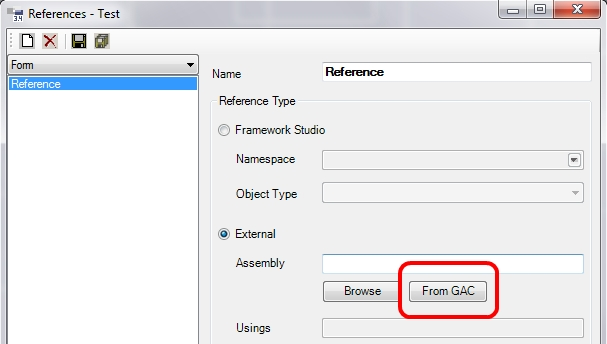
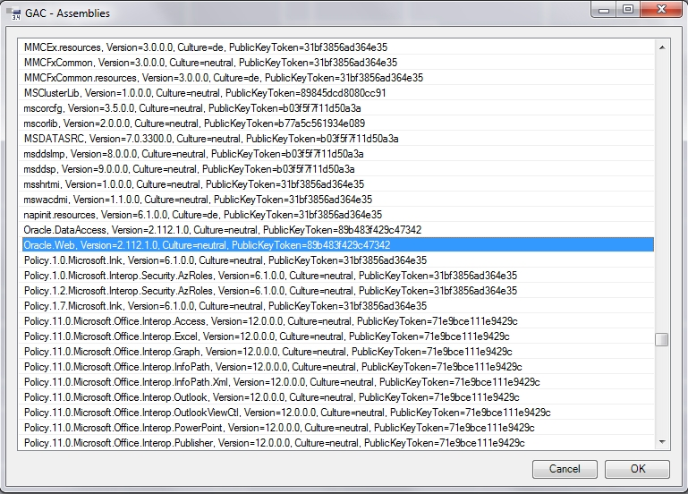
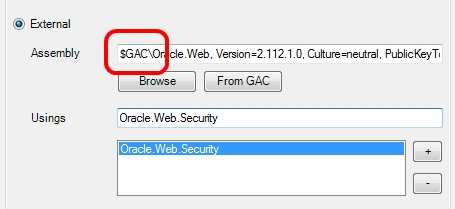

# References

Wenn innerhalb eines Namespaces Klassen eines weiteren Namespaces genutzt werden sollen, müssen diese über ein **using**-Statement eingebunden werden. Dasselbe gilt, wenn Sie externe Klassen nutzen wollen, wie z.B. die des .Net Frameworks.

Über den Dialog **References** können Sie sowohl interne, als auch externe Referenzen erzeugen.

Wenn Sie als Datentyp für ein Property eine Klasse aus einem anderen Namespace auswählen, wird automatisch ein **using** für diesen Namespace generiert. Referenzen anlegen / löschen

Um eine Referenz hinzuzufügen, wählen Sie zunächst den Namespace auf der [**Registerkarte Namespaces**](registerkarten.md#registerkarte-namespaces) aus, dem die Referenz hinzugefügt werden soll. Öffnen Sie anschließend den Dialog **References**, in dem Sie im unteren Bereich der Registerkarte das Kontext-Menü zu dem Namespace aufrufen und den Eintrag **References...** aufrufen oder auf den Button  **(References)** klicken.

Erzeugen Sie anschließend eine neue Referenz, indem Sie in der Combobox den Bereich auswählen, für den die Referenz erzeugt werden soll und drücken den Button  **(New)**. Sie sehen die neue Referenz jetzt als Eintrag in der Listbox. Nun werden noch die Einstellungen für die Referenz angepasst, wie nachfolgend beschrieben.

Löschen können Sie eine Referenz, indem Sie in der Combobox den gewünschten Bereich auswählen und anschließend in der Listbox die zu löschende Referenz markieren. Mit dem Button  **(Delete)** wird die Referenz gelöscht. Diese Aktion wird erst mit dem Button  **(Save All)** im Repository wirksam.

Wenn ein anderer Namespace innerhalb von **Framework Studio** referenziert werden soll, wählen Sie als Reference-Type ***"Framework Studio"***.

Über die Combobox **Namespace** haben Sie dann die Möglichkeit den Namespace auszuwählen, der eingebunden werden soll.

**Object-Type** definiert, zu welchem Bereich die Referenz gehört. Da die einzelnen Bereiche eigene Assemblies erzeugen, ist dieser hier ebenfalls zu definieren. Der Standardtyp wird Component sein, da zumeist auf Components referenziert werden wird.

Sollten Sie externe Klassen nutzen wollen, geben Sie als Reference-Type **External** an. Über den Datei-Auswahl-Dialog können Sie anschließend die COM-Component oder .Net Assembly auswählen, die Sie einbinden möchten.

## Referenzen bearbeiten

Um eine Referenz zu bearbeiten, wählen Sie in der Combobox den gewünschten Bereich und anschließend in der Listbox die zu bearbeitende Referenz aus.

Auf der rechten Seite des Fensters werden die Daten der Referenz bearbeitet.

#### **Name**

Hier können Sie die Namen der Referenz angeben. **Framework Studio** belegt diesen Namen mit ReferenceXX vor.

####  **Use In Sub Namespaces**

Über diese Checkbox können Referenzen an Sub Namespaces vererbt werden. Die vererbten Referenzen werden in den Sub Namespaces als **Readonly** mit dem Zusatz, aus welchem Namespace die Refernz stammt, dargestellt.

#### **Framework Studio**

Wählen Sie diesen Radio-Button, wenn Sie eine Framework-Studio-interne Referenz haben wollen.

#### **Namespace**

Hier benennen Sie für eine interne Referenz den Namespace, der verwendet werden soll.

#### **Object Type**

Hier geben Sie für eine interne Referenz an, welcher Bereich eingebunden werden soll. In der Regel werden Sie hier **Component** angeben.

#### **External**

Wählen Sie diesen Radio-Button, wenn Sie eine externe Assembly einbinden möchten.

#### **Assembly**

Hier können Sie ein Assembly angeben, das eingebunden werden soll. Mit dem Button **Browse** öffnen Sie eine Datei-Auswahl, in der Sie ein Assembly angeben können.

In dieser Zeile können folgende Platzhalter verwendet werden:

* $CodeDirectory: Definiert das Compile-Verzeichnis des Brokers

* $DotNetDirectory: Definiert das Verzeichnis des .NET Framework 4.0

* $GAC: Die Assembly soll aus dem GAC geladen werden

#### **From GAC**

Siehe [Referenzen auf GAC-Assemblies](#referenzen-auf-gac-assemblies)

#### **Usings**

Hier müssen Sie angeben, welche Namespaces aus dem eingebundenen Assembly verwendet werden sollen. Mit dem Button **\[+]** wird ein neuer Eintrag erstellt und mit dem Button **\[-]** wird der aktuell markierte Eintrag gelöscht.

## Referenzen auf GAC-Assemblies

Es können Assemblies aus dem GAC (Global Assembly Cache) in Framework Studio referenziert werden.

**From GAC Button:**

Nach dem Klick auf den Button erscheint eine Auflistung mit allen Assemblies, die im GAC des aktuellen PC‘s oder Servers vorhanden sind:

**GAC-Assembly Auswahldialog:**

Wird eine Assembly ausgewählt, erscheint diese mit dem Prefix **$GAC** und dem starken Namen im References-Dialog:

**$GAC-Prefix:**

Wie gewohnt können dann Usings definiert und die Assembly im Code verwendet werden.

> [!CAUTION]
> Welche GAC-Assemblies auf einem PC oder Server vorhanden sind, ist unterschiedlich und von installierter Software abhängig. Wird eine Framework Studio Applikation auf einem PC oder Server veröffentlicht oder kompiliert, auf dem die referenzierten GAC-Assemblies nicht vorhanden sind, kann es zu Laufzeit- oder Compilierfehlern kommen. Es muss dann sichergestellt werden, dass etwaige Drittsoftware korrekt installiert ist.
