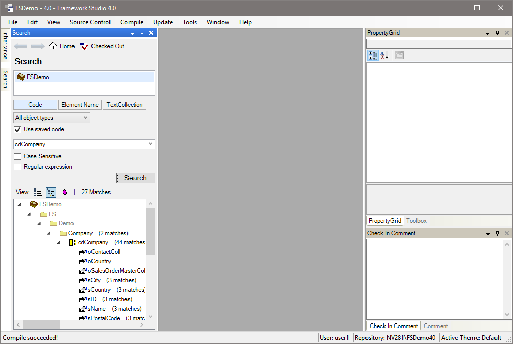

# Registerkarten im Framework Designer

## Registerkarte Namespaces

Diese Registerkarte ist noch mal in 2 Teile gegliedert.

Im oberen Teil ist der Namespace-Baum abgebildet. In **Framework Studio** werden zu jedem Package ([**Packages**](../package/packages.md)) die Klassen wie in .NET üblich in Namespaces strukturiert. Diese Namespaces sind wie ein Baum unter ihrem Package aufgebaut und können beliebig tief verschachtelt sein.

Im unteren Teil werden die Elemente des im oberen Baum ausgewählten Namespace im so genannten Objekt-Baum angezeigt. Mit einem Doppelklick können diese geöffnet werden. Es öffnet sich für jedes Element ein Designer-Fenster im Hauptfenster.

Die Toolbar im mittleren Teil der Registerkarte bezieht sich auf den darunter dargestellten Objekt-Baum. Die einzelnen Elemente der Toolbar werden im Abschnitt [**Allgemeine Funktionalitäten**](allgemeine-funktionatitaeten.md) erläutert.

Außer der Registerkarte [**Search**](#registerkarte-search) beziehen sich alle anderen Registerkarten, die im Folgenden beschrieben werden, immer auf das gerade aktive Designer-Fenster bzw. das dort ausgewählte Element. Ein Wechsel auf diese Registerkarten ist nur möglich, wenn bereits ein Designer-Fenster geöffnet wurde.

## Registerkarte Class

Die Registerkarte **Class** zeigt alle Members des geöffneten Elements an. Über das Kontext-Menü des Elements (oberster Eintrag) können auch neue Member hinzugefügt werden.

Mit einem Doppelklick auf einen Eintrag dieses Baums wird das entsprechende Member im Designer-Fenster auf der rechten Seite geöffnet bzw. ausgewählt.

Über das Kontext-Menü eines Members lässt sich dieses aus dem Objekt löschen, umbenennen oder ein weiteres Member gleichen Typs erzeugen.

## Registerkarte Inheritance

In dieser Registerkarte wird der Vererbungsbaum für das geöffnete Objekt angezeigt.

> [!WARNING]
> Nur Metadatentypen, Reports, Forms und Workflows lassen sich vererben.

## Registerkarte Properties

Hier können die Eigenschaften der Elemente eines Objektes geändert werden. Es werden immer die Eigenschaften des im aktiven Designer-Fensters ausgewählten Elements angeboten.

Sie können ein Element wählen, indem Sie es im Designer-Fenster anklicken. Diese listet alle Elemente auf, die im Zusammenhang zu der im aktiven Designer-Fenster ausgewählten Registerkarte stehen.

 Sortierung nach Kategorien:
Standardmäßige Sortierreihenfolge der Properties.

 Sortierung Alphabetisch:
Alternativ können Sie sich die Properties alphabetisch sortiert anzeigen lassen.

> [!WARNING]
> TODO!
> ++ Vererbte und Fett gedruckte Property-Werte
> ++ Zurücksetzen auf default-Wert
> ++ Ggf. Spezielle Editoren

## Registerkarte Toolbox

Handelt es sich bei dem ausgewählten Objekt um ein Form oder einen Workflow, wird diese Registerkarte zugänglich.

Bei Forms werden dort alle verfügbaren Controls angeboten. Ein Control kann per Drag & Drop auf dem Form positioniert werden.

Bei Workflows werden über diese Registerkarte Links, Branches und Switches angeboten, welche per Drag & Drop in den Workflow gezogen und dort positioniert werden können.

Ergänzende Informationen zu den Tools finden Sie in den Abschnitten zu **Form**(!TODO LINK) und **Workflows Designer**(!TODO LINK).

## Registerkarte Search

Auf dieser Registerkarte werden verschiedene Suchfunktionen zur Verfügung gestellt.

Für die Suche gelten folgende allgemeine Funktionen:

### Suchbegriffeingabe

Die Combobox unter der Suchdomänenauswahl ist zur Eingabe des Suchbegriffs vorgesehen. Sie speichert die 15 zuletzt verwendeten Suchbegriffe. Kommt ein sechzehnter Suchbegriff hinzu, so wird der älteste Eintrag verdrängt. Wird ein Suchbegriff verwendet, der schon in der Liste enthalten ist, so wird der Eintrag an den Anfang der Liste verschoben.

### Button **Search**

Mit dem Button **Search** wird die Suche gestartet und die Ergebnisse werden in der Liste im unteren Bereich angezeigt.

### Suchergebnis-Historie

Die Links/Rechts Pfeil-Buttons ermöglichen das chronologische Wechseln (links = zurück, rechts = vor) zwischen Suchergebnissen, die in der Suchergebnis-Historie abgelegt wurden. Sobald eine neue Suche ausgeführt wird, wird das Ergebnis dieser Suche ans Ende der Historie angehängt und angezeigt. Die Historie speichert maximal 15 Einträge.

Außerdem erscheinen beim Blättern zusätzliche Informationen zum jeweiligen Eintrag unterhalb der Suchergebnisse.

Suchergebnis-Historie mit zusätzlichen Informationen

### Result view style

Hier kann ausgewählt werden, ob die Ergebnisse in einer Liste  oder in einem Namespace-Baum  angezeigt werden sollen. Zusätzlich besteht die Möglichkeit nur Methoden  anzuzeigen. Diese Einstellung kann auch nach der Suche verändert werden.

### Ergebnis-Liste

Die Ergebnisse werden wie gewünscht als Liste oder in einem Namespace-Baum angezeigt.

Beim Namespace-Baum sind die Einträge mit grauem Text nicht Bestandteil der Ergebnis-Menge sondern dienen dazu, die Ergebnisse in einem Baum anzuordnen. In dieser Ansicht ist das Einchecken von Elementen inklusive aller Unterelemente über das Kontextmenü möglich. So können beispielsweise, nach der Suche nach ausgecheckten Elementen, alle ausgecheckten Elemente des Benutzers in einem Vorgang eingecheckt werden.

Durch Doppelklick auf ein Suchergebnis wird das Ergebnis geöffnet.

Nun folgt die Beschreibung der verschiedenen Such-Mechanismen.

### Volltext-Suche in generierten Code

Die Suche auf den generierten Code ist ein guter Mechanismus, um z.B. nach bestimmten Verwendungen zu suchen. Der generierte Code beinhaltet sowohl alle im Designer angegebenen Informationen als auch den selbst geschriebenen Code. Der generierte Code wird mit entsprechenden Marken versehen, sodass die Suche bei einem Treffer die gefundene Code-Zeile einem Element (z.B. Component, Form) oder einem Teil (z.B. Property, Methode) zuordnen kann. Wird z.B. eine Zeile in einer selbst geschrieben Methode gefunden, kann diese Code-Zeile aus der Treffer-Liste heraus direkt angesprungen werden.

Sie können in dem Textfeld einen zu suchenden Text angeben. Es wird dabei nach dem kompletten Text gesucht.

#### Search Domain

Hier wird angegeben, in welchem Bereich die Suche erfolgen soll. Sie können ein gesamtes Package durchsuchen oder den Suchbereich auf einen Namespace mit allen darunter liegenden Namespaces einschränken.

Der Suchbereich kann auch über den Menüeintrag **Search...** im Objektbaum auf der [Registerkarte Namespaces](#registerkarte-namespaces) oder über den Menüeintrag **Edit/Search...** im Designerfenster eines LabeledRecords auf einen einzelnen LabeledRecord, also z.B. auf ein Form oder eine Textcollection eingeschränkt werden.

Search in Component:

In diesem Fall wird der Button **Select Namespace** angezeigt, mit dem der Suchbereich wieder auf einen beliebigen Namespace festgelegt werden kann.

Grundsätzlich gilt: Je kleiner der Suchbereich, desto schneller die Suche.

Bei einer großen Anwendung kann die Suche über alle Namespaces sehr lange dauern.

#### Checkbox **Case sensitive**

Bei der Suche wird nach Groß- und Klein-Schreibung unterschieden.

#### Checkbox **Regular Expressions**

Bei dem Suchtext handelt es sich um einen regulären Ausdruck. Es muss ein gültiger Ausdruck angegeben werden.

#### Checkbox **Use Saved Code**

Für die Suche soll der gespeicherte generierte Code verwendet werden.

Es wird empfohlen, diese Option zu verwenden, da ansonsten der Code für die Suche komplett neu erzeugt werden muss. Das kann bei einer großen Anwendung sehr lange dauern.

#### Combobox **Element type**

Hier können Sie angeben, in welcher Art von Elementen die Suche durchgeführt werden soll. (z.B. Components, Forms, …)

### Suche in Textcollections

Mit der Suche in Textcollections ist es möglich, gezielt die in den Textcollections angegebenen Texte zu durchsuchen.

Suche in Textcollections:

#### Search Domain

Hier wird angegeben, in welchem Bereich die Suche erfolgen soll. Sie können in allen Textcollections eines Packages oder in allen Textcollections, die unterhalb eines bestimmten Namespaces liegen, suchen.

Der Suchbereich kann außerdem über den Menüeintrag **Search...** im Objektbaum auf der [Registerkarte Namespaces](#registerkarte-namespaces) oder über den Menüeintrag **Edit/Search...** im Designerfenster einer Textcollection auf eine spezielle Textcollection eingeschränkt werden.

#### Checkbox **Textcollection**

Mit dieser Checkbox wird dieser Suchmodus aktiviert.

#### Combobox **Language**

Hier kann angegeben werden, in welcher Sprache gesucht werden soll.

#### Checkbox **Case sensitive**

Bei der Suche wird nach Groß- und Klein-Schreibung unterschieden.

#### Checkbox **Regular Expressions**

Bei dem Suchtext handelt es sich um einen regulären Ausdruck. Es muss ein gültiger Ausdruck angegeben werden.

Wird z.B. als Suchtext ein regulärer Ausdruck **^$** angegeben und es wird eine Sprache ausgewählt, lassen sich alle Texte finden, bei denen der Text in dieser Sprache nicht gefüllt ist. (**^** ist ein Zeilen-Anfang, **$** ist ein Zeilenende und dazwischen soll nichts stehen.)

### Suche nach ausgecheckten Elementen

In diesem Suchmodus werden alle ausgecheckten Elemente des Benutzers im aktuellen Package angezeigt.

#### Checkbox **Checked out**

Damit wird der Suchmodus aktiviert.

Es werden alle anderen Controls inklusive des Namespace-Baumes deaktiviert.

In der Ergebnis-Liste besteht die Möglichkeit, ein [Check In](#check-in) oder ein [Undo Check Out](#undo-check-out) durchzuführen. Dabei können auch mehrere Elemente gleichzeitig verarbeitet werden. Dazu gibt es für die Ergebnisse ein Kontext-Menu, welches mit der rechten Maustaste aufgerufen werden kann.

Nach einem [Check In](#check-in) oder ein [Undo Check Out](#undo-check-out) wird die Ergebnis-Liste nicht aktualisiert. Es muss anschließend ggf. noch einmal neu gesucht werden, um die Liste zu aktualisieren.

Während der [Check In](#check-in) in einem Rutsch durchgeführt wird, wird der [Undo Check Out](#undo-check-out) für jedes Element einzeln durchgeführt. Dabei erscheint jedes Mal eine Meldung, die bestätigt werden muss. Es kann auch vorkommen, dass ein [Undo Check Out](#undo-check-out) mal nicht durchgeführt werden kann, weil dies durch eine bereits existierende Referenz verhindert wird. Der Vorgang muss ggf. wiederholt werden.

Es folgt die Beschreibung des Kontext-Menus. Je nach Ergebnis können die Menu-Einträge variieren.

#### Check In

Checkt das einzelne Element ein.

#### Check In all sub records

Checkt alle, unterhalb eines Namespaces liegenden Elemente ein – auch über mehrere Ebenen hinweg.

#### Check In with all its sub records

Checkt den Namespace und alle unterhalb diesem Namespace liegenden Elemente ein – auch über mehrere Ebenen hinweg.

#### Undo Check Out

Führt einen Undo Check Out für das einzelne Element durch.

#### Undo Check Out all sub records

Führt einen **[Undo Check Out](#undo-check-out)** für alle unterhalb einem Namespace liegenden Elemente durch – auch über mehrere Ebenen hinweg.

#### Undo Check Out with all its sub records

Führt einen **[Undo Check Out](#undo-check-out)** für den Namespace und alle unterhalb dieses Namespace liegenden Elemente durch – auch über mehrere Ebenen hinweg.

### Suche nach Elementnamen

Dieser Suchmodus wird mit der Checkbox **Element Name** aktiviert und dient dem schnellen Auffinden von Elementen über ihren Namen.

Suche nach Elementnamen:

#### Checkbox **Case sensitive**

Bei der Suche wird nach Groß- und Klein-Schreibung unterschieden.

#### Checkbox **Regular Expressions**

Bei dem Suchtext handelt es sich um einen regulären Ausdruck. Es muss ein gültiger Ausdruck angegeben werden.

#### Combobox **Element type**

Hier kann die Suche auf einen Elementtyp (z.B. Components, Forms, ...) eingeschränkt werden.

### Suche nach Abhängigkeiten

Sucht alle Elemente, die vom aktuellen Element abhängig sind. Mit dieser Funktion können Sie beispielsweise von einem Form zu Workflows wechseln, in denen das Form verwendet wird:

* von einer Component zu anderen Components oder zu Forms wechseln, die diese Component verwenden
* von einem Metadatentypen zu Components oder Forms wechseln, die den Metadatentypen verwenden
* von Workflows zu anderen Workflows wechseln, die diesen Workflow verwenden

Data Source Hierarchiesuche

Eine spezielle Form der Abhängigkeitssuche ist die Data Source Hierarchiesuche. Diese wird an einem Control innerhalb eines Forms ausgelöst und listet eine geordnete Kette von Elementen auf, die sich aus der Datenquelle des Controls ergeben:

1. Das Control, für das die Suche ausgeführt wurde.
2. Das Form-Property. Wenn eine Component beteiligt ist, wird das entsprechende Component-Property ebenfalls dargestellt – wie z.B. cdCall.oPCSInfo.
3. Das Component-Property
4. Die Tabellen-Spalte
5. Der Metadatentyp und ggf. Basis-Metadatentypen

#### Checkbox **Dependencies**

Da diese Option eine spezielle Suchdomäne benötigt, kann die Suche nur durch das Menü **Edit/Search Dependencies** im Designerfenster bzw. über das Kontextmenü an einem Form Control erfolgen und die Checkbox **Dependencies** wird erst dann aktiv. Erst wenn das Häkchen entfernt wurde, kann wieder eine normale Suche durchgeführt werden.

## Registerkarte Comment

Auf der Registerkarte **Comment** können Methoden dokumentiert werden. Wird z.B. ein Form geöffnet und auf der **Registerkarte Methods** eine Methode ausgewählt, wird die Comment-Registerkarte freigeschaltet.

## Registerkarte Check In Comment

Auf der Registerkarte **Check In Comment** kann für ein Element (z.B. Form, Workflow, Component usw.) ein Kommentar hinterlegt werden, der beim nächsten **Check In** verwendet werden soll.
