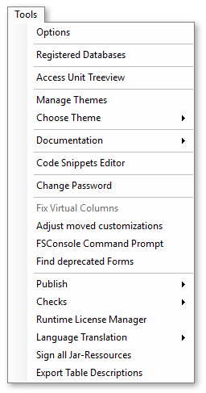
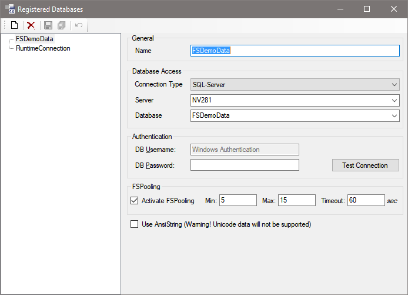
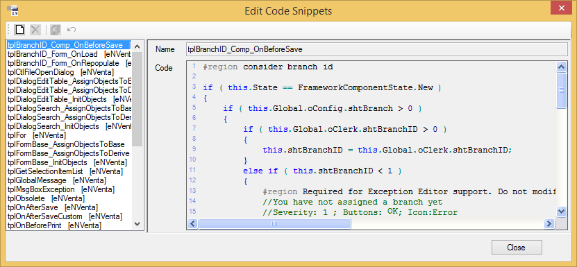
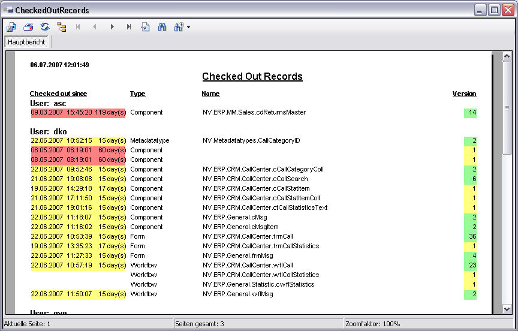
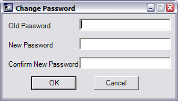

# Tools Menü

In den folgenden Abschnitten werden die Menüpunkte im Menü **Tools** beschrieben.

## Registered Databases

In diesem Dialog werden die im Repository verwendeten Datenbankverbindungen verwaltet.

Die Verbindung mit dem Namen **RuntimeConnection** stellt die Verbindung zum Repository dar.

Die in diesem Dialog angelegten Verbindungen stehen allen Benutzern in allen Packages des Repositories zur Verfügung.

> [!CAUTION]
> Die Angaben stehen nicht unter der Versionskontrolle. Sie können von allen Benutzern zu jeder Zeit verändert werden. Die Änderungen wirken sich auf alle Benutzer gleichermaßen aus. Es sollte daher beachtet werden, dass andere Benutzer dadurch nicht behindert werden.

Die Verbindungs-Einstellungen sind im Kapitel **Connection Einstellungen**(!TODO LINK) beschrieben.

## Access Unit Treeview

Über den Menüpunkt **Tools / Access Unit Treeview...** kann das Fenster zum Bearbeiten der Access Unit Hierarchie aufgerufen werden. Siehe dazu **Access Unit Hierarchie**(!TODO LINK).

## Code Snippets Editor

Der **Code Snippets Editor** ist ein hilfreiches Werkzeug, wenn Sie einen Code haben, der immer wieder auftaucht. Was für einen Code Sie im Endeffekt hinterlegen, bleibt dabei Ihnen überlassen. Es könnten z.B. Templates für die Dokumentation sein, Code-Strukturen oder Schleifenkonstrukte. Auch Methoden, die Sie laufend bei Vererbung benötigen, könnten hilfreich sein.

Sie können die hinterlegten Code-Snippets im **Code-Editor** über die Tastenkombination **\<Strg+J>** aufrufen. Es öffnet sich eine Listbox, über die Sie das gewünschte Snippet auswählen können. Auch über die Toolbox können die Snippets per Drag und Drop in den Code-Editor oder dem Comment-Editor gezogen werden.

Die Code-Snippets werden im Repository an der aktuellen Package-Version gespeichert. Sie werden zusammen mit der Package-Version exportiert und so in das Ziel-Repository übertragen. Das ursprüngliche manuelle Exportieren und Importieren der Code-Snippets entfällt.

Im Code-Snippet-Editor können die Code-Snippets für die aktuelle Package-Version bearbeitet werden.

Zusätzlich werden die Code-Snippets aus den Basis-Packages zusammen mit dem Package-Namen angezeigt – sie sind readonly. Überschreiben können Sie ein Code-Snippet indem Sie im aktuellen Package ein weiteres Code-Snippet mit identischem Namen erstellen. In der Liste sind die Code-Snippets nach der Package-Hierarchie angeordnet, sodass Überschreibungen gut zu erkennen sind.

**Beispiel:**

Das aktuelle Package hat FSDemoCustomize und FSDemo als Basis und dementsprechend werden auch die Code-Snippets dieser Packages angezeigt. In dem Code-Snippet Editor werden die Snippets folgendermaßen dargestellt:

* **Snippet1**
* **Snippet1  \[FSDemoCustomize]**
* **Snippet1  \[FSDemo]**
* **Snippet2  \[FSDemoCustomize]**
* **Snippet2  \[FSDemo]**
* **Snippet3  \[FSDemo]**
* **Snippet4**
* **Snippet4  \[FSDemo]**
  
Von den im Code-Snippet-Editor angezeigten Einträgen **gewinnt** jeweils der erste. Die **grauen** Einträge werden im Intellisense und der Toolbox nicht angezeigt.

## Checked Out Report

Im Menu **Tools / Checked Out Report** öffnet sich ein Report-Fenster.

**Checked Out Records:**

Dieser Report zeigt die ausgecheckten Elemente aller Benutzer an. Die Anzeige ist nach Benutzern gruppiert.

Eine Legende mit den Bedeutungen der Farben befindet sich am Ende dieses Reports.

## Change Password

Im Menu **Tools / Change Password** öffnet sich ein Dialog zum Ändern des eigenen Passworts.

**Change Password Dialog:**

In diesem Dialog müssen Sie im Feld **Old Password** das zurzeit gültige Passwort eingeben. In **New Password** können Sie das neue Passwort eingeben, welches in **Confirm New Password** bestätigt werden muss, um Fehleingaben zu verhindern. Mit dem Button **OK** wird das neue Passwort gesetzt.

Wenn Sie kein neues Passwort eingeben und mit dem Button **OK** bestätigen, wird das Passwort gelöscht und Sie können sich ab sofort ohne Passwort mit Ihrem Benutzernamen anmelden.

Wenn Sie im Team mit mehreren Entwicklern arbeiten, wird aus Sicherheitsgründen empfohlen ein Passwort zu verwenden.

Sollten Sie Ihr Passwort einmal vergessen, gibt es die Möglichkeit über die **Benutzer-Verwaltung**(!TODO LINK) ein neues Passwort zu vergeben.

## Adjust moved customizations

Wird ein Element aus einem Basis-Package gecustomized, dann merkt sich Framework Studio aus Performance-Gründen auch im Customizing-Package den Namespace, in dem sich dieses Element befindet.

Nun kann es passieren, dass im Basis-Package ein Element mit der Funktion **Change Namespace** in einen anderen Namespace verschoben wird. Dies führt zu Compile-Fehlern im Customizing-Package.

Mit der Routine **Adjust moved customizations** wird der Namespace der gecustomizten Elemente korrigiert. Diese werden dazu ausgecheckt und müssen anschließend wieder eingecheckt werden, bevor ein Framework Compiler gestartet wird.

## FSConsole Command Prompt

Startet ein Konsolen-Fenster. Dort ist als aktuelles Verzeichnis das Framework Studio Programm-Verzeichnis gesetzt.

## Runtime Licenses

Über den Menüpunkt **Tools / Runtime Licenses** kann der Runtime License Manager geöffnet werden.

Details zur Verwaltung von Laufzeitlizenzen mit dem **Runtime License Manager** finden Sie unter **Laufzeitlizenzen**(!TODO LINK).
