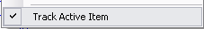
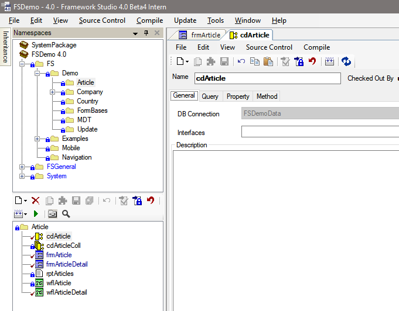
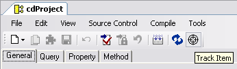

# View Menü

## Track Active Item

Ist der Menüeintrag **Track Active Item** mit einem Häkchen versehen, so wird auf der [**Registerkarte Namespaces**](registerkarten.md#registerkarte-namespaces) automatisch der Namespace ausgewählt, in dem das aktuell fokussierte Element im Framework Designer (z.B. ein Form oder eine Component) angelegt ist.

Ist der Menüeintrag nicht mit einem Häkchen versehen, ist dieser Automatismus abgeschaltet. Stattdessen wird in den Designer Fenstern ein zusätzlicher Button  **(Track Item)**  angeboten, mit dem auf der [**Registerkarte Namespaces**](registerkarten.md#registerkarte-namespaces) in den Namespace des Elements gewechselt werden kann.

