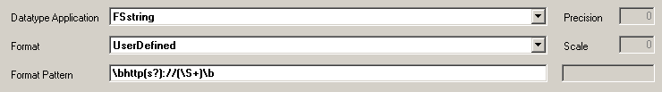
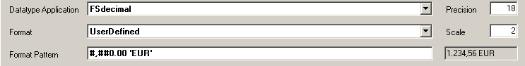
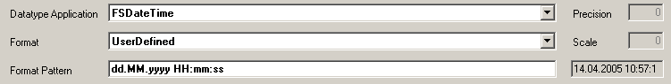

# Format-Pattern im Metadatentyp

Je nachdem, welcher Datentyp ausgewählt wurde, ändern sich die Einstellungen für das Format-Pattern.

## Format Pattern für Zeichenketten

Bei Zeichenketten können im Format reguläre Ausdrücke eingegeben werden. Die Zeichenketten müssen dann dem definierten regulären Ausdruck entsprechen. Im Java-Client wird bereits bei der Eingabe überprüft, ob die Zeichenkette dem Ausdruck genügt.

## Format-Pattern für Zahlen

Bei Zahlen können gewöhnliche Zahlenformate eingegeben werden. Neben dem Feld Format-Pattern wird eine Beispiel-Zahl für das eingegebene Format dargestellt.

> [!WARNING]
> Es ist aber zu beachten, dass als Tausender-Trennzeichen das Komma und als Dezimal-Trennzeichen der Punkt dient.

Gültige Formate wären z.B.

* `#,##0.00` ergibt 1.234,56
* `0.00` ergibt 1.234,56
* `#,##0.00 ’EUR’` ergibt 1.234,56 EUR

## Format-Pattern für Datum

Bei Datum können gewöhnliche Datum-Formate eingegeben werden. Neben dem Feld Format-Pattern wird als Beispiel das aktuelle Systemdatum entsprechend formatiert dargestellt.

Der Button Default Values setzt die Werte auf die vom Framework Studio vorgegebenen Standardwerte zurück.
