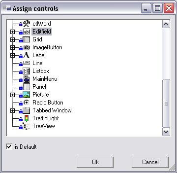

# Metadatentypen

Die Idee der Metadatentypen kommt daher, dass bestimmte Felder innerhalb einer Anwendung immer wieder auftauchen (z.B. Artikelnummer, Kundennummer, ...). Deshalb können solche Felder an einer zentralen Stelle definiert werden, was Fehler in der Felddefinition verhindert und Redundanzen minimiert. Dabei werden Informationen wie das Label, das Datenformat, das zugehörige Control, die mehrsprachige Bezeichnung usw. hinterlegt, so dass sich der Arbeitsaufwand bei der späteren Arbeit mit dem Metadatentypen minimiert.

Sie erkennen Metadatentypen an einem   - Icon vor der Bezeichnung.

## Metadatentypen bearbeiten

Um einen Metadatatypen zu bearbeiten, doppelklicken Sie den entsprechenden Eintrag auf der Registerkarte **Namespaces**. Der Metadatentyp wird im Hauptfenster des **Framework Designers** angezeigt.

Der Metadatentyp kann in verschiedenen Teilen der Anwendung zum Einsatz kommen:

* Er kann auf unterster Ebene der Spalte einer DBTable zugeordnet werden.
* Er kann in Components oder Forms als Datentyp für Properties verwendet werden.

Deshalb nehmen Sie an einem Metadatentyp verschiedene Einstellungen vor:

* **Name**:
Geben Sie die Bezeichnung des Metadatentyps an.

* **Datatype Database**:
Benennen Sie den Datentyp der Spalte in der Datenbank.

* **Datatype Application**:
Gibt den FS-Datentyp des Metadatentyps an. Dieser Datentyp wird später in den **Components** und **Forms** gezogen.

Die folgende Tabelle zeigt, welche Database-Datentypen mit welchem Application-Datatype kombiniert werden können:

|              | FSbool | FSbyte | FSbyteArray | FSDateTime | FSdecimal | FSdouble | FSfloat | FSint | FSlong | FSshort | FSstring |
|-------------:|:------:|:------:|:-----------:|:----------:|:---------:|:--------:|:-------:|:-----:|:------:|:-------:|:--------:|
| Binary       |        |        |      X      |            |           |          |         |       |        |         |          |
| Boolean      |    X   |        |             |            |           |          |         |       |        |         |          |
| Byte         |        |    X   |             |            |           |          |         |       |        |         |          |
| Date         |        |        |             |      X     |           |          |         |       |        |         |          |
| DateTime     |        |        |             |      X     |           |          |         |       |        |         |          |
| Time         |        |        |             |      X     |           |          |         |       |        |         |          |
| Double       |        |        |             |            |           |     X    |         |       |        |         |          |
| Currency     |        |        |             |            |     X     |     X    |    X    |       |        |         |          |
| Single       |        |        |             |            |     X     |     X    |    X    |       |        |         |          |
| Decimal      |        |        |             |            |     X     |          |         |       |    X   |         |          |
| Big Int      |        |        |             |            |           |          |         |       |    X   |         |          |
| Integer      |        |        |             |            |           |          |         |   X   |    X   |         |          |
| Smallint     |        |        |             |            |           |          |         |   X   |    X   |    X    |          |
| Tiny Int     |        |        |             |            |           |          |         |   X   |    X   |    X    |          |
| Ansi String  |        |        |             |            |           |          |         |       |        |         |     X    |
| Long Varchar |        |        |             |            |           |          |         |       |        |         |     X    |
| String       |        |        |             |            |           |          |         |       |        |         |     X    |
| null         |    X   |    X   |      X      |      X     |     X     |     X    |    X    |   X   |    X   |    X    |     X    |

> [!WARNING]
> Wenn Sie die Datentypen nachträglich ändern, kann das evtl. Auswirkungen auf Programmteile haben, die diesen Metadatentypen bereits verwenden. Unter Umständen lassen sich diese Programmteile nicht mehr kompilieren.

Die Einstellungen für Size, Precision und Scale hängen von der Auswahl des **Datatype Database** ab. Je nachdem, ob der Datenbank-Datentyp Zeichen, Ganzzahlen oder Gleitkommazahlen unterstützt, sind die Felder für Eingaben zugänglich.

* **Size**:
Definiert die Feldlänge bei Zeichenfeldern.

* **Precision**:
Anzahl der Stellen inkl. eventueller Nachkommastellen bei numerischen Feldern.

* **Scale**:
Anzahl der Nachkommastellen bei **Dezimal**-Feldern.

* **Format**:
Gibt das Anzeige-Format des Felds an. Das Format wirkt sich in der Darstellung des Felds auf einem Form aus.

* **Format Pattern**:
Wird im Feld Format **User Defined** gewählt, ist es möglich hier selbst ein Format anzugeben. Es können Formate für Zahlen, Daten und Zeichenketten entsprechend der Standard-Definition für reguläre Ausdrücke eingegeben werden.

    Siehe auch [Format-Pattern](format-pattern.md)

## Registerkarte Description

Hier kann eine Beschreibung des Metadatentyps eingegeben werden.

## Registerkarte Values

Für einen Metadatentypen kann definiert werden, welche Werte er annehmen darf. Wird hier nichts angegeben, sind alle Werte möglich, die der entsprechend hinterlegte Datentyp zulässt.

Es können mehrere Werte oder Wertebereiche angegeben werden.

* **From**: Gibt die untere Grenze eines Wertebereichs an.

    > [!WARNING]
    > Ist nur dieses Feld gefüllt (und **To** nicht), wird dies als Wert und nicht als Wertebereich angesehen.

* **To**: Gibt die obere Grenze eines Wertebereichs an.

* Button **Add New Range**: Mit dem Button Add New Range kann ein neuer Bereich hinzugefügt werden.

* Button **Remove Range**: Mit dem Button Remove Range kann ein Bereich gelöscht werden.

## Registerkarte Default Label

Einem Metadatentypen kann ein Label zugewiesen werden. Dieses Label wird im Form links neben dem Control des Metadatentyps angezeigt. Das Label kann mehrsprachig hinterlegt werden.

> [!TIP]
> Es ist möglich, dieses Label in den Components und im Form zu überschreiben.

## Registerkarte Control Types

Die Registerkarte **ControlTypes** zeigt an, welche Controls später im Form zur Verfügung stehen sollen. Es ist möglich, einem Metadatentypen mehrere Controls zuzuordnen. Es kann aber maximal ein Control als Default gekennzeichnet sein. Das als Default gekennzeichnete Control wird zunächst angezeigt, wenn ein Property (welches diesen Metadatentypen verwendet) in ein Form gezogen wird. Das Default-Control kann dann auf weitere, hier hinterlegte Controls geändert werden.

Diese Liste von Controls kann auch im DBTable oder in der einer Component ergänzt werden. Ist kein Control als Standard-Control hinterlegt, wird ein Editfeld angenommen.

Mit dem Button **Add** wird ein neuer Control-Type hinzugefügt. Es öffnet sich das Fenster Assign Controls.

In diesem Fenster sind alle Controls aufgelistet, einschließlich der Controls, die Sie in den **Control Default Styles** definieren können (siehe Kapitel Control Default Styles). Wählen Sie hier ein Control aus und setzen Sie ggf. die Checkbox **is Default**. Mit dem Button OK wird das Control der Liste hinzugefügt.

Mit dem Button **Change** können Sie das Control ändern. Es öffnet sich wieder wie bei **Add** das Fenster **Assign Controls**. Sie können hier ein anderes Control auswählen und dann mit **OK** bestätigen.

Mit dem Button **Delete** wird das markierte Control gelöscht.
