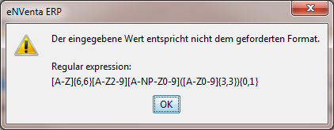
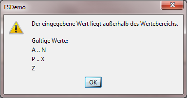

# Metadatentyp-Validierung

Die Einstellungen, die am Metadatentyp zu sehen sind (z.B. Größe, Formatierung, Wertebereich, …), werden bei der Arbeit mit Properties herangezogen, um die Werte zu validieren und ggf. zu korrigieren. Auch der Client nutzt diese Informationen, um falsche Eingaben so früh wie möglich zu unterbinden. Die Zusammenhänge werden durch folgendes Schaubild erläutert:

Die folgende Tabelle stellt dar, was passiert, wenn mit einem Wert gearbeitet wird, der denen am Metadatentyp definierten Kriterien nicht entspricht.

<table>
    <thead>
        <tr>
            <th> Einstellung </th>
            <th> Lesen von Properties   aus der Datenbank,   die falsche Werte beinhalten </th>
            <th> Setzen von Properties </th>
            <th> Client </th>
        </tr>
    </thead>
    <tbody>
        <tr>
            <td colspan="4">  Allgemein </td>
        </tr>
        <tr>
            <td> Values   Value Ranges </td>
            <td> Es wird ein Null-Wert zurückgegeben.</td>
            <td> Eine Exception wird geworfen.</td>
            <td> Nach der Eingabe wird der Wert geprüft und es wird eine Fehlermeldung ausgegeben.</td>
        </tr>
        <tr>
            <td colspan="4">  Strings</td>
        </tr>
        <tr>
            <td> Size </td>
            <td> Bei zu langen Strings wird auf dieser auf die Size gekürzt.</td>
            <td> Eine Exception wird geworfen.</td>
            <td> Die Eingabe wird begrenzt.</td>
        </tr>
        <tr>
            <td> Uppercase, Lowercase </td>
            <td> Der Text wird ggf. mit ToUpperInvariant() bzw. ToLowerInvariant() korrigiert.</td>
            <td> Der Text wird ggf. mit ToUpperInvariant() bzw. ToLowerInvariant() korrigiert.</td>
            <td> Die Eingabe lässt nur Groß- bzw. Kleinbuchstaben zu.</td>
        </tr>
        <tr>
            <td rowspan="2"> Format-Pattern (Regulärer Ausdruck) </td>
            <td> Es wird FSstring.Null zurückgegeben.</td>
            <td> Eine Exception wird geworfen.</td>
            <td> Nach der Eingabe wird der Wert geprüft und es wird eine Fehlermeldung ausgegeben.</td>
        </tr>
        <tr>
            <td colspan="3">Es wird zuvor noch versucht, den String mit Uppercase oder Lowercase zu korrigieren, wenn der reguläre Ausdruck selber Uppercase bzw. Lowercase ist. Wenn das funktioniert, dann wird der Wert in Uppercase bzw. Lowercase konvertiert.</td>
        </tr>
        <tr>
            <td colspan="4">  Numerische Werte</td>
        </tr>
        <tr>
            <td> Precision </td>
            <td> Es wird ein Null-Wert zurückgegeben. </td>
            <td> Eine Exception wird geworfen. </td>
            <td> Die Eingabe wird begrenzt. </td>
        </tr>
        <tr>
            <td> Scale   (bei Dezimal-Zahlen)</td>
            <td> Der Wert wird „kaufmännisch“ gerundet. </td>
            <td> Der Wert wird „kaufmännisch“ gerundet. </td>
            <td> Die Eingabe wird begrenzt. </td>
        </tr>
        <tr>
            <td> Positive Integer, Negative Integer  (bei Ganzzahlen) </td>
            <td> Es wird ein Null-Wert zurückgegeben. </td>
            <td> Eine Exception wird geworfen. </td>
            <td> Das Minus-Zeichen wird bei der Eingabe unterdrückt bzw. automatisch hinzugefügt. </td>
        </tr>
    </tbody>
</table>

Der Java-Client gibt bei der Eingabe eines falschen Wertes die folgenden Fehlermeldungen aus:

* Wenn das Format-Pattern (der reguläre Ausdruck) verletzt wird:

    

* Wenn ein Wertebereich verletzt wird:

    
