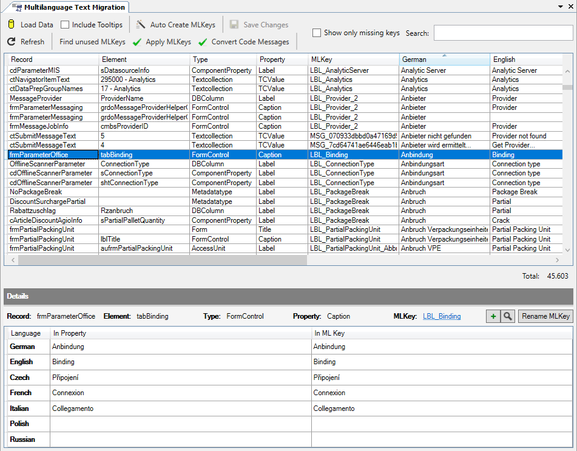
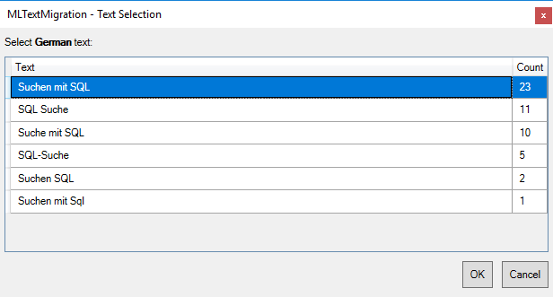

# MLKey Migration

Ziel ist es, dass alle Texte aus den Records entfernt und in das Wörterbuch übertragen werden. Die Records erhalten dafür Verweise auf Einträge im Wörterbuch, die **MLKeys**.

Generell teilt sich die Migration in zwei große Phasen auf:

1. [MLKeys erzeugen und zuordnen](#mlkeys-erzeugen-und-zuordnen): Diese Phase kann parallel zur Weiterentwicklung durchgeführt werden. Es werden zum Einen neue Einträge im Wörterbuch angelegt und zum Anderen vorgemerkt, wo diese später verwendet werden sollen.
2. [MLKeys übertragen](#mlkeys-übertragen): In dieser Phase werden primär die vorbereiteten Zuordnungen an die Elemente übertragen: angegebene Texte werden entfernt und statt dessen die gewünschten MLKeys eingetragen. Dazu müssen alle betroffenen Elemente ausgecheckt werden. Zusätzlich werden weitere Umstellungen (z.B. bestehende Messages und Exceptions) durchgeführt.

## Abwärts-Kompatibilität

Texte, die bisher an den Records definiert sind, funktionieren auch weiterhin, weil jeder MLString neben dem MLKey explizit gesetzte Texte versteht. So kann man nach dem Update auf die Version 4.2 die Migration in aller Ruhe angehen.

> [!NOTE]
> In Kunden-Packages ist die Umstellung der eigenen Texte auf MLKeys empfohlen. Sie ist aber nicht zwingend notwendig.

Das hat aber langfristig einige Nachteile zur Folge - insbesondere in Hinblick auf die Mehrsprachigkeit der Anwendung:

* Der Language Export / Import funktioniert nur für das Wörterbuch. Individuelle Texte an Records werden nicht (mehr) berücksichtigt.
* Das Pflegen von Fremdsprachen an den Records ist sehr aufwändig. Die MLKeys aus dem Wörterbuch bringen hingegen die Übersetzungen automatisch in alle Bereiche der Anwendung.

> [!IMPORTANT]
> Funktionale Packages, die als Produkt an mehrere Kunden vertrieben werden, sollten in jedem Fall migriert werden.

## MLKeys erzeugen und zuordnen

Diese erste Phase der MLKey Migration dient zum Einen der Erzeugung der benötigten Einträge im Wörterbuch (MLKeys) und zum Anderen der Zuordnung, wo diese später verwendet werden sollen.

Zentrales Werkzeug für diese Phase ist der Dialog **Multilanguage Text Migration**, welcher über das Menü **Tools / Multilanguage Text Migration** geöffnet werden kann.



> [!NOTE]
> Die im Grid angezeigten Sprachen und deren Reihenfolge können in den [Options](../allgemein/options.md#languages-in-designer) mit der Einstellung **Languages in designer** eingestellt werden.

Alle durch den Benutzer definierten Zuordnungen werden in der Ressource **Migration.xml** im Verzeichnis **FSGeneral/Resources/lang** gespeichert, welche automatisch bei der ersten Benutzung angelegt wird.

Ist diese Datei bei der Bearbeitung mit dem Multilanguage Text Migration Dialog nicht ausgecheckt, so wird beim Speichern mit dem Button **Save** automatisch die neueste Version ausgecheckt, die Änderungen ergänzt und anschließend sofort wieder eingecheckt. Dieses Verhalten ist dann hilfreich, wenn mehrere Benutzer gleichzeitig mit dem Multilanguage Text Migration Dialog arbeiten. Andernfalls empfiehlt es sich, die Datei vor Beginn der Arbeit auszuchecken und erst nach Beendigung der Arbeit wieder einzuchecken. So werden unnötige Checkin- und Checkout-Vorgänge vermieden.

Beim Speichern werden außerdem ggf. ungespeicherte Änderungen am [Wörterbuch](woerterbuch.md) gespeichert.

### Generelles Vorgehen

Die zu leistende Arbeit besteht in erster Linie darin, logisch identische Begriffe zusammenzuführen und logisch unterschiedliche Begriffe, die ggf. in einzelnen Sprachen Überlappungen mit anderen Begriffen haben, zu trennen.

Beispiel:

Die Begriffe *Suche mit SQL*, *Suchen mit SQL*, *SQL Suche*, *SQL-Suche*, *Suchen SQL*, *Sql Suche* und weitere Varianten sollten zu einem einzigen Eintrag zusammengefasst werden.

#### (1) Load Data

> [!IMPORTANT]
> Zunächst sollten Tooltips außen vor gelassen werden. Dazu darf die Checkbox **Include Tooltips** **NICHT gesetzt** sein, wenn mit dem Button **Load Data** alle im Package angegebenen Texte eingelesen werden.
> Erst wenn allen Texten ein MLKey zugeordnet wurde, werden die im Folgenden beschriebenen Schritte nach dem erneuten Laden der Daten **inklusive Tooltips** ein zweites Mal durchgeführt.

> [!NOTE]
> Wenn durch ein Basis-Package bereits Einträge im Wörterbuch existieren, so wird Framework Studio nach dem Laden automatisch einem mehrsprachigen Text aus dem Custom-Package den MLKey zuweisen, der mindestens in den angegebenen Sprachen die Texte in exakt der Schreibweise enthält.

Die mit dem Button **Load Data** eingelesenen Texte werden in einer Tabelle angezeigt. Die einzelnen Spalten haben folgende Bedeutung:

* **Record**: Name des Elements, an dem der Text angegeben ist, z.B. *frmArticle*.
* **Element**: Name des Unterelements, an dem der Text angegeben ist, z.B. *edtsName*.
* **Type**: Typ des Unterelements, z.B. *FormControl*.
* **Property**: Eigenschaft, an der der Text angegeben ist, z.B. *Caption*.
* **MLKey**: Der MLKey, welcher zugeordnet werden soll, z.B. *LBL_Name*.
* **{Sprachen...}**, z.B. **German**, **English** usw.: Der Text, welcher in der jeweiligen Sprache angegeben ist, z.B. *Name*.

Die Spalten können durch anklicken der Spaltenüberschrift sortiert werden. Meist wird man nach deutschem Text sortiert arbeiten.

Ein Doppelklick in die Spalten **Record** oder **Element** öffnet das Designerfenster für das Element und springt soweit möglich zum Unterelement. In allen anderen Spalten wird beim Doppelklick der Text der Zelle als Filterkriterium in das Feld **Search:** gesetzt.

Für die Filterfunktion mit dem Feld **Search:** gelten folgende Regeln:

* Groß-Kleinschreibung wird ignoriert
* Es wird in allen Spalten gesucht
* Es werden nur die Zeilen angezeigt, die ALLE der durch ein Leerzeichen getrennten Buchstabenfolgen enthalten
* In Anführungsstriche **"** gekapselte Buchstabenfolgen müssen genau so in der Zeile enthalten sein, damit diese angezeigt wird

Beispiel:
Die Suche nach `LBL_Quantity " geliefert"` zeigt nur die Zeilen an, welche *geliefert* mit einem führenden Leerzeichen und *LBL_Quantity* in irgendeiner Spalte enthalten.

#### (2) Auto Create MLKeys

Nach dem Einlesen der Daten (zunächst ohne Tooltips, siehe [Load Data](#1-load-data)) sollten einmalig mit dem Button **Auto Create MLKeys** alle automatisch erzeugbaren MLKeys in das Wörterbuch eingefügt werden. Automatisch erzeugt werden MLKeys dann, wenn es zu gleichen Texten in einer Sprachen keine abweichenden Texte in anderen Sprachen gibt.

> [!NOTE]
> Framework Studio weist danach automatisch den Zeilen einen MLKey zu, die nur Texte enthalten, welche zu einem MLKey aus dem Wörterbuch keinen Wiederspruch aufweisen.

#### (3) Manuelle Zuweisungen

Ist die Checkbox **Show only missing keys** gesetzt, so wird die Anzeige aller Texte in der Tabelle auf die Einträge reduziert, welchen bisher noch kein MLKey zugewiesen wurde - die noch zu bearbeitenden Einträge.

Im unteren Bereich des Multilanguage Migration Dialogs werden im Bereich **Details** zum aktuell in der Tabelle selektierten Eintrag alle Eigenschaften angezeigt. Ist bereits ein MLKey zugewiesen, werden die Texte des MLKeys in der Tabellenspalte **In MLKey** angezeigt.

In der oberen Tabelle können auch mehrere Zeilen gleichzeitig ausgewählt werden. So kann mehreren Zeilen gleichzeitig ein MLKey zugewiesen werden. Für die Zuweisung stehen mehrere Optionen zur Verfügung:

* Mit dem Button  im Bereich **Details** kann ein bereits existierender MLKey ausgewählt werden, siehe [Multilanguage Text Editor](woerterbuch.md#multilanguage-text-editor), insbesondere [Suchen von MLKeys](woerterbuch.md#suchen-von-mlkeys).
* Wurde bereits ein MLKey zugewiesen, so wird ein weiterer Button **Set ...** angeboten, mit dem der zuletzt zugewiesene MLKey den aktuell selektierten Zeilen zugewiesen werden kann.
* Mit dem Button  im Bereich **Details** kann ein neuer MLKey  (basierend auf den selektierten Zeilen) erzeugt werden.

Wenn beim Erzeugen eines neuen MLKeys mehrere Zeilen ausgewählt wurden und diese in einzelnen Sprachen abweichende Texte enthalten, so wird pro Sprache bei Bedarf der folgende Dialog geöffnet:



In diesem werden alle Varianten, sortiert nach Häufigkeit absteigend, aufgeführt. Durch Selektion und Bestätigung mit dem Button **OK** oder durch Doppelklick wird die Auswahl als Vorbelegung für den neuen MLKey verwendet (siehe [Erfassen neuer MLKeys](woerterbuch.md#erfassen-neuer-mlkeys)).

> [!IMPORTANT]
> Bei der Zuweisung und Erzeugung von MLKeys sind die [eNVenta Regeln für MLKeys](eNVenta-regeln.md) zu beachten.

Mit dem Button **Rename MLKey** ist es im Rahmen der Migration möglich, einen bestehenden MLKey umzubenennen. Alle manuellen Zuordnungen dieses MLKeys werden automatisch angepasst.

#### (4) Bereinigungen

Im Wörterbuch werden sich durch die vorangegangenen Schritte (z.B. durch die von Framework Studio automatisch generierten MLKeys) einige Unsauberkeiten eingeschlichen haben. Daher sind die folgenden Maßnahmen empfehlenswert:

Maßnahmen im Wörterbuch:

* Sortierung nach MLKey: Folgen aufeinander logisch identische Begriffe?
* Suche Nach `_1`, `_2`, `_3` usw: Sind diese Varianten nötig oder sollten anders benannt werden?
* Sortierung nach deutschem Text: Folgen aufeinander logisch identische Begriffe? In Custom-Packages sind dabei nur die MLKeys aus dem eigenen Package (zu erkennen an der Fettschreibung) und ihre Vorgänger und Nachfolger interessant.

Außerdem können im Multilanguage Text Migration Dialog mit dem Button **Find unused MLKeys** alle MLKeys aus dem eigenen Package aufgelistet werden, welche im Wörterbuch existieren, jedoch nirgendwo zugeordnet sind. Diese gilt es, kritisch zu prüfen.

#### (5) Abschluss Phase 1

Wurden die vorigen Schritte (zunächst ohne Tooltips, danach mit Tooltips) abgeschlossen, so kann nun mit Phase 2 ([MLKeys übertragen](#mlkeys-übertragen)) fortgefahren werden.

### MLKeys in Custom-Packages

Im Customizing kann man grundsätzlich 2 verschiedene Arten von **überschriebenen** Texten unterscheiden:

1. Texte, die eine ganz neue Bedeutung haben.

    Wenn z.B. ein relativ allgemeiner Metadatentyp in einem Component-Property verwendet wird, wird dort am Default-Label ein neuer Text formuliert.

    In diesen Fällen sollte auf jeden Fall ein entsprechender (ggf. neuer) MLKey zugeordnet werden.

2. Ändern eines bestehenden Textes.

    Es wird z.B. ein Metadatentyp customized und das Default-Label geändert - aus dem Begriff "Angebot" wird z.B. "Offerte". Die Bedeutung bleibt aber dieselbe.

    In solchen Fällen gilt es zu prüfen, ob es evtl. ratsam ist, diese Änderung direkt im Wörterbuch vorzunehmen. So zieht diese für die gesamte Anwendung. Bei der Migration weist man dann diesen Einträgen den existierenden MLKey zu - auch wenn er identisch mit dem bereits zugeordneten MLKey aus dem Basis-Package sein sollte. In einem späteren Schritt der Migration wird eine redundante Zuordnung dann automatisch eliminiert.

## MLKeys übertragen

Ist das Wörterbuch komplett vorbereitet (siehe [MLKeys erzeugen und zuordnen](#mlkeys-erzeugen-und-zuordnen)), ist es an der Zeit, die MLKeys in die Records zu übertragen.

In diesem Schritt werden alle Aktionen ausgeführt, die einen Checkout der Records zur Folge haben. So wird die ggf. erhebliche Menge an Checkouts auf das nötigste reduziert.

### (1) Als FCUser anmelden

Weil nach der Konvertierung sehr viel kompiliert werden muss, ist es empfehlenswert als **FCUser** zu arbeiten. So kann direkt nach dem Kompilieren der **Complete Framework Compiler** aufgerufen werden und es ist kein zusätzlicher FrameworkCompiler nötig.

* Mit dem Benutzer FrameworkCompiler anmelden - mit Refresh Workspace. Get DLLs ist nicht notwendig.
* Framework Studio direkt wieder beenden.
* Jetzt als FC-User anmelden - mit Refresh Workspace. Das übernimmt den Workspace vom Benutzer FrameworkCompiler.

### (2) Apply MLKeys

Im Fenster **Multilanguage Text Migration**  mit dem Button **Load Data** (inkl. den Tooltips) alle Daten einlesen. Es sollte jetzt keine offenen Zuordnungen mehr geben - wenn man die Checkbox **Show only missing keys** setzt, dürfen keine Einträge angezeigt werden.

Mit dem Button **Apply MLKeys** wird die Routine gestartet. Es werden alle zugeordneten MLKeys an die entsprechenden Properties der Records übertragen. Dabei werden ALLE in den jeweiligen Sprachen gesetzten Texte aus den Records entfernt. Somit ziehen ab diesem Zeitpunkt die Texte nur noch aus dem Wörterbuch.

### (3) Convert Messages

Mit dem Button **Convert Messages** im Fenster **Multilangage Text Migration** wird die Routine gestartet. Für diese Routine müssen keine Daten eingelesen werden - das gilt auch, wenn sie zu einem späteren Zeitpunkt erneut gestartet wird.

Es werden alle Methoden-Codes analysiert und nach Exceptions- und MessageBox-Aufrufen gesucht. Diese werden in das neue Message-Format umgewandelt und die Verweise auf die Text-Collections werden durch den entsprechenden MLKey ersetzt.

> [!WARNING]
> Die Routine **Apply MLKeys** muss zuvor ausgeführt worden sein, damit die Message-TextCollections sauber zugeordnete MLKeys besitzen.

Alter Exception-Code vor der Konvertierung:

```csharp
#region Required for Exception Editor support. Do not modify manually.
//Component type is required.
//Severity: 0 ; Buttons: OK; Icon:Error
throw new FrameworkApplicationException (String.Format(FSGeneral.ctMessagesFactory.Get(this.Global,3550).Value[Global.SelectedLanguage],new object []{}),0 );
//<ExceptionEditor TextColl="Messages" ID ="832e0e50c2b748068ba38a2c4422aaab" Severity="0" EHID=""  ></ExceptionEditor>
#endregion End of generated section
```

Neuer Exception-Code nach der Konvertierung:

```csharp
// FSCodeMessage: Component type is required.
throw new FrameworkApplicationException(this.Global.GetMLKeyText(MLKeys.MSG_445559f2ca44452e8d49ca9515b3a83e), 0);
```

Es ist relativ wahrscheinlich, dass Warnings oder sogar Errors ausgegeben werden. Diese können erst einmal ignoriert werden. Es handelt sich dabei um inhaltliche Probleme und nicht um Compile-Errors. Die **Convert Code Messages** Routine kann zu einem späteren Zeitpunkt erneut ausgeführt und diese Probleme dann behoben werden.

> [!IMPORTANT]
> Damit sind die Message-Text-Collections jetzt obsolete.
> Sie dürfen aber nicht gelöscht oder geleert werden, weil sie ggf. noch von Customizing-Packages referenziert werden.

### (4) MLStrings Cleanup

Nachdem alle MLKeys übertragen wurden, können jetzt noch einige Bereinigungen durchgeführt werden.

Über das Menü **Tools / Checks / MLStrings Cleanup** kann das Cleanup-Fenster geöffnet werden.

Dort stehen mehrere Routinen zur Auswahl. Diese sollten einer nach der anderen ausgeführt werden. Dabei ist es ratsam zuerst den Button **Analyze** zu benutzen. Erst nach der Sichtung der Infos und Warnings wird die Routine mit dem Button **Cleanup** ausgeführt.

1. **Clean MLKeys**

    Wird in einem Record (z.B. DBColumn, Form-Control) der MLKey mit demselben Wert überschrieben, wie er in der Basis (z.B. Metadatentyp, Basis-Package) definiert ist, dann wird diese Überschreibung entfernt.

2. **Transfer translations**

    Wurden trotz vererbtem MLKey Übersetzungen nur an Records gepflegt, dann wurden diese mit der Migration ggf. nicht in das Wörterbuch übertragen. Das wird mit dieser Routine nachgeholt.

    Wird an einem Record, der einen MLKey besitzt, eine Übersetzung gefunden und das Wörterbuch kennt diese noch nicht, wird diese in das Wörterbuch übertragen und der Text vom Record entfernt.

    Dabei gewinnt pro MLKey der erste Record. Wird ein weiterer Record mit gleichem MLKey aber einer anderen Übersetzung gefunden, dann wird dieser als Warning ausgegeben. Beim Cleanup verbleibt dieser Text am Record. Bei einem weiteren Lauf würde dieser Record mit der Routine Clean individual texts gefunden werden.

3. **Clean individual texts**

    Die MLKey-Migration berücksichtigt nur Texte, die mindestens in Deutsch und Englisch gepflegt sind. Sind an einem Record nur andere Sprachen definiert, dann wird dieser Text nicht migriert. Oftmals erben diese Records schon einen Text aus der Basis und es sind nur einige Übersetzungen gepflegt. Diese sollen hier bereinigt werden.

    Es werden Texte, die identisch mit dem Wörterbuch sind, entfernt. Vom Wörterbuch abweichende Texte werden als Warning ausgegeben und NICHT entfernt. Diese müssen in einem weiteren Schritt bearbeitet werden.

4. **Warnings bearbeiten**

    Jetzt müssen die aufgetretenen Warnings begutachtet und ggf. manuell bearbeitet werden.

5. **Clean individual texts** mit **Remove different**

    Wurden im vorherigen Schritt die Warnings begutachtet, können mit dieser Aktion alle abweichenden Texte entfernt werden.

### (5) Compile und CheckIn

Jetzt müssen alle Änderungen compiliert werden. Menü **Compile / Compile Changes**.

Nachdem der Compiler erfolgreich beendet wurde, werden alle Elemente eingecheckt. Dabei sollte ein CheckIn-Kommentar z.B. `MLKey Migration` angegeben werden.

Zum Abschluss noch über den Compile-Manager den Button **Complete Framework Compiler** aufrufen.
