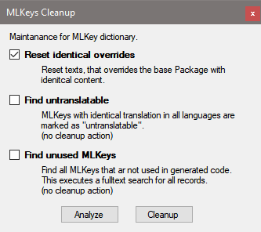

# MLKeys Cleanup

MLKeys-Cleanup ist eine Wartungs-Routine, die Bereinigungen im [Wörterbuch](woerterbuch.md) durchführt.

Sie kann in der IDE über das Menu **Tools / Checks / MLKeys Cleanup** aufgerufen werden.

#### Checkbox **Reset identical overrides**

Es werden Texte gesucht, die im aktuellen Package denselben Inhalt haben wie im Basis-Package.

Die Bereinigung entfernt diese Überschreibungen.

#### Checkbox **Find untranslatable**

(1) Es werden MLKeys gesucht, an denen die Texte in allen gepflegten Sprachen identisch sind. Es wird vorgeschlagen diese auf **untranslatable** zu setzen. Dazu kann der Button [**Untranslatable**](woerterbuch.md#button-untranslatable) verwendet werden. Die Treffer werden als *Information* ausgegeben.

(2) Es werden MLKeys gesucht, die als **untranslatable** gekennzeichnet sind, aber in Fremdsprachen einen Text besitzen. Die Treffer werden als *Warnung* ausgegeben.

> [!NOTE]
> Es findet keine Bereinigung der Treffer statt. Dies muss bei Bedarf manuell erfolgen.

#### Checkbox **Find unused MLKeys**

Es werden MLKeys angezeigt, die nicht verwendet werden. Es wird dazu der komplette generierte Code nach Verwendungen von MLKeys durchsucht. Dieser Vorgang kann einige Zeit dauern, er kann aber bei Bedarf abgebrochen werden.

> [!NOTE]
> Es findet keine Bereinigung der Treffer statt. Dies muss bei Bedarf manuell erfolgen.

#### Button **Analyze**

Dieser Button führt für die ausgewählten Operationen lediglich eine Analyse durch. Die gefundenen Treffer werden im Error-Fenster ausgegeben.

#### Button **Cleanup**

Nach einer Sichtung der mit dem Button **Analyze** gefundenen Treffer, kann mit diesem Button die Bereinigung ausgeführt werden.
