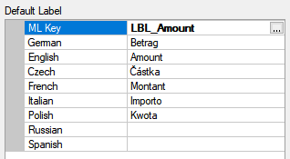
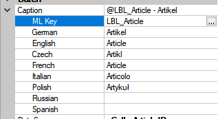
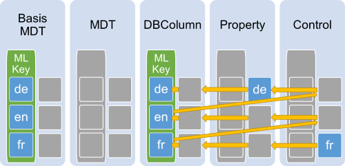

# MLString

 

**TODO**

* Option Sprachen
* Auswahl-Dialog mit der Option neue MLKeys zu erfassen.
* dasselbe wie Wörterbuch + Auswählen

## Vererbung

Mit den verschiedenen Records in Framework Studio werden auch die entsprechenden MLStrings vererbt. Dadurch werden im Idealfall die am Metadatentyp definierten Texte über die komplette Kette bis hin zu den Form-Controls durchgereicht.

Ein vererbter Text kann an jeder beliebigen Stelle in der Kette überschrieben werden. Es gibt 2 Möglichkeiten:

1. Einen anderen MLKey zuweisen

    Damit werden alle anderen Texte aus der Basis inkl. MLKeys und den überschriebenen Texten ausgeblendet. Auch wenn der neue MLKey z.B. keinen Text für `fr` definiert hat, wird ein in der Basis definierter `fr` Text ausgeblendet.

2. Einen einzelnen Text überschreiben:

    > [!WARNING]
    > Darauf sollte möglichst verzichtet werden. Wenn lediglich die Übersetzung gepflegt wird, dann erfolgt dies besser im Wörterbuch. Wenn eine abweichende Bedeutung gewünscht ist, dann sollte ein anderer MLKey angegeben werden.

    Das überschreibt nur den Text der entsprechenden Sprache. Die anderen nicht überschriebenen Sprachen werden weiter aus der Basis gezogen.

    > [!CAUTION]
    > In der **eNVenta/WS** Standard-Entwicklung ist das verboten.

Das folgende Bild zeigt eine Vererbungs-Hierarchie. Die Pfeile stellen den Weg dar, über den der Text für das Control ermittelt wird. Dabei wird hier die Sprache `fr` mit den Fallback-Sprachen `en` und `de` verwendet. Der erste Text der auf diesem Weg gefunden wird, wird ausgegeben.

