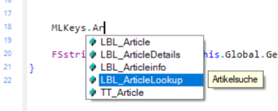
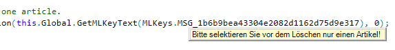

# Programmierung mit MLKeys

## Klasse MLKeys

Framework Studio generiert aus dem Wörtebuch eine Klasse `MLKeys`, die alle MLKeys beinhaltet. Sie wird im Compile-Schritt **Ressource** compiliert und steht somit in der kompletten Applikation zur Verfügung.

Sie erbt die MLKeys aus dem Basis-Package - so z.B. auch die `SYS_`-Keys aus dem System-Package.

Die Klasse wird z.B. folgendermaßen verwendet:

`this.Global.GetMLText(`**`MLKeys.LBL_Amount`**`);`

Alle Quellcodes, die mit MLKeys arbeiten, greifen auf diese Klasse zu - sowohl selbst geschriebener Methoden-Code als auch der von Framework Studio generierte Code. Dadurch findet der CSharp-Compiler alle Probleme, die im Zusammenhang mit MLKeys auftreten können:

* Compile-Error, wenn ein MLKey nicht mehr existiert. Auch wenn diese z.B. in einem Metadatentypen oder einem Form-Control verwendet werden.
* Eine Obsolete-Warning, wenn ein mit einer Obsolete-Message versehener MLKey verwendet wird. Die Obsolete-Message wird als `Obsolete`-Attribut vor den MLKey generiert.
* Eine Warning, wenn in einem Customizing-Package ein identischer MLKey definiert ist.

Die generierte `MLKeys`-Klasse sieht in etwa so aus:

```csharp
public class MLKeys : BasisPackage_MLKeys
{
    public static readonly MLKey LBL_Amount = new MLKey("LBL_Amount");
    public static readonly MLKey LBL_Article = new MLKey("LBL_Article");
    public static readonly MLKey TTT_Article = new MLKey("TTT_Article");
    public static readonly MLKey MSG_0da9815a719049ae806d3c0ba7d824ff = new MLKey("MSG_0da9815a719049ae806d3c0ba7d824ff");
    public static readonly MLKey MSG_0f2ad9d4385b49fc9667ed7eff2d925f = new MLKey("MSG_0f2ad9d4385b49fc9667ed7eff2d925f");

    [Obsolete("Please use LBL_Amount")]
    public static readonly MLKey LBL_Amount2 = new MLKey("LBL_Amount2");
}
```

> [!WARNING]
> Es sollten keine eigenen MLKey-Instanzen aus Strings erzeugt werden. Diese können vom Compiler nicht validiert werden.

## Code Editor

Der **Code-Editor** bietet diverse Unterstützung bei der Arbeit mit der Klasse `MLKeys`.

1. Im **Intellisense** werden alle MLKeys angeboten und im jeweiligen Tooltip wird zur besseren Orientierung der deutsche Text angezeigt.

    

2. Fährt man mit der Maus über einen MLKey, dann wird ein **Info-Tooltip** mit dem deutschen Text angezeigt.

    

3. Wird auf einem MLKey der Befehl **Goto Definition** (F12) ausgeführt, dann öffnet sich der [**Multilanguage Text Editor**](woerterbuch.md) und es wird der entsprechende Eintrag selektiert.

## Methoden am Global-Object

Das GlobalObject bietet mehrere Methoden an, mit denen ein MLKey in ein Text überführt werden kann.

### GetMLText

```csharp
public string GetMLText(MLKey mlkey)
```

Diese Methode ermittelt für den übergebenen `MLKey` den Text. Es wird die aktuell in der Session gesetzte Sprach-Hierarchie verwendet.

```csharp
public string GetMLText(MLKey mlkey, string iso)
```

Bei dieser Variante wird der Iso-Code der gewünschten Sprache übergeben.

Beispiel:

```csharp
FSstring sArticleLabel = this.Global.GetMLText( MLKeys.LBL_Article );
FSString sAmountEn = this.Global.GetMLText( MLKeys.LBL_Amount, "en" );
```

### FormatMLText

```csharp
public string FormatMLText(MLKey mlkey, params object[] args)
```

Diese Methode ermittelt für den übergebenen `MLKey` den Text. Es wird zudem ein `String.Format()` mit den übergebenen `args` ausgeführt.

Beispiel:

```csharp
FSstring sFormattedText = this.Global.FormatMLText( MLKeys.LBL_MitFormat, "Text1", lngAmount );
```

### GetMLKeyText

```csharp
public MLKeyText GetMLKeyText(MLKey mlkey)
```

Diese Variante gibt ein `MLKeyText` Objekt zurück, welches neben dem Text auch den übergebenen `MLKey` beinhaltet. Das kann hilfreich sein, wenn der MLKey interessant ist, um ihn z.B. als Fehler-Code zu verwenden.

Diese Methode wird z.B. für die Code-Messages benutzt:

```csharp
// FSCodeMessage: Please select only one article.
throw new FrameworkApplicationException(this.Global.GetMLKeyText(MLKeys.MSG_1b6b9bea43304e2082d1162d75d9e317), 0);
```

### FormatMLKeyText

```csharp
public MLKeyText FormatMLKeyText(MLKey mlkey, params object[] args)
```

Gibt ein `MLKeyText`-Objekt mit dem formatierten Text und dem MLKey zurück. Diese Methode wird in den Code-Messages benutzt.

Beispiel:

```csharp
// FSCodeMessage: Please specify {0}
throw new FrameworkApplicationException(this.Global.FormatMLKeyText(MLKeys.MSG_24979a3d247546318dc673c5501d3b15, this.sName), 0);
```

## cGlobal EntryPoint

In der Klasse `cGlobal` gibt es einen zentralen Entry-Point `GlobalGetMLText`. Dieser wird JEDES MAL aufgerufen, wenn aus einem MLKey ein Text erzeugt wird.

```csharp
public virtual string GlobalGetMLText(MLKey mlkey, string iso)
```

Die Sprach-Hierarchie der Session, welche am GlobalObject hinterlegt ist, wird außerhalb dieser Methode aufgelöst. Besteht die Hierarchie aus mehreren Fallbacks (z.B. `fr, en, de`), wird diese Methode auch ggf. mehrfach nacheinander mit den unterschiedlichen Iso-Codes aufgerufen. Liefert die Methode einen Wert ungleich `null` oder `String.Empty` zurück, wird dieser als Text verwendet und es erfolgt kein weiterer Aufruf.

Es ist möglich, diese Methode am cGlobal zu überschreiben und die Ermittlung der Texte zu beeinflussen oder zu überwachen.

> [!WARNING]
>
> 1. Diese Methode muss sehr performant gestaltet werden. Komplexe Logik kann die **Performance** der kompletten Anwendung sehr negativ beeinflussen.
>
> 2. Der **Basis-Aufruf** muss sichergestellt werden. Ansonsten wird das komplette Wörterbuch ausgehebelt und es werden gar keine Texte mehr ermittelt.
