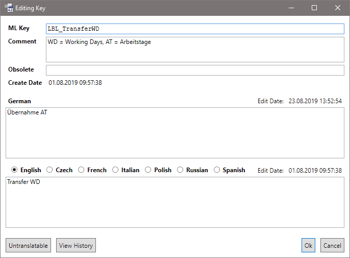

# Wörterbuch

Alle mehrsprachigen Texte der Anwendung werden in einem zentralen Wörterbuch abgelegt.

Organisiert werden die Einträge mit einem eindeutigen alphanumerischen Schüssel - dem **MLKey**.

## Multilanguage Text Editor

Die Bearbeitung des Wörterbuchs erfolgt über den **Multilanguage Text Editor**. Dieser wird über das Menü **Tools / Multilanguage Text Editor** geöffnet.

Die im Grid angezeigten Sprachen können in den **Options** mit der Einstellung **Languages in designer** eingestellt werden.

Die Bearbeitung des Wörterbuchs funktioniert ohne Checkout-Mechanismus. Wenn mehrere Benutzer zur gleichen Zeit an denselben MLKeys arbeiten sollten, dann gewinnt derjenige, der zuletzt den Button **Save** drückt.

Der Editor sammelt alle vorgenommenen Änderungen (Add, Edit, Delete) im Hintergrund. Mit dem Button **Save** werden diese in das Repository gespeichert. Dabei wird in einer Transaktion zuerst der aktuelle Stand frisch aus dem Repository gelesen, dann die Änderungen erneut auf diesen (evtl. durch einen anderen Benutzer veränderten) Stand angewendet und zuletzt der neue Stand wieder zurück in das Repository gespeichert.

Das hat die Folge, dass nach einem Save Änderungen sichtbar sind, die zuvor von einem anderen Benutzer vorgenommen wurden. Eine Ausnahme sind die Basis-Packages. Diese werden aus einem Stand gezogen, den der FrameworkCompiler zum Zeitpunkt des Compile-Laufs in den Workspace gespeichert hat.

## Suchen von MLKeys

Essentiell für die tägliche Arbeit ist das Auffinden von existierenden MLKeys. Dazu wird das **Search** Feld angeboten.

* Die Suche scannt alle Felder des MLKeys: MLKey, Comment, Obsolete, Texte.
* Die Groß-Klein-Schreibung wird nicht berücksichtigt.
* Es können mehrere Worte eingegeben werden. Dann müssen alle Worte oder Wortteile in irgend einem Feld auftauchen. z.B. `MSG_ Artikel Save` sucht nach Messages die mit `Artikel` und `Save` zu tun haben.
* Generell wird nach Wortteilen gesucht. Wenn man das Wort oder den Text in Anführungszeichen setzt, wird nach einem exakten Treffer und ganzen Worten gesucht. Das funktioniert auch mit mehreren Worten und in Kombination mit der normalen Suche. z.B. `LBL_ "Kunde"`

Ziel des Wörterbuches ist es, Texte wiederzuverwenden und die Anzahl der Einträge auf das Nötigste zu reduzieren. Aus diesem Grund sollte man immer zuerst nach einem MLKey suchen, bevor man einen neuen erfasst. Zu einem logischen Begriff sollen keine zwei MLKeys existieren.

> [!TIP]
> Die Suche sollte durchaus kreativ gestaltet werden - besonders bei Texten die eigentlich schon vorhanden sein müssten. Ein Beispiel dafür ist das Wort `Einfügen`. Möchte man dieses mit der englischen Bezeichnung `Add` nutzen, stellt man fest, dass es `Einfügen` schon mit mehreren Übersetzungen gibt, jedoch nicht mit der englischen Bezeichnung `Add`. Sucht man dann aber nach `Add`, so wird man den zu verwendenden deutschen Text 'Hinzufügen' finden.

## Erfassen neuer MLKeys

Mit dem Button **Add** öffnet sich ein Dialog, in dem der neue MLKey erfasst werden kann.

* **MLKey**: Hier wird der MLKey angegeben. Im Customizing-Package wird der Package-Code automatisch vorbelegt.

  > [!NOTE]
  > Der MLKey kann zu einem späteren Zeitpunkt nicht mehr geändert werden.

  Der MLKey kann frei vergeben werden, es gibt jedoch ein paar Regeln und Empfehlungen:

  * Es handelt sich um einen C#-Identifier, der auch im Quellcode verwendet wird.
    * Buchstaben, Zahlen, Unterstrich
    * Groß-Klein-Schreibung ist relevant
  * Der sprechende Name sollte sich nach Möglichkeit an den englischen Text anlehnen.
    * z.B. `LBL_Article`
  * Wenn der Text zu komplex ist - z.B. bei Messages oder Tooltips, dann kann der Name eine Guid enthalten. Diese kann mit dem Button **Generate Guid** angefügt werden.
    * z.B. `MSG_1c9f3024dfc340dfba0651cb92d90ad6`
  * In Customizing-Packages erhält der MLKey einen Package-Code. Dieser wird automatisch vorbelegt.
    * z.B. `LBL_K87_SpecialArticle`
  * In der **eNVenta/WS** Standard-Entwicklung sind entsprechende [Namensregeln](enventa-regeln.md) einzuhalten.

  Wird dieser Dialog aus der MLKey-Suche heraus geöffnet, dann wird abhängig vom jeweiligen Context auch ein passender Präfix vorbelegt:

  * `LBL_` / `LBL_<PackageCode>_`: Der Suchdialog wurde z.B. aus einem Caption- oder Default-Label-Property aufgerufen.
  * `TTT_` / `TTT_<PackageCode>_`: Der Suchdialog wurde aus dem Tooltip-Property aufgerufen.
  * `MSG_` / `MSG_<PackageCode>_`: Der Suchdialog wurde aus dem MessageBox- bzw. Exception-Wizard aufgerufen.

* **Comment**: Der Kommentar beschreibt bei Bedarf den MLKey genauer. Das ist sinnvoll, wenn der Text oder auch der MLKey erklärungsbedürftige Abkürzungen beinhaltet oder wenn es ähnliche Texte mit verschiedenen Verwendungszwecken gibt.

* **Obsolete**: Ein MLKey kann durch die Eingabe einer Obsolete-Message als veraltet markiert werden. Der Compiler wird bei Verwendung dieses MLKeys diese Message als Warning ausgeben. Weil das Löschen von MLKeys vor allem im Hinblick auf Customizing-Packages Compile-Errors erzeugt, sollte davon abgesehen und stattdessen diese Obsolete-Message verwendet werden. Ein Hinweis auf einen alternativ zu verwendenden MLKey ist empfehlenswert.

* **German**: Die Eingabe eines deutschen Textes ist Pflicht, weil Deutsch immer der letzte Fallback ist, wenn eine Fremdsprache nicht gepflegt ist.

* **Fremdsprachen**: Über die Radio-Buttons kann festgelegt werden, welche Sprache im 2. Textfeld angezeigt oder bearbeitet werden soll. Diese Texte sind optional.

  In der **eNVenta/WS** Standard-Entwicklung muss der englische Text gepflegt werden.

* Button **Untranslatable**: Es gibt Texte, die nicht übersetzt werden können wie z.B. Eigennamen oder Einheiten. Dieser Button löscht alle Fremdsprachen-Texte und Schreibt den Text `untranslatable` in das **Comment** Feld.

  Mitt der Routine [MLKeys Cleanup](mlkey-cleanup.md) kann diese Aktion systematisch für das komplette Wörterbuch ausgeführt werden.

## Bearbeiten von MLKeys

Mit dem Button Edit wird für den selektierten MLKey der Bearbeitungs-Dialog geöffnet.

Durch einen Doppelklick in das Grid kann der Bearbeitungs-Dialog ebenfalls geöffnet werden. Dabei wird der Fokus automatisch in das Feld gesetzt, dass der angeklickten Grid-Zelle entspricht. Das ist praktisch, wenn man z.B. gezielt eine Fremdsprache bearbeiten möchte.

Außerdem können alle Texte direkt im Grid bearbeitet werden.

> [!NOTE]
> Die logische Bedeutung des MLKeys darf zu einem späteren Zeitpunkt nicht mehr geändert werden.

Der Dialog ist gleich aufgebaut wie der Add-Dialog. Es werden zusätzlich das **Create Date** des MLKeys und die **Edit Dates** der Fremdsprachen-Texte angezeigt.

Der **MLKey** kann nicht bearbeitet werden.

Wird im Customizing-Package ein MLKey aus dem Basis-Package geöffnet, dann sind einige weitere Felder für die Bearbeitung gesperrt: **Comment** / Button **Untranslatable**, **Obsolete**

Die Texte können bearbeitet werden.

## Copy Entry / Paste Entry

Wenn man ein oder mehrere Einträge selektiert hat, kann man mit dem Button **Copy Entry** diese in die Zwischenablage kopieren. Mit dem Button **Paste Entry** können diese Einträge z.B. in einer anderen Version des Packages eingefügt werden.

Intern benutzt diese Funktion den [Import- / Export-Mechanismus](import-export.md). Dieser verwendet ein XML im TMX-Format. Dadurch ist es möglich, das XML vor dem **Paste Entry** bei Bedarf in einem Text-Editor zu manipulieren.

* Ändern des MLKey - um z.B. den PackageCode anzupassen.

Mit **Paste Entry** werden neue MLKeys hinzugefügt. Enthält die Zwischenablage existierende Keys, dann wird vor dem Einfügen ein Auswahl-Dialog angezeigt.

* **Ignore**: Es werden keinerlei Einträge ersetzt. Lediglich unbekannte, neue MLKeys werden hinzugefügt.
* **Replace**: Es wird der komplette existierende Eintrag ersetzt. Wenn in der Zwischenablage ein Wert nicht gesetzt ist, dann wird dieser entfernt.
* **Merge**: Die beiden Einträge werden zusammengeführt. Dabei gewinnt jeweils der Text mit dem neueren Edit-Date.

Mit dem Button **Cancel** wird die komplette Aktion abgebrochen. Dann werden auch keine MLKeys hinzugefügt.

## Customizing

Jedes Customizing-Package verwaltet sein eigenes Wörterbuch.

* Es können neue MLKeys angelegt werden. Diese erhalten den Package-Code, damit es in Zukunft keine Kollisionen mit Basis-Packages gibt.

    Bevor ein neuer MLKey angelegt wird, sollte immer geprüft werden, ob es nicht doch einen passenden MLKey gibt.

* Texte aus Basis-Packages können überschrieben bzw. ergänzt werden. So können z.B. Übersetzungen für Fremdsprachen gepflegt werden.

    Es muss darauf geachtet werden, dass die Bedeutung des MLKeys nicht geändert wird, weil dieser ggf. an mehreren Stellen in der Anwendung verwendet wird. Wird an einer bestimmten Stelle in der Anwendung ein anderer Text benötigt (in eNVenta kann das z.B. der Text "Code1" sein, der ersetzt werden soll) dann muss an dieser Stelle (jedoch möglichst weit unten in der DBColumn oder Metadatentyp) ein anderer MLKey zugeordnet werden. (siehe auch [MLString-Vererbung](mlstring.md#vererbung))

Im Customizing-Package übersetzte Texte können [exportiert](import-export.md) und in das Basis-Package importiert werden. Zu einem späteren Zeitpunkt können die dann redundanten Übersetzung mit der [MLKeys Cleanup](mlkey-cleanup.md) Routine bereinigt werden.
